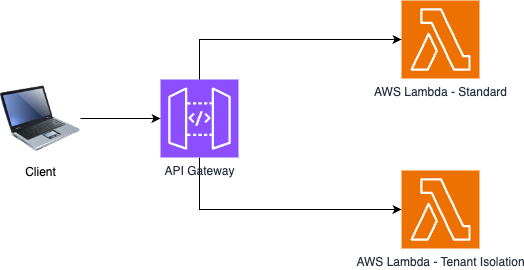

# Multi-tenant API with AWS Lambda functions tenant isolation

This sample project demonstrates tenant isolation mode of AWS Lambda functions by comparing two Lambda functions - one with tenant isolation enabled and one without. The demonstration uses in-memory counters to visually show how tenant isolation provides separate execution environments for different tenants.

## Requirements

- [Create an AWS account](https://portal.aws.amazon.com/gp/aws/developer/registration/index.html) if you do not already have one and log in. The IAM user that you use must have sufficient permissions to make necessary AWS service calls and manage AWS resources.
- [AWS CLI](https://docs.aws.amazon.com/cli/latest/userguide/install-cliv2.html) installed and configured
- [Git Installed](https://git-scm.com/book/en/v2/Getting-Started-Installing-Git)
- [AWS Serverless Application Model](https://docs.aws.amazon.com/serverless-application-model/latest/developerguide/serverless-sam-cli-install.html) (AWS SAM) installed
- [Python 3.14 or above](https://www.python.org/downloads/) installed
- [Maven 3.8.6 or above](https://maven.apache.org/download.cgi) installed

## Deployment Instructions

1. Create a new directory, navigate to that directory in a terminal and clone the GitHub repository:

   ```bash
   git clone https://github.com/aws-samples/serverless-patterns
   ```

2. Change directory to the pattern directory:

   ```bash
   cd serverless-patterns/apigw-lambda-tenant-isolation
   ```

3. From the command line, run the following commands:

   ```bash
   sam build
   sam deploy --guided
   ```

4. During the prompts:

   - Enter a stack name
   - Enter the desired AWS Region e.g. `us-east-1`.
   - Allow SAM CLI to create IAM roles with the required permissions.
   - Keep default values to the rest of the parameters.

   Once you have run `sam deploy --guided` mode once and saved arguments to a configuration file (samconfig.toml), you can use `sam deploy` in future to use these defaults.

5. Note the outputs from the SAM deployment process. These contain the resource names and/or ARNs which are used for next step as well as testing.

## How it works

The SAM template deploys two Lambda functions - one tenant isolation mode enabled and another disabled.



Here's a breakdown of the steps:

1. **Standard AWS Lambda Function**: Receives tenant headers (`x-tenant-id`) but shares execution environment across all tenants. The counter variable when increased for one tenant, it impacts the other tenant (demonstrates the limitation)

2. **Tenant-Isolated AWS Lambda Function**: Maintains separate execution environments per tenant using AWS Lambda tenant isolation mode (demonstrates the solution)

3. **Amazon API Gateway**: Provides REST endpoints for both functions with header mapping

## Testing

Use [curl](https://curl.se/) to send a HTTP POST request to the API. Make sure to replace `api-id` with the one from your `sam deploy --guided` output:

### Standard Function (The limitation)

The standard function receives tenant headers but cannot isolate tenants - all requests share the same counter:

Replace with `StandardMultiTenantAPIEndpointUrl`:

```bash
STANDARD_URL="https://your-api-id.execute-api.region.amazonaws.com/dev/standard"
```

BlueTenant request:

```bash
curl -H "x-tenant-id: BlueTenant" "$STANDARD_URL"
```

Response:

```bash
{
  "counter": 1,
  "tenant_id_received": "BlueTenant",
  "tenant_id": null,
  "isolation_enabled": false,
  "message": "Counter incremented successfully - SHARED across all tenants! (Received tenant: BlueTenant)",
  "warning": "This function does NOT provide tenant isolation - all tenants share the same counter!"
}
```

RedTenant request:

```bash
curl -H "x-tenant-id: RedTenant" "$STANDARD_URL"
```

Response:

```bash
{
  "counter": 2,
  "tenant_id_received": "RedTenant",
  "tenant_id": null,
  "isolation_enabled": false,
  "message": "Counter incremented successfully - SHARED across all tenants! (Received tenant: RedTenant)",
  "warning": "This function does NOT provide tenant isolation - all tenants share the same counter!"
}
```

GreenTenant request:

```bash
curl -H "x-tenant-id: GreenTenant" "$STANDARD_URL"
```

Response:

```bash
{
  "counter": 3,
  "tenant_id_received": "GreenTenant",
  "tenant_id": null,
  "isolation_enabled": false,
  "message": "Counter incremented successfully - SHARED across all tenants! (Received tenant: GreenTenant)",
  "warning": "This function does NOT provide tenant isolation - all tenants share the same counter!"
}
```

Continue to invoke the API for different tenants. Note the `counter` values. As all the three tenants are reusing the same Lambda execution environment, the counter variable is also shared and continuously increasing across tenants.

### Isolated Function (The solution)

The isolated function provides true tenant isolation - each tenant gets separate Lambda execution environments:

Replace with `IsolatedTenantAPIEndpointUrl`:

```bash

ISOLATED_URL="https://your-api-id.execute-api.region.amazonaws.com/dev/isolated"
```

BlueTenant requests (independent counter):

```bash
curl -H "x-tenant-id: BlueTenant" "$ISOLATED_URL"
```

Response:

```bash
{
  "counter": 1,
  "tenant_id": "BlueTenant",
  "isolation_enabled": true,
  "message": "Counter incremented successfully for tenant BlueTenant"
}
```

GreenTenant requests (separate independent counter):

```bash
curl -H "x-tenant-id: GreenTenant" "$ISOLATED_URL"
```

Response:

```bash
{
  "counter": 1,
  "tenant_id": "GreenTenant",
  "isolation_enabled": true,
  "message": "Counter incremented successfully for tenant GreenTenant"
}
```

Continue to invoke the API for different tenants. Note the `counter` values. Each tenant maintains independent counters (BlueTenant: 1→2→3, GreenTenant: 1→2), showing true isolation.

### Monitoring

Check CloudWatch logs to see tenant isolation in action:

```bash
# View logs for standard function
aws logs filter-log-events \
  --log-group-name "/aws/lambda/your-stack-name-counter-standard" \
  --start-time $(date -d '10 minutes ago' +%s)000

# View logs for isolated function (notice tenantId in platform events)
aws logs filter-log-events \
  --log-group-name "/aws/lambda/your-stack-name-counter-isolated" \
  --start-time $(date -d '10 minutes ago' +%s)000
```

## Cleanup

1. To delete the resources deployed to your AWS account via AWS SAM, run the following command:

```bash
sam delete
```

---

Copyright 2026 Amazon.com, Inc. or its affiliates. All Rights Reserved.

SPDX-License-Identifier: MIT-0