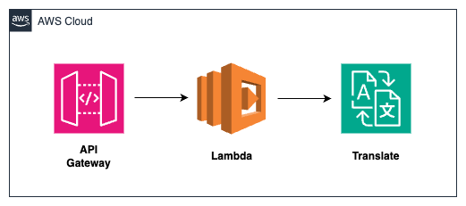

# API Gateway -> Lambda -> Translate
This patterns shows CDK deployment on how to leverage Amazon API Gateway, AWS Lambda, and Amazon Translate to perform language translation in a serverless fashion.

## Architecture


### What resources will be created?
This CDK code will create the following:
   - One Lambda function (to invoke the Translate API)
   - One API Gateway (to trigger the Lambda function with user input)
   - One IAM role (for the Lambda function to invoke Translate service)

## Requirements

### Development Environment
**Cloud 9**

This demonstration for this pattern is executed in an AWS Cloud9 environment. The EC2 instance used is t2.micro (1 GiB RAM + 1 vCPU). However, users have an option to deploy the application using CDK from local environment as well.

### AWS setup
**Region**

If you have not yet run `aws configure` and set a default region, you must do so, or you can also run `export AWS_DEFAULT_REGION=<your-region>`. The region used in the demonstration is us-east-1. Please make sure the region selected supports both Translate and Comprehend service.
(If the user does not know the source language that needs to be translated, the source language is set as `auto` in the lambda function and Translate service internally invokes Comprehend API to detect the source language.) 

**Authorization**

You must use a role that has sufficient permissions to create IAM roles, as well as CloudFormation resources

#### Python >=3.8
Make sure you have [python3](https://www.python.org/downloads/) installed at a version >=3.8.x in the CDK environment. The demonstration uses python 3.10.

#### AWS CDK
Make sure you have the [AWS CDK](https://docs.aws.amazon.com/cdk/v2/guide/getting_started.html#getting_started_install) installed in the Cloud9 environment.


## Setup

### Set up environment and gather packages

```
cd apigw-lambda-translate
```

Install the required dependencies (aws-cdk-lib and constructs) into your Python environment 
```
pip install -r requirements.txt
```

### Gather and deploy resources with the CDK

First synthesize, which executes the application, defines which resources will be created, and translates this into a CloudFormation template
```
cdk synth
```
All AWS CDK v2 deployments use dedicated AWS resources to hold data during deployment. Therefore, your AWS account and Region must be bootstrapped to create these resources before you can deploy. If you haven't already bootstrapped execute the below command
```
cdk bootstrap
```
and deploy with
```
cdk deploy
```

The deployment will create a S3 bucket, a Lambda function and a DynamoDB table.

## How it works
The API Gateway handles the incoming requests from user and it invokes the relevant route. The Lambda, triggered by API Gateway, invokes the Translate's TranslateText API and the analyzed response from Translate service is routed back to the requester.

## Testing
Upon successful deployment of the stack, the Output section would provide the `APIEndpoint` in the CDK environment. Alternatively, the `APIEndpoint` can be found from the Outputs section of the `CloudFormation` stack.

Use the below format to the test the API (replace the API Endpoint with the one retrieved from the above step):
```bash
curl -d '{"input": "I love AWS Services."}' -H 'Content-Type: application/json' https://<abcdefg>.execute-api.<region>.amazonaws.com/TranslateText
```

A response as below would be seen on the terminal console:
```
{
    "Translated Text": "J'adore AWS Services.",
    "statusCode": 200,
    "Source Text": "I love AWS Services."
}
```

## Cleanup

To clean up the resources created as part of this demonstration, run the command `cdk destroy` in the directory `apigw-lambda-translate`. In addition, users are advised to terminate the Cloud9 EC2 instance to avoid any unexpected charges.
