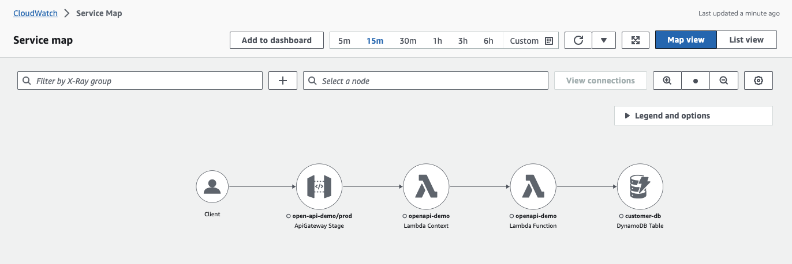

# Deploying API Gateway REST API using OpenAPI specification with Lambda Powertools for logging and tracing 

This pattern demonstrates how to deploy an API Gateway REST API with Lambda backend integration that is defined in an OpenAPI specification format using Terraform. The pattern also shows how backend Lambda is integrated with Lambda powertools for logging and more importantly tracing the requests end to end from API Gateway to DynamoDB data store.

Learn more about this pattern at Serverless Land Patterns: http://serverlessland.com/patterns/apigw-openapi-lambda-dynamodb-xray-terraform

Important: this application uses various AWS services and there are costs associated with these services after the Free Tier usage - please see the [AWS Pricing page](https://aws.amazon.com/pricing/) for details. You are responsible for any AWS costs incurred. No warranty is implied in this example.

## Requirements

* [Create an AWS account](https://portal.aws.amazon.com/gp/aws/developer/registration/index.html) if you do not already have one and log in. The IAM user that you use must have sufficient permissions to make necessary AWS service calls and manage AWS resources.
* [AWS CLI](https://docs.aws.amazon.com/cli/latest/userguide/install-cliv2.html) installed and configured
* [Git Installed](https://git-scm.com/book/en/v2/Getting-Started-Installing-Git)
* [Node and NPM](https://docs.npmjs.com/downloading-and-installing-node-js-and-npm) installed
* [Terraform](https://developer.hashicorp.com/terraform/tutorials/aws-get-started/install-cli) installed

## Deployment Instructions

1. Create a new directory, navigate to that directory in a terminal and clone the GitHub repository:
    ```bash 
    git clone https://github.com/aws-samples/serverless-patterns
    ```
2. Change directory to the pattern directory:
    ```bash
    cd apigw-openapi-lambda-dynamodb-xray-terraform
    ```
3. Compile typescript code and build the package:
    ```bash
    chmod 700 build.sh
    npm install
    npm run build
    ```
4. Deploy with terraform:
    ```bash
    terraform -chdir=infra init
    terraform -chdir=infra apply
    ```
5. After successful deployment, note the output `restapi_url`. You will use this URL for testing.

## How it works

This Terraform application deploys a Lambda backed Amazon API Gateway REST API using OpenAPI specification. OpenAPI specification yaml is included in the project which defines CRUD endpoints and their Lambda integrations. In addition, as a best practice Lambda powertools have been incorporated as a Layer which provides a structured logging mechanism via Cloudwatch Logs and enhanced tracing which allows end to end tracing of the incoming requests via AWS X-Ray.   

## Testing

1. Retrieve the API Gateway base url from the deployment output variable `restapi_url`
    ```
    restapi_url = "https://5jntg09nob.execute-api.us-east-1.amazonaws.com/prod"
    ```
2. Using `curl` make a POST request to the API to create a new customer entity
    ```bash
    curl -d "@test/request.json" -H "Content-Type: application/json" -X POST <restapi_url>/customers
    # example 
    curl -d "@test/request.json" \
    -H "Content-Type: application/json" \
    -X POST https://5jntg09nob.execute-api.us-east-1.amazonaws.com/prod/customers
    ```
3. You will receive a JSON response with customer id along with other details. Note the customer id, you need it for GET request
    ```
    {"id":"46RMQIA02R5BKZL","firstname":"John","lastname":"Doe","zipcode":"30303"}
    ```
4. Using `curl` make a GET request to the API to retrieve the customer entity you just created
    ```bash
    curl https://5jntg09nob.execute-api.us-east-1.amazonaws.com/prod/customers/<id>
    # example 
    curl https://5jntg09nob.execute-api.us-east-1.amazonaws.com/prod/customers/46RMQIA02R5BKZL
    ```
5. You will receive the JSON response with customer details.
    ```
    {"id":"46RMQIA02R5BKZL","firstname":"John","lastname":"Doe","zipcode":"30303"}
    ```
6. Now navigate to [AWS Cloudwatch Console](https://us-east-1.console.aws.amazon.com/cloudwatch/home), under **X-Ray traces** you should see the service map that shows end-to-end trace of the GET request.




## Cleanup
 
1. Delete the application
    ```bash
    terraform -chdir=infra destroy
    ```
2. Confirm the application has been deleted
    ```bash
    terraform -chdir=infra show
    ```
----
Copyright 2023 Amazon.com, Inc. or its affiliates. All Rights Reserved.

SPDX-License-Identifier: MIT-0
