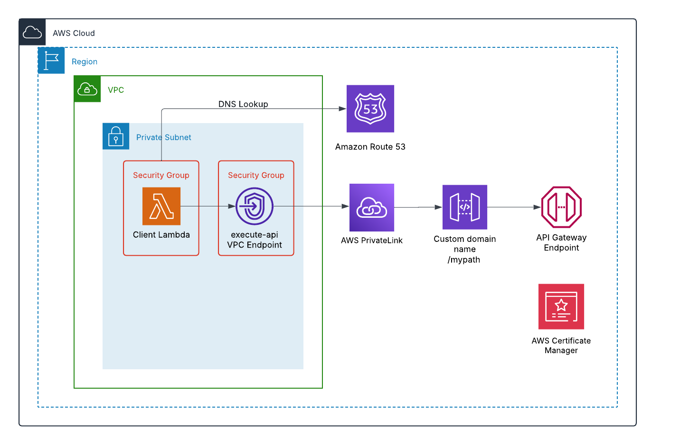

# Amazon API gateway private REST API with private custom domain name configured with private SSL cert imported and managed by ACM

This pattern enables secure access to a private REST API Gateway using a private custom domain name. The solution utilizes SSL certificates, imported and managed through AWS Certificate Manager (ACM).

Learn more about this pattern at [Serverless Land Patterns](https://serverlessland.com/patterns/apigw-private-cdn).

You can update the template to add AWS resources through the same deployment process that updates your application code.

Important: This application uses various AWS Services and there are costs associated with these services after the Free Tier Usage - please see the [AWS Pricing Page](https://aws.amazon.com/pricing/) for more details. You are responsible for any AWS costs incurred. No warranty is implied in this example.

### Requirements

- [Create an AWS account](https://portal.aws.amazon.com/gp/aws/developer/registration/index.html) if you do not already have one and log in. The IAM user that you use must have sufficient permissions to make necessary AWS service calls and manage AWS resources.
- [AWS CLI](https://docs.aws.amazon.com/cli/latest/userguide/install-cliv2.html) installed and configured
- [Git](https://git-scm.com/book/en/v2/Getting-Started-Installing-Git) installed and configured
- [A VPC with subnets and a security group](https://docs.aws.amazon.com/vpc/latest/userguide/vpc-getting-started.html). The security group must have following conditions:
    1. Inbound rule allowing 443 traffic on the VPC CIDR range.
    2. Outbound rule allowing 443 traffic on VPC CIDR range.
- [An Amazon S3 bucket](https://docs.aws.amazon.com/AmazonS3/latest/userguide/GetStartedWithS3.html) located in the same region as the CloudFormation stack, used to store local artifacts including Lambda function source code required for this deployment.

### How it works

Please refer to the architecture diagram below:



This implementation consists of three major components:

1. Certificate and API Gateway Setup
    1. Import a private SSL certificate into ACM
    2. Create a private REST API in API gateway
    3. Create API Gateway's private custom domain configured with ACM certificate created in step 1
    4. Configure a Lambda function as the API Gateway backend processor
    5. Deploy the private REST API through API Gateway
    6. Associate the custom domain with the API Gateway stage

2. "execute-api" VPC Endpoint configuration - Provide private access to the private REST API

3. DNS Configuration
    1. Establish a private hosted zone for the domain name
    2. Create a CNAME record within the hosted zone for custom domain name
    3. Point API Gateway's private custom domain name to the "execute-api" VPC Endpoint DNS name

### Deployment Instructions

**Note**: Please make sure to follow the below steps in order to make sure the deployment is successful. 

1.  Create a new directory, navigate to that directory in a terminal and clone the GitHub repository:
    ``` bash
    git clone https://github.com/aws-samples/serverless-patterns
    ```
2. Change directory to the pattern directory:
    ```bash
    cd serverless-patterns/apigw-private-cdn-acm
    ```
3. Execute the following AWS CLI command after replacing the placeholders (indicated by <>) with their corresponding values:
    ```bash
    aws cloudformation package \
        --template-file template.yaml \
        --s3-bucket <your-s3-bucket-name> \
        --output-template-file output.yaml 
    ```
4. Execute the following AWS CLI command after replacing the placeholders (indicated by <>) with their corresponding values:
    ```bash
    aws cloudformation deploy \
        --template-file output.yaml \
        --stack-name apigw-private-cdn-acm \
        --parameter-overrides VpcIdParameter=<vpc-id> VpcEndpointSubnetIdsParameter=<subnet-id> ApiVPCESecurityGroup=<security-group-id> \
        --capabilities CAPABILITY_IAM
    ```
4. To implement your own custom domain configuration:
      1. Modify the CloudFormation template.yaml file by updating two constant parameter's values: `CustomDomain` and `DomainName`:
      ```bash
    Mappings:
        Constants:
            CustomDomain:
                Value: "apigw.example.com"
            DomainName:
                Value: "example.com"
    ```
      2. Prepare the following certificate files:
            1. Root certificate `rootCA.pem`.
            2. Server certificate `server.crt`.
            3. Server private key `server.key`.
      3. Update certificate files in the following directories:
            1. `acm-certificate` folder:
                1. `rootCA.pem`
                2. `server.crt`
                3. `server.key`
            2. `api-testing` folder:
                1. `rootCA.pem`

## Testing

1. Sign in to the AWS Management Console.
2. Navigate to AWS Lambda by searching 'Lambda' in the services search bar.
3. From the Lambda functions list, select the function containing 'APITestingLambdaFunction' in its name.
4. Click the 'Test' button in the function's detail page.
5. Review the execution results in the output section, which will contain the response from the private API Gateway API.

## Cleanup

To remove all resources deployed to your AWS account through CloudFormation:

```bash
aws cloudformation delete-stack --stack-name apigw-private-cdn-acm
```


---

Copyright 2024 Amazon.com, Inc. or its affiliates. All Rights Reserved.

SPDX-License-Identifier: MIT-0
