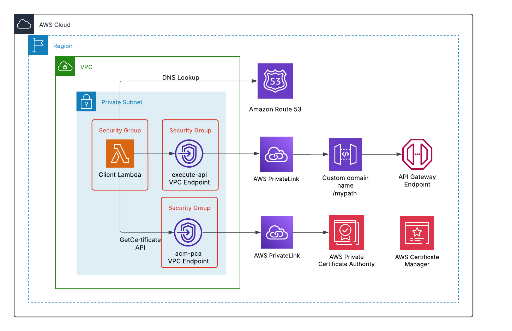

# Private Custom Domain for Amazon API Gateway API Using AWS Certificate Manager and Amazon Private Certificate Authority

This pattern enables secure access to a private REST API Gateway using a private custom domain name. The solution utilizes SSL certificates managed by AWS Certificate Manager (ACM) and signed by Amazon Private Certificate Authority (PCA), ensuring secure and authenticated communication within the private network. 

Learn more about this pattern at [Serverless Land Patterns](https://serverlessland.com/patterns/apigw-private-cdn-private-ca-sam).

You can update the template to add AWS resources through the same deployment process that updates your application code.

Important: This application uses various AWS Services and there are costs associated with these services after the Free Tier Usage - please see the [AWS Pricing Page](https://aws.amazon.com/pricing/) for more details. You are responsible for any AWS costs incurred. No warranty is implied in this example.

### Requirements

- [Create an AWS account](https://portal.aws.amazon.com/gp/aws/developer/registration/index.html) if you do not already have one and log in. The IAM user that you use must have sufficient permissions to make necessary AWS service calls and manage AWS resources.
- [AWS CLI](https://docs.aws.amazon.com/cli/latest/userguide/install-cliv2.html) installed and configured
- [AWS SAM CLI](https://docs.aws.amazon.com/serverless-application-model/latest/developerguide/install-sam-cli.html) installed and configured
- [Git](https://git-scm.com/book/en/v2/Getting-Started-Installing-Git) installed and configured
- [A VPC with subnets and a security group](https://docs.aws.amazon.com/vpc/latest/userguide/vpc-getting-started.html). The security group must have following conditions:
  1. Inbound rule allowing 443 traffic on the VPC CIDR range.
  2. Outbound rule allowing 443 traffic on VPC CIDR range.

### AWS Private CA Cost Considerations

Amazon PCA incurs costs based on your chosen operating mode:
- General-purpose mode: Allows issuing certificates with any validity period
- Short-lived certificate mode: Limited to certificates valid for up to 7 days

Please refer to the [AWS Private CA pricing page](https://aws.amazon.com/private-ca/pricing/). 

**Alternative Cost-Effective Solution:**

If cost is a concern, consider creating Amazon API Gateway private custom domain name which can be configured with a SSL/TLS certificate from:
- Your existing enterprise/internal Private CA
- A third-party public Certificate Authority
- Any other Certificate Authority you trust

The certificate can be imported and managed through [AWS Certificate Manager (ACM)](https://docs.aws.amazon.com/acm/latest/userguide/import-certificate.html). 

### How it works

Please refer to the architecture diagram below:



This implementation consists of three major components:

1. Private Certificate Authority and API Gateway Setup:
   1. Create an PCA
   2. Issue a root certificate through the PCA
   3. Create a certificate in ACM using PCA's root certificate
   4. Create a private REST API in API gateway
   5. Create API Gateway's private custom domain configured with ACM certificate created in step 3
   6. Configure a Lambda function as the API Gateway backend processor
   7. Deploy the private REST API through API Gateway
   8. Associate the custom domain with the API Gateway stage
  
2. VPC Endpoints configurations for private communication:
   1. "acm-pca" VPC Endpoint - Facilitates communication with PCA
   2. "execute-api" VPC Endpoint - Provides private access to the REST API

3. DNS Configuration:
    1. Establish a private hosted zone for the domain name
    2. Create a CNAME record within the hosted zone for custom domain name
    3. Point API Gateway's private custom domain name to the "execute-api" VPC Endpoint DNS name

### Deployment Instructions

**Note**: Please make sure to follow the below steps in order to make sure the deployment is successful. 

1.  Create a new directory, navigate to that directory in a terminal and clone the GitHub repository:
    ``` bash
    git clone https://github.com/aws-samples/serverless-patterns
    ```
2. Change directory to the pattern directory:
    ```bash
    cd serverless-patterns/apigw-private-cdn-private-ca-sam
    ```
3. Execute the following AWS CLI commands after replacing the placeholders (indicated by <>) with their corresponding values:
    ```bash
    # First, build the SAM application
    sam build

    # Then deploy with guided deployment (recommended for first time)
    sam deploy --guided --stack-name apigw-private-cdn-private-ca-sam

    # Or deploy with specific parameters directly
    sam deploy \
    --stack-name apigw-private-cdn-private-ca-sam \
    --parameter-overrides \
        VpcIdParameter=<vpc-id> \
        VpcEndpointSubnetIdsParameter=<subnet-id-1>,<subnet-id-2> \
        ApiVPCESecurityGroup=<security-group-id> \
    --capabilities CAPABILITY_IAM CAPABILITY_AUTO_EXPAND \
    --region <your-region>
   ```
4. To implement your own custom domain configuration, modify the SAM template.yaml file by updating two constant parameter's values: `CustomDomain` and `DomainName`:
    ```bash
    Mappings:
        Constants:
            CustomDomain:
                Value: "apigw.example.com"
            DomainName:
                Value: "example.com"
    ```

## Testing

1. Sign in to the AWS Management Console.
2. Navigate to the AWS Lambda console.
3. From the Lambda functions list, select the function containing 'APITestingLambdaFunction' in its name.
4. Click the 'Test' button in the function's detail page.
5. Review the execution results in the output section, which will contain the response from the private API Gateway API.

## Cleanup

To remove all resources deployed to your AWS account through AWS SAM:

```bash
sam delete --stack-name apigw-private-cdn-private-ca-sam
```

---

Copyright 2025 Amazon.com, Inc. or its affiliates. All Rights Reserved.

SPDX-License-Identifier: MIT-0
