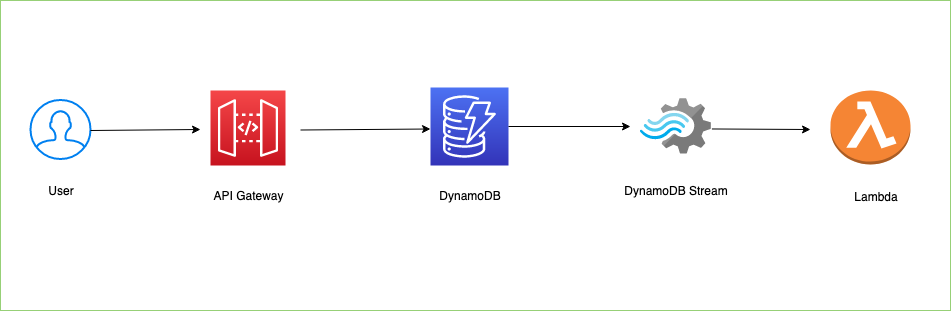

# Amazon API Gateway REST API to Amazon DynamoDB

This pattern creates an Amazon API Gateway REST API that integrates with an Amazon DynamoDB table.

Learn more about this pattern at Serverless Land Patterns: http://serverlessland.com/patterns/apigw-dynamodb-lambda-cdk.

Important: this application uses various AWS services and there are costs associated with these services after the Free Tier usage - please see the [AWS Pricing page](https://aws.amazon.com/pricing/) for details. You are responsible for any AWS costs incurred. No warranty is implied in this example.

## Requirements

* [Create an AWS account](https://portal.aws.amazon.com/gp/aws/developer/registration/index.html) if you do not already have one and log in. The IAM user that you use must have sufficient permissions to make necessary AWS service calls and manage AWS resources.
* [AWS CLI](https://docs.aws.amazon.com/cli/latest/userguide/install-cliv2.html) installed and configured
* [Git Installed](https://git-scm.com/book/en/v2/Getting-Started-Installing-Git)
* [AWS Serverless Application Model](https://docs.aws.amazon.com/serverless-application-model/latest/developerguide/serverless-sam-cli-install.html) (AWS SAM) installed

## Architecture
The following diagram illustrates the solutions architect

## Deployment Instructions

1. Create a new directory, navigate to that directory in a terminal and clone the GitHub repository:
    ``` 
    git clone https://github.com/aws-samples/serverless-patterns
    ```
1. Change directory to the pattern directory:
    ```
    cd apigw-rest-api-dynamodb-lambda-cdk
    ```

1. Install dependencies
    ```
    npm install
	cd src
	pip install aws-xray-sdk --target .
	pip install aws_lambda_powertools --target .
    ```

1. Deploy the stack to your default AWS account and region. The output of this command should give you the HTTP API URL.
    ```
	cd ..
    cdk deploy
    ```

## How it works

This pattern creates an Amazon API Gateway REST API that integrates with an Amazon DynamoDB table. The API integrates directly with the DynamoDB API and supports [PutItem](https://docs.aws.amazon.com/amazondynamodb/latest/APIReference/API_PutItem.html) and [Query](https://docs.aws.amazon.com/amazondynamodb/latest/APIReference/API_Query.html) actions. The API Integration has read and write access to the DynamoDB. There is no authentication on the API endpoint

## Testing

Upon deployment, you will see the API endpoint URL in the output. It will take the format:

`https://${API_ID}.execute-api.${REGION_NAME}.amazonaws.com`

Once the application is deployed, use [Postman](https://www.postman.com/) to test the API using the following instructions.

1. Launch Postman

1. Invoke the DynamoDB **PutItem** action to add a new item to the DynamoDB table:
	* Enter the API URL with the **prod** stage as the path:.
	```
	https://${API_ID}.execute-api.${REGION_NAME}.amazonaws.com/prod/awsomedynamodb
	```
	* Select **POST** as the HTTP method from the drop-down list to the left of the address bar.
	* Choose the **Body** tab. Choose **raw** and select **JSON** from the drop-down list. Enter the following into the text box: 
	```
	{
		"id":"14",
    	"name":"Do some thing",
    	"description":"Do some thing",
    	"customer":"John"
	}
	```
	* Choose **Send** to submit the request and receive a "200 OK" response.
	* Open the DynamoDB console and select the `AWSomeDynamoDB` table which was created to confirm that the item has been added.
	* Change the values for `pk` or `data` in the POST body and repeat this process to add multiple items to the DynamoDB table.

1. Invoke the DynamoDB **Query** action to query all items by artist in the DynamoDB table:
	* Enter the Invoke URL in the address bar. 
	```
	https://${API_ID}.execute-api.${REGION_NAME}.amazonaws.com/prod/awsomedynamodb
	```
	* Select **GET** as the HTTP method from the drop-down list to the left of the address bar.
	* Choose the **Body** tab. Choose **none**.
	* Choose **Send** to submit the request and receive a "200 OK" response with a list of the matching results. Example: 
	```
{
    "Count": 2,
    "Items": [
        {
            "AWSomeDynamoDBId": {
                "S": "c80cf550-f695-4759-b936-2730c1140668"
            },
            "Description": {
                "S": "Do some thing"
            },
            "Id": {
                "S": "14"
            },
            "Customer": {
                "S": "Julian"
            },
            "Name": {
                "S": "Do some thing"
            }
        },
        {
            "AWSomeDynamoDBId": {
                "S": "5f00a663-fd47-41ad-a425-6cb470d8c869"
            },
            "Description": {
                "S": "Do some thing"
            },
            "Id": {
                "S": "14"
            },
            "Customer": {
                "S": "John"
            },
            "Name": {
                "S": "Do some thing"
            }
        }
    ],
    "ScannedCount": 2
}
	```
	
1. Invoke the DynamoDB **Query** action to query specific item by artist in the DynamoDB table:
	* Enter the Invoke URL in the address bar. Add **/{AWSomeDynamoDBId}** to the URL path. Replace with one of the `AWSomeDynamoDBId` values from the previous query. This defines the ID that you want to query.
	```
	https://${API_ID}.execute-api.${REGION_NAME}.amazonaws.com/prod/awsomedynamodb/{AWSomeDynamoDBId}
	```
	* Select **GET** as the HTTP method from the drop-down list to the left of the address bar.
	* Choose the **Body** tab. Choose **none**.
	* Choose **Send** to submit the request and receive a "200 OK" response with a list of the matching results. Example: 
	```
		{
			"Count": x,
			"Items": [
				{
					"AWSomeDynamoDBId": {
						"S": "foo"
					},
					"name": {
						"S": "blah blah blah"
					},
					"description": {
						"S": "blah blah blah"
					},
					"Id": {
						"S": "string"
					}
				}
			],
			"ScannedCount": 1
		}
	```
## Documentation
- [Tutorial: Build an API Gateway REST API with AWS integration](https://docs.aws.amazon.com/apigateway/latest/developerguide/getting-started-aws-proxy.html)
- [How do I use API Gateway as a proxy for another AWS service?](https://aws.amazon.com/premiumsupport/knowledge-center/api-gateway-proxy-integrate-service/)
- [Using Amazon API Gateway as a proxy for DynamoDB](https://aws.amazon.com/blogs/compute/using-amazon-api-gateway-as-a-proxy-for-dynamodb/)
- [Setting up data transformations for REST APIs](https://docs.aws.amazon.com/apigateway/latest/developerguide/rest-api-data-transformations.html)
- [Amazon API Gateway API request and response data mapping reference](https://docs.aws.amazon.com/apigateway/latest/developerguide/request-response-data-mappings.html)
- [API Gateway mapping template and access logging variable reference](https://docs.aws.amazon.com/apigateway/latest/developerguide/api-gateway-mapping-template-reference.html)

## Cleanup
 
Run the given command to delete the resources that were created. It might take some time for the CloudFormation stack to get deleted.
```
cdk destroy
```

----
Copyright 2021 Amazon.com, Inc. or its affiliates. All Rights Reserved.

SPDX-License-Identifier: MIT-0
