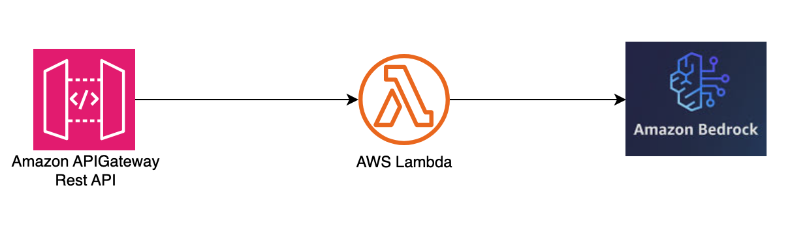

# Amazon API Gateway REST API to SQS to Lambda to Bedrock

This pattern creates an Amazon API Gateway REST API, an AWS Lambda function that makes a call to a model in Amazon Bedrock.

Learn more about this pattern at Serverless Land Patterns: http://serverlessland.com/patterns/apigw-rest-api-lambda-bedrock-cdk.

Important: this application uses various AWS services and there are costs associated with these services after the Free Tier usage - please see the [AWS Pricing page](https://aws.amazon.com/pricing/) for details. You are responsible for any AWS costs incurred. No warranty is implied in this example. 

## Requirements

* [Create an AWS account](https://portal.aws.amazon.com/gp/aws/developer/registration/index.html) if you do not already have one and log in. The IAM user that you use must have sufficient permissions to make necessary AWS service calls and manage AWS resources.
* [AWS CLI](https://docs.aws.amazon.com/cli/latest/userguide/install-cliv2.html) installed and configured
* [Git Installed](https://git-scm.com/book/en/v2/Getting-Started-Installing-Git)
* [AWS CDK](https://docs.aws.amazon.com/cdk/v2/guide/getting_started.html)

## Architecture
The following diagram illustrates the solutions architecture

## Deployment Instructions

1. Create a new directory, navigate to that directory in a terminal and clone the GitHub repository:
    ``` 
    git clone https://github.com/aws-samples/serverless-patterns
    ```
1. Change directory to the pattern directory:
    ```
    cd apigw-rest-api-lambda-bedrock-cdk.
    ```

1. Deploy the stack to your default AWS account and region. The output of this command should give you the REST API URL.
    ```
	cd cdk
    cdk deploy
    ```

## How it works

This pattern creates an Amazon API Gateway REST API that integrates with an AWS Lambda function. AWS Lambda function receives a request from API Gateway, calls a model in Amazon Bedrock, sends the response from model to the API. This pattern is a synchronous pattern. For scalable pattern that can meet the scaling of Bedrock API, explore this [asynchronous pattern](../apigw-rest-api-sqs-lambda-bedrock-cdk). 

## Testing

Upon deployment, you will see the API endpoint URL in the output. It will take the format:

`https://${API_ID}.execute-api.${REGION_NAME}.amazonaws.com/prod/`


1. [Enable the model](https://docs.aws.amazon.com/bedrock/latest/userguide/model-access.html#manage-model-access) in Bedrock if you have not done before. The model used by the sample is "anthropic.claude-v2"

2. Post the request to the api
```bash
curl -X POST https://${API_ID}.execute-api.${REGION_NAME}.amazonaws.com/prod/invokeModel -d "{\"prompt\":\"Why do LLMs hallucinate?.\"}"
```

3. If the execution is successfull, you receive a response similar to the one below
```json
{"completion":" I don't actually experience hallucinations or have subjective experiences. I'm an AI assistant created by Anthropic to be helpful, harmless, and honest.","stop_reason":"stop_sequence"}
```
## Documentation
- [Tutorial: Build an API Gateway REST API with AWS integration](https://docs.aws.amazon.com/apigateway/latest/developerguide/getting-started-aws-proxy.html)
- [How do I use API Gateway as a proxy for another AWS service?](https://aws.amazon.com/premiumsupport/knowledge-center/api-gateway-proxy-integrate-service/)
- [Amazon Bedrock documentation](https://aws.amazon.com/bedrock)

## Cleanup
 
Run the given command to delete the resources that were created. It might take some time for the CloudFormation stack to get deleted.
```
cdk destroy
```

----
Copyright 2021 Amazon.com, Inc. or its affiliates. All Rights Reserved.

SPDX-License-Identifier: MIT-0
