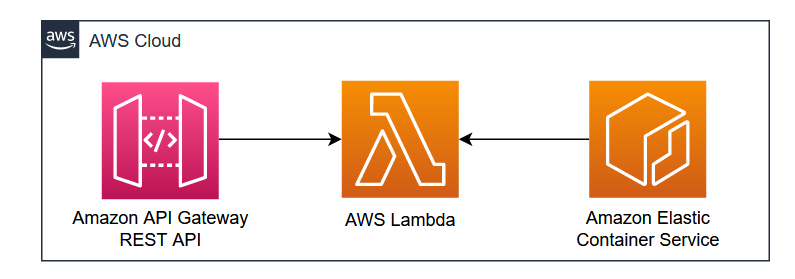

# Deploy ASP.NET Core Web API to AWS Lambda as Container Image

This AWS CDK application demonstrates how to deploy ASP.NET Core Web API (.NET 6) to to AWS Lambda as Container Image.

This pattern uses .NET as a programming language to create the entire AWS CDK stack. Many .NET customers have started their modernization journey by breaking monoliths into micro-services and containerizing them, as it gives them the flexibility to scale, save on costs and run applications consistently across environments. AWS Lambda is one of the most commonly known services on AWS and, this service has helped hundreds of thousands of customers to gain cloud native benefits and modernize their applications on AWS but until recently it did not support packaging containers as functions. But now AWS Lambda enables packaging and deploying functions as container images up to 10 GB. This combines the flexibility and familiarity of container tooling and the agility and operational simplicity of AWS Lambda. This feature will help customers who have invested in container tooling, development workflows and expertise to leverage the full benefits of AWS lambda along with containers. 

## Architecture 


Learn more about this pattern at Serverless Land Patterns: https://serverlessland.com/patterns/apigw-rest-api-lambda-ecr

**Important**: this application uses various AWS services and there are costs associated with these services after the Free Tier usage - please see the [AWS Pricing page](https://aws.amazon.com/pricing/) for details. You are responsible for any AWS costs incurred. No warranty is implied in this example.

## Requirements

* [Create an AWS account](https://portal.aws.amazon.com/gp/aws/developer/registration/index.html) if you do not already have one and log in. The IAM user that you use must have sufficient permissions to make necessary AWS service calls and manage AWS resources.
* [AWS CLI](https://docs.aws.amazon.com/cli/latest/userguide/install-cliv2.html) installed and configured
* [Git Installed](https://git-scm.com/book/en/v2/Getting-Started-Installing-Git)
* [.NET 7](https://dotnet.microsoft.com/en-us/download/dotnet/7.0) installed
* [AWS Cloud Development Kit](https://docs.aws.amazon.com/cdk/latest/guide/cli.html) (AWS CDK) installed

## Deployment Instructions

1. Clone the project to your local working directory.
    ```
    git clone https://github.com/aws-samples/serverless-patterns
    ```
2. Change the working directory.
    ```
    cd apigw-rest-api-lambda-ecr/cdk
    ```
3. Bootstrap AWS Environment.
    ```
    cdk bootstrap
    ```
4. Deploy the stack to your default AWS account and region.
    ```
    cdk deploy
    ```

## Testing

1. After deployment, copy the endpoint URL from cdk deploy execution output and access the URL in browser.

```
https://xxxxxxxxxx.execute-api.eu-west-2.amazonaws.com/prod/

Welcome to running ASP.NET Core on AWS Lambda

https://xxxxxxxxxx.execute-api.eu-west-2.amazonaws.com/prod/api/values

 { "value1", "value2" }
```

## Cleanup

Run the given command to delete the resources that were created. It might take some time for the CloudFormation stack to get deleted.
```
cdk destroy
```
----
Copyright 2023 Amazon.com, Inc. or its affiliates. All Rights Reserved.

SPDX-License-Identifier: MIT-0