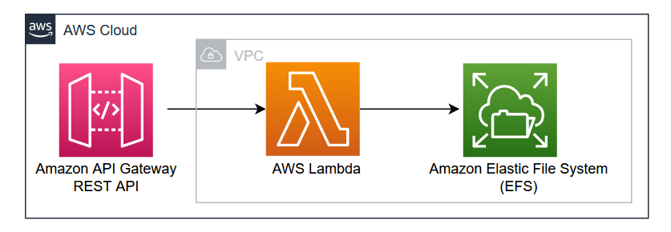

# Accessing Amazon EFS from .NET based AWS Lambda functions

This AWS CDK application demonstrates how to attach, configure and access Amazon EFS from AWS Lambda function.

This pattern provides a solution for accessing the Elastic File System (EFS) from an AWS Lambda. An ideal use case for connecting to EFS from AWS Lambda is processing files shared across multiple components of an application. When an upstream component writes data to a file, and a backend task needs to process the data for a downstream component, using file storage with AWS Lambda yields the desired results. EFS is a serverless, maintenance-free file system that can be accessed by various AWS resources.

## Architecture 


Learn more about this pattern at Serverless Land Patterns: https://serverlessland.com/patterns/apigw-rest-api-lambda-efs-dotnet

**Important**: this application uses various AWS services and there are costs associated with these services after the Free Tier usage - please see the [AWS Pricing page](https://aws.amazon.com/pricing/) for details. You are responsible for any AWS costs incurred. No warranty is implied in this example.

## Requirements

* [Create an AWS account](https://portal.aws.amazon.com/gp/aws/developer/registration/index.html) if you do not already have one and log in. The IAM user that you use must have sufficient permissions to make necessary AWS service calls and manage AWS resources.
* [AWS CLI](https://docs.aws.amazon.com/cli/latest/userguide/install-cliv2.html) installed and configured
* [Git Installed](https://git-scm.com/book/en/v2/Getting-Started-Installing-Git)
* [.NET 7](https://dotnet.microsoft.com/en-us/download/dotnet/7.0) installed
* [AWS Cloud Development Kit](https://docs.aws.amazon.com/cdk/latest/guide/cli.html) (AWS CDK) installed

## Deployment Instructions

1. Clone the project to your local working directory.
    ```
    git clone https://github.com/aws-samples/serverless-patterns
    ```
2. Change the working directory.
    ```
    cd apigw-rest-api-lambda-efs-dotnet/cdk
    ```
3. Bootstrap AWS Environment.
    ```
    cdk bootstrap
    ```
4. Deploy the stack to your default AWS account and region.
    ```
    cdk deploy
    ```

## Testing

1. After deployment, After deployment, copy the endpoint URL from cdk deploy execution output.
2. Open Postman and execute the following request.

```
Method: POST
URL: https://<endpoint url copied from cdk output>/prod/api/EfsDemo
Body: "test"
Output: 
[
    "/mnt/lambdaefs/test.txt"    
]
```

## Cleanup

Run the given command to delete the resources that were created. It might take some time for the CloudFormation stack to get deleted.
```
cdk destroy
```
----
Copyright 2023 Amazon.com, Inc. or its affiliates. All Rights Reserved.

SPDX-License-Identifier: MIT-0
