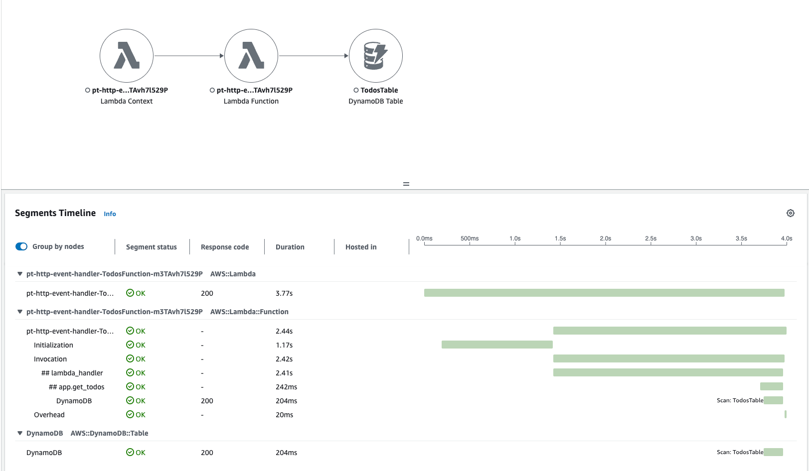
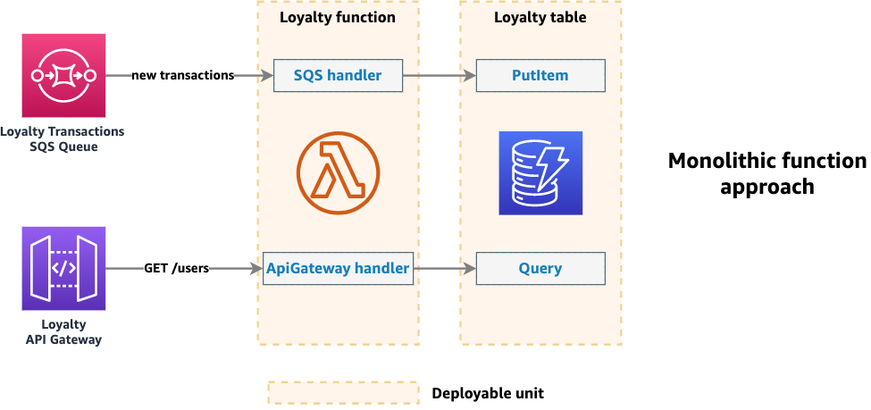

# Api Gateway Rest Api with Powertools for AWS Lambda (Python) Event Handler and DynamoDB

This pattern demonstrates a simple Todos API built using AWS Serverless Application Model (SAM), AWS Lambda, Amazon API Gateway, Powertools for AWS Lambda (Python) and Amazon DynamoDB. The API allows you to create, retrieve, update, and delete todo items.

Learn more about this pattern at Serverless Land Patterns: [Serverless Land Patterns](https://serverlessland.com/patterns)

**Important:** This application uses various AWS services, and there are costs associated with these services after the Free Tier usage. Please see the [AWS Pricing](https://aws.amazon.com/pricing/) page for details. You are responsible for any AWS costs incurred. No warranty is implied in this example.

## Requirements

1. **AWS Account:** Create an AWS account if you do not already have one and log in. The IAM user that you use must have sufficient permissions to make necessary AWS service calls and manage AWS resources.
2. **AWS CLI:** Installed and configured. [AWS CLI Installation Guide](https://docs.aws.amazon.com/cli/latest/userguide/install-cliv2.html)
3. **Git:** Installed. [Git Installation Guide](https://git-scm.com/book/en/v2/Getting-Started-Installing-Git)
4. **AWS SAM:** Installed. [AWS SAM Installation Guide](https://docs.aws.amazon.com/serverless-application-model/latest/developerguide/serverless-sam-cli-install.html)

## Deployment Instructions

1. **Clone the repository:**

    ```bash
    git clone https://github.com/aws-samples/serverless-patterns
    ```

2. **Change directory to the pattern directory:**

    ```bash
    cd serverless-patterns/apigw-rest-api-powertools-eventhandler-python
    ```

3. **Deploy the AWS resources using SAM:**

    ```bash
    sam deploy --guided
    ```

    During the prompts:
    - Enter a stack name
    - Enter the desired AWS Region
    - Allow SAM CLI to create IAM roles with the required permissions.

    Once you have run `sam deploy --guided` mode once and saved arguments to a configuration file (`samconfig.toml`), you can use `sam deploy` in future to use these defaults.

4. **Note the outputs from the SAM deployment process:** These contain the resource names and/or ARNs which are used for testing.

## How it works

This application uses AWS Lambda functions to handle HTTP requests received by API Gateway. The data is stored in a DynamoDB table.

- **API Gateway:** Handles HTTP requests and routes them to the appropriate Lambda function.
- **Lambda Functions:** Contains the logic for creating, retrieving, updating, and deleting todos.
- **DynamoDB:** Stores the todo items.
- **Powertools for AWS Lambda Python:** Uses the [Logger](https://docs.powertools.aws.dev/lambda/python/latest/core/logger/), [Metrics](https://docs.powertools.aws.dev/lambda/python/latest/core/metrics/), [Tracer](https://docs.powertools.aws.dev/lambda/python/latest/core/tracer/) and [Event Handler](https://docs.powertools.aws.dev/lambda/python/latest/core/event_handler/api_gateway/) features.

### Key Features of Powertools for AWS Lambda (Python) Event Handler

- **Lightweight Routing:** Reduces boilerplate for API Gateway REST/HTTP API, ALB, and Lambda Function URLs.
- **Support for CORS, Binary, and Gzip Compression:** Enhances API capabilities.
- **Decimals JSON Encoding:** Provides flexibility in JSON handling.
- **Integration with Event Source Data Classes Utilities:** Self-documents event schema.
- **Supports Micro and Monolithic Functions:** Works with both small and large Lambda functions.
- **Support for OpenAPI and Data Validation:** Validates requests and responses.

### Event Resolvers

A resolver handles request resolution, including one or more routers, and provides access to the current event via typed properties.

For resolvers, Powertools provides:

- `APIGatewayRestResolver`
- `APIGatewayHttpResolver`
- `ALBResolver`
- `LambdaFunctionUrlResolver`
- `VPCLatticeResolver`

This example uses `APIGatewayRestResolver`.

### Dynamic Routes

Dynamic URL paths like `/todos/<todo_id>` allow runtime resolution of `<todo_id>`. Each dynamic route must be part of the function signature to enable keyword argument matching.

### HTTP Methods

Named decorators specify the HTTP method for functions. For example, `app.<http_method>`, where `<http_method>` could be `get`, `post`, `put`, `patch`, or `delete`.

Event Handler resolvers can coerce and validate incoming requests by setting `enable_validation=True`, shifting data validation responsibilities to the resolver and reducing boilerplate code.

### Swagger UI

This example also enables [Swagger UI](https://swagger.io/tools/swagger-ui/) to visualize and interact with your newly auto-documented API.

```python
app.enable_swagger(path="/swagger") 
```

To see the Swagger UI go to `https://<api-id>.execute-api.<region>.amazonaws.com/Prod/swagger`

## Tracer

Tracer is an opinionated thin wrapper for AWS X-Ray Python SDK.

### Key features

- Auto capture cold start as annotation, and responses or full exceptions as metadata
- Auto-disable when not running in AWS Lambda environment
- Support tracing async methods, generators, and context managers
- Auto patch supported modules by AWS X-Ray



## Considerations

To get an up-to-date verions go to the Powertools for AWS Lambda (Python )[documentation](https://docs.powertools.aws.dev/lambda/python/latest/core/event_handler/api_gateway/#considerations)

Event Handler naturally leads to a single Lambda function handling multiple routes for a given service, which can be eventually broken into multiple functions.



A monolithic function means that your final code artifact will be deployed to a single function. This is generally the best approach to start.

### Benefits

- Code reuse. It's easier to reason about your service, modularize it and reuse code as it grows. Eventually, it can be turned into a standalone library.
- No custom tooling. Monolithic functions are treated just like normal Python packages; no upfront investment in tooling.
- Faster deployment and debugging. Whether you use all-at-once, linear, or canary deployments, a monolithic function is a single deployable unit. IDEs like PyCharm and VSCode have tooling to quickly profile, visualize, and step through debug any Python package.

### Downsides

- Cold starts. Frequent deployments and/or high load can diminish the benefit of monolithic functions depending on your latency requirements, due to Lambda scaling model. Always load test to pragmatically balance between your customer experience and development cognitive load.
- Granular security permissions. The micro function approach enables you to use fine-grained permissions & access controls, separate external dependencies & code signing at the function level. Conversely, you could have multiple functions while duplicating the final code artifact in a monolithic approach.
Regardless, least privilege can be applied to either approaches.
- Higher risk per deployment. A misconfiguration or invalid import can cause disruption if not caught earlier in automated testing. Multiple functions can mitigate misconfigurations but they would still share the same code artifact. You can further minimize risks with multiple environments in your CI/CD pipeline.

## Testing

### Unit tests

Unit tests are available on the tests/unit folder.
To run the unit tests

```bash
python -m pytest tests/unit -vv
```

### Endpoint testing

1. **Get all todos:**

    ```bash
    curl https://<api-id>.execute-api.<region>.amazonaws.com/Prod/todos
    ```

2. **Get a specific todo:**

    ```bash
    curl https://<api-id>.execute-api.<region>.amazonaws.com/Prod/todos/<todo_id>
    ```

3. **Create a new todo:**

    ```bash
    curl -X POST -H "Content-Type: application/json" -d '{"task": "New Task", "completed": false}' https://<api-id>.execute-api.<region>.amazonaws.com/Prod/todos
    ```

4. **Update an existing todo:**

    ```bash
    curl -X PUT -H "Content-Type: application/json" -d '{"task": "Updated Task", "completed": true}' https://<api-id>.execute-api.<region>.amazonaws.com/Prod/todos/<todo_id>
    ```

5. **Delete a todo:**

    ```bash
    curl -X DELETE https://<api-id>.execute-api.<region>.amazonaws.com/Prod/todos/<todo_id>
    ```

## Cleanup

To delete the stack and all resources associated with it:

1. **Delete the stack using SAM CLI:**

    ```bash
    sam delete
    ```

This ensures all resources created by the SAM deployment are cleaned up.

---

This README provides a comprehensive overview of the project, including deployment, testing, and cleanup instructions, along with detailed information on the usage of Powertools for AWS Lambda Python.

Copyright 2024 Amazon.com, Inc. or its affiliates. All Rights Reserved.

SPDX-License-Identifier: MIT-0
