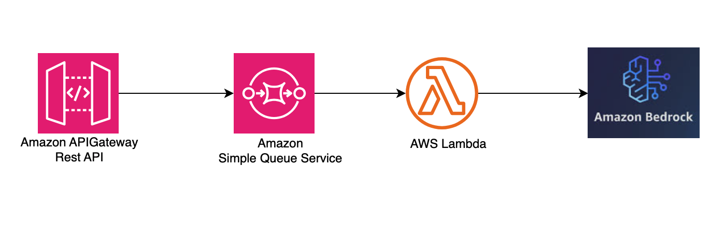

# Amazon API Gateway REST API to SQS to Lambda to Bedrock

This pattern creates an Amazon API Gateway REST API, Amazon SQS queue and an AWS Lambda function that makes a call to a model in Amazon Bedrock.

Learn more about this pattern at Serverless Land Patterns: http://serverlessland.com/patterns/apigw-rest-api-sqs-lambda-bedrock-cdk.

Important: This application uses various AWS services and there are costs associated with these services after the Free Tier usage - please see the [AWS Pricing page](https://aws.amazon.com/pricing/) for details. You are responsible for any AWS costs incurred. No warranty is implied in this example. 

## Requirements

* [Create an AWS account](https://portal.aws.amazon.com/gp/aws/developer/registration/index.html) if you do not already have one and log in. The IAM user that you use must have sufficient permissions to make necessary AWS service calls and manage AWS resources.
* [AWS CLI](https://docs.aws.amazon.com/cli/latest/userguide/install-cliv2.html) installed and configured
* [Git Installed](https://git-scm.com/book/en/v2/Getting-Started-Installing-Git)
* [AWS CDK](https://docs.aws.amazon.com/cdk/v2/guide/getting_started.html)

## Architecture
The following diagram illustrates the solutions architecture

## Deployment Instructions

1. Create a new directory, navigate to that directory in a terminal and clone the GitHub repository:
    ``` 
    git clone https://github.com/aws-samples/serverless-patterns
    ```
1. Change directory to the pattern directory:
    ```
    cd apigw-rest-api-sqs-lambda-bedrock-cdk.
    ```

1. Deploy the stack to your default AWS account and region with Amazon Bedrock availability. The output of this command should give you the REST API URL.
    ```
	cd cdk
    cdk deploy
    ```

## How it works

This pattern creates an Amazon API Gateway REST API, an Amazon SQS queue and an AWS Lambda function. AWS Lambda function consumes messages from SQS using [AWS lambda event source mapping](https://docs.aws.amazon.com/lambda/latest/dg/with-sqs.html). The lambda function then calls Amazon Bedrock using the request from SQS. The Lambda function is set with the max concurrency of 10 (configurable through [cdk.context.json](./cdk/cdk.context.json)). This setting is enabled to make sure the requests does not overwhelm Amazon Bedrock.

To achieve full functionality with this pattern, you must send the response from Lambda function to client using techniques such as websocket or GraphQL subscriptions. This pattern is an asynchronous pattern. For a simple pattern that synchronously call Amazon Bedrock, explore this [synchronous pattern](../apigw-lambda-bedrock-cdk-python). 

## Testing

Upon deployment, you will see the API endpoint URL in the output. It will take the format:

`https://${API_ID}.execute-api.${REGION_NAME}.amazonaws.com/prod/`


1. [Enable the model](https://docs.aws.amazon.com/bedrock/latest/userguide/model-access.html#manage-model-access) in Amazon Bedrock if you have not done before. The model used by the sample is "anthropic.claude-3-5-sonnet-20240620-v1:0".

2. Post the request to the api
```bash
curl -X POST https://${API_ID}.execute-api.${REGION_NAME}.amazonaws.com/prod/invokeModel -d "{\"prompt\":\"Why do LLMs hallucinate?.\"}" -H "Content-Type: application/json"
```

3. If the execution is successful, you will get response similar to
```json
{"SendMessageResponse":{"ResponseMetadata":{"RequestId":"3e68af6a-ef58-5e30-9f8b-f2f505e81d87"},"SendMessageResult":{"MD5OfMessageAttributes":null,"MD5OfMessageBody":"a6a30ffa140e3e258baad55e6ccbb7cb","MD5OfMessageSystemAttributes":null,"MessageId":"5c8fd071-8633-4c8e-bc89-d7689c6692e8","SequenceNumber":null}}}
```

 
## Documentation
- [Tutorial: Build an API Gateway REST API with AWS integration](https://docs.aws.amazon.com/apigateway/latest/developerguide/getting-started-aws-proxy.html)
- [How do I use API Gateway as a proxy for another AWS service?](https://aws.amazon.com/premiumsupport/knowledge-center/api-gateway-proxy-integrate-service/)
- [Amazon Bedrock documentation](https://aws.amazon.com/bedrock)
- [Anthropic Claude Messages API](https://docs.aws.amazon.com/bedrock/latest/userguide/model-parameters-anthropic-claude-messages.html)
- [API Gateway websocket](https://docs.aws.amazon.com/apigateway/latest/developerguide/apigateway-websocket-api.html)
- [Publishing message to IoT Topic](https://serverlessland.com/patterns/apigw-lambda-iot-cdk)


## Cleanup
 
Run the given command to delete the resources that were created. It might take some time for the CloudFormation stack to get deleted.
```
cdk destroy
```

----
Copyright 2021 Amazon.com, Inc. or its affiliates. All Rights Reserved.

SPDX-License-Identifier: MIT-0
