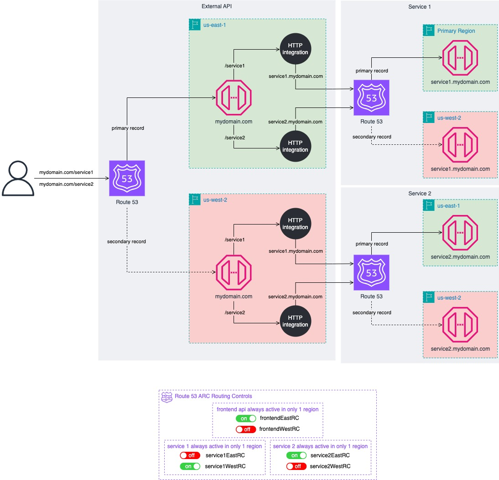
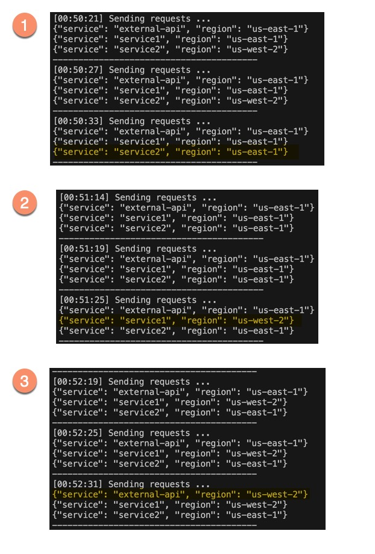

# Serverless patterns - Multi-Region REST API Failover

Companies often have multiple teams managing different services behind a shared public API. In disaster recovery scenarios, each team needs the ability to fail over their services independently.

This pattern demonstrates a multi-region active-passive external API that proxies to independent multi-region active-passive service APIs. The primary and secondary regions can be configured independently for the external API and each internal service. This allows you to fail over the external API and each internal service independently as needed for disaster recovery.



Learn more about this pattern at Serverless Land Patterns: https://serverlessland/patterns/apigateway-multi-region-active-passive-rest-apis

Important: this application uses various AWS services and there are costs associated with these services after the Free Tier usage - please see the [AWS Pricing page](https://aws.amazon.com/pricing/) for details. You are responsible for any AWS costs incurred. No warranty is implied in this example.

## Requirements
* [Create an AWS account](https://portal.aws.amazon.com/gp/aws/developer/registration/index.html) if you do not already have one and log in. The IAM user that you use must have sufficient permissions to make necessary AWS service calls and manage AWS resources.
* [AWS CLI](https://docs.aws.amazon.com/cli/latest/userguide/install-cliv2.html) installed and configured
* [Git Installed](https://git-scm.com/book/en/v2/Getting-Started-Installing-Git)
* [AWS Serverless Application Model](https://docs.aws.amazon.com/serverless-application-model/latest/developerguide/serverless-sam-cli-install.html) (AWS SAM) installed


## Deployment Instructions
Before deploying this application you will need the following:
* A domain name and hosted zone
* An ACM certificate for the domain name **on both regions** you plan to deploy your APIs on.

Please follow the following steps, in this exact order.

1. [Deploy the Route 53 ARC stack](route53/README.md#deployment-instructions )
1. [Deploy the service1 stack](service1/README.md#deployment-instructions)
1. [Deploy the service2 stack](service2/README.md#deployment-instructions)
1. [Deploy the external api stack](external-api/README.md#deployment-instructions)

## How it works

You will deploy 3 applications (external api, service2 and service 2) in two separate regions. The external api (i.e. https://externalapi.mydomain.com) is your entry point to access service 1  (i.e. https://externalapi.mydomain.com/service1) and service 2  (i.e. https://externalapi.mydomain.com/service2). The external api uses public HTTP endpoint integrations (/service1 and /service2) to access service 1 and service 2.

If an issue with the primary region occurs, you can user Route53 ARC to route traffic to the secondary region. You can failover each application (external api, service1 and service2) independently.

This example demonstrates the failover only and does not encompass authentication and data for the multiple regions.


## Testing

Deploy all 3 applications to both primary and secondary regions. Traffic will initially be routed to the primary region only. Use route 53 ARC to independently failover the applications to the primary or secondary region. Route 53 will then route traffic the the new chose region for each service.

Edit the test.sh file on lines 3-5 to point to your api endpoint. Then give that file execution permissions and run it:

```bash
chmod +x ./test/sh
./test.sh
```

It will send an HTTP request to each oneof your 3 endepoints every 5 minutes. You can then failover your services independently and see the responses being served from different regions.

For example, on the test below, we initially had the external api and service 1 routing traffic to us-east-1. Service 2 was initially routing traffic to us-west-2.




1. We failed over service2 from us-west-2 to us-east-1.
1. We failed over service1 from us-east-1 to us-west-2.
1. We failed over the external api from us-east-1 to us-west-2.

> Notes: Each service (external app, service1 and servce 2) have their own Route 53 ARC control pannel. To manage [routing controls](https://docs.aws.amazon.com/r53recovery/latest/dg/routing-control.html) for each service, you need to use their specific control panels. You can check the [route53 stack](./route53/README.md) outputs to see the details for each control panel.


## Cleanup

Please follow the following steps, in this exact order.

1. [Delete service1 stacks](service1/README.md#cleanup)
1. [Delete service2 stacks](service2/README.md#cleanup)
1. [Delete the external stacks](external-api/README.md#cleanup)
1. [Delete the Route 53 ARC stack](route53/README.md#cleanup)

----
Copyright 2023 Amazon.com, Inc. or its affiliates. All Rights Reserved.

SPDX-License-Identifier: MIT-0