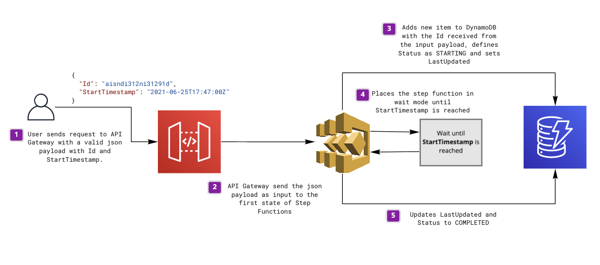

# API Gateway REST API endpoint to Step Functions 

This SAM template deploys a REST API endpoint integrated with a Step Functions workflow that returns a response immediately. 

The Step Function receives an `Id` and a `StartTimestamp` as inputs and as a first step it adds the `Id` to a DynamoDB table and the status of `STARTING`. Then waits for the `StartTimestamp` to be reached and only after updates the status of that same `Id` in DynamoDB to `COMPLETE`.



Learn more about this pattern at Serverless Land Patterns: https://serverlessland.com/patterns/apigw-rest-stepfunction

**Important:** this application uses various AWS services and there are costs associated with these services after the Free Tier usage - please see the [AWS Pricing page](https://aws.amazon.com/pricing/) for details. You are responsible for any AWS costs incurred. No warranty is implied in this example.

## Requirements

* [Create an AWS account](https://portal.aws.amazon.com/gp/aws/developer/registration/index.html) if you do not already have one and log in. The IAM user that you use must have sufficient permissions to make necessary AWS service calls and manage AWS resources.
* [AWS CLI](https://docs.aws.amazon.com/cli/latest/userguide/install-cliv2.html) installed and configured
* [Git Installed](https://git-scm.com/book/en/v2/Getting-Started-Installing-Git)
* [AWS Serverless Application Model](https://docs.aws.amazon.com/serverless-application-model/latest/developerguide/serverless-sam-cli-install.html) (AWS SAM) installed

## Deployment Instructions

1. Create a new directory, navigate to that directory in a terminal and clone the GitHub repository:
    ``` 
    git clone https://github.com/aws-samples/serverless-patterns
    ```
1. Change directory to the pattern directory:
    ```
    cd apigw-rest-stepfunction
    ```
1. From the command line, use AWS SAM to deploy the AWS resources for the pattern as specified in the template.yml file:
    ```
    sam deploy --guided
    ```
1. During the prompts:
    * Enter a stack name
    * Enter the desired AWS Region
    * Allow SAM CLI to create IAM roles with the required permissions.

    Once you have run `sam deploy --guided` mode once and saved arguments to a configuration file (samconfig.toml), you can use `sam deploy` in future to use these defaults.

1. Note the outputs from the SAM deployment process. These contain the resource names and/or ARNs which are used for testing.

## How it works

**AWS Console:**

* Send a `POST` request to the REST API endpoint with a json payload like the following:
  ```json
    {
      "Id": "4f30bb61-39bc-47f2-91c6-a7dba009f919",
      "StartTimestamp": "2021-06-25T17:47:00Z"
    }
    ```
* The REST API integration will start an execution of the Step Function that immediatelly returns to API Gateway. 
* The Step Function adds a new row to a DynamoDB table with the Id provided as input and the Status as `STARTING`.
* The Step Function waits for the StartTimestamp provided as input to be reached before moving to the last task.
* The Step Function changes the status of the Id provided as input to `COMPLETED`.

## Testing

Sign in to your aws console at https://console.aws.amazon.com
2. Go to the API Gateway service
3. Select the **waitable-stepfunction-pattern-api** API 
   > this is the default name on the SAM template. If you changed it the API may have a different name
4. Select the **POST** method on the resources tab
5. Select the **Test** button on the right panel
6. Specify a valid json payload as the **request body**, like so:
    ```json
    {
      "Id": "4f30bb61-39bc-47f2-91c6-a7dba009f919",
      "StartTimestamp": "2021-06-25T17:47:00Z"
    }
    ```
7. Press the **Test** button. 
You should get a valid response.

## Cleanup
 
1. Delete the stack
    ```bash
    aws cloudformation delete-stack --stack-name STACK_NAME
    ```
1. Confirm the stack has been deleted
    ```bash
    aws cloudformation list-stacks --query "StackSummaries[?contains(StackName,'STACK_NAME')].StackStatus"
    ```
----
Copyright 2021 Amazon.com, Inc. or its affiliates. All Rights Reserved.

SPDX-License-Identifier: MIT-0
