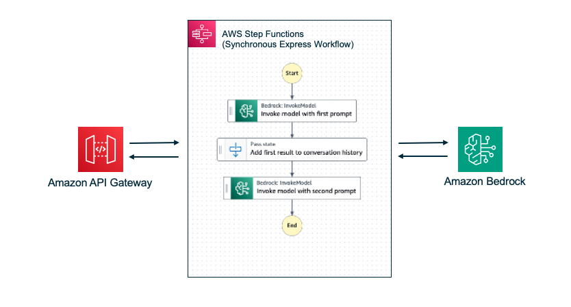

# Prompt Chaining with Amazon API Gateway, AWS Step Functions and Amazon Bedrock.

The AWS Serverless Application Model (SAM) template deploys an Amazon API Gateway HTTP API endpoint connected to an AWS Step Functions state machine. This example demonstrates how to invoke an Express state machine synchronously and utilize AWS Step Functions intrinsic functions to chain two prompts, which are then used to invoke the Amazon Bedrock language model. The output from the state machine execution is returned to the client within 29 seconds, using the HTTP API. This no-code example showcases how the results from the first prompt can be used to provide context for the second prompt, allowing the language model to deliver a highly-curated response. By chaining these prompts, the system can leverage the capabilities of the language model to generate more meaningful and contextual outputs.

Learn more about this pattern at [Serverless Land Patterns](https://serverlessland.com/patterns/apigw-rest-stepfunctions-express-sync-bedrock-sam)

Important: this application uses various AWS services and there are costs associated with these services after the Free Tier usage - please see the [AWS Pricing page](https://aws.amazon.com/pricing/) for details. You are responsible for any AWS costs incurred. No warranty is implied in this example.

## Requirements

* [Create an AWS account](https://portal.aws.amazon.com/gp/aws/developer/registration/index.html) if you do not already have one and log in. The IAM user that you use must have sufficient permissions to make necessary AWS service calls and manage AWS resources.
* [AWS CLI](https://docs.aws.amazon.com/cli/latest/userguide/install-cliv2.html) installed and configured
* [Git Installed](https://git-scm.com/book/en/v2/Getting-Started-Installing-Git)
* [AWS Serverless Application Model](https://docs.aws.amazon.com/serverless-application-model/latest/developerguide/serverless-sam-cli-install.html) (AWS SAM) installed
* [NOTE! Manage Access to Amazon Bedrock Foundation Models](https://docs.aws.amazon.com/bedrock/latest/userguide/model-access.html) at the time of writing, this example uses Amazon Bedrock foundation model cohere.command-text-v14


## Deployment Instructions

1. Create a new directory, navigate to that directory in a terminal and clone the GitHub repository:
    ``` 
    git clone https://github.com/aws-samples/serverless-patterns
    ```
2. Change directory to the pattern directory:
    ```
    cd apigw-rest-stepfunctions-express-sync-bedrock-sam
    ```
3. From the command line, use AWS SAM build to prepare an application for subsequent steps in the developer workflow, such as local testing or deploying to the AWS Cloud:
    ```
    sam build
    ```    
4. From the command line, use AWS SAM to deploy the AWS resources for the pattern as specified in the template.yml file:
    ```
    sam deploy --guided
    ```
5. During the prompts:
    * Enter a stack name
    * Select the desired AWS Region
    * Allow SAM to create roles with the required permissions if needed.

6. Note the outputs from the SAM deployment process. These contain the resource names and/or ARNs which are used for testing.
 
## Architecture


## How it Works
In this example, the state machine is invoked with a JSON payload
```asl
{
  "prompt_one": "Write a 500 word blog post on The Beatles"
}
```
During execution, the Task state calls the Bedrock API and the response is passed to the task 'result_one'.
```asl
{
  "result_one.$": "$.Body.generations[0].text"
}
```
A Pass state is then used to format the data using an Intrinsic Function (States.) which is passed to the next state.
```asl
{
  "convo_one.$": "States.Format('{}',$.result_one.result_one)"
}
```
The second prompt is then executed with new instructions and the results from the first execution. This provides the prompt with more context
```asl
{
  "prompt.$": "States.Format('{}\n{}','Human: Now write a short story based on the following. Assistant:', $.convo_one.convo_one)",
  "max_tokens": 1000
}
```
By default, the state then sends the task result as output.


## Testing

The stack will output the **api endpoint**. You can use *Postman* or *curl* to send a POST request to the API Gateway endpoint.
   
```
curl -H "Content-type: application/json" -X POST -d '{"prompt_one": "Write a 500 word blog post on The Beatles"}' <Your API endpoint>

```
After runnning the above command, API Gateway will invoke the State machine and return the results back to the client instead of just the State machine's execution Id. 

## Cleanup
 
1. Delete the stack
    ```bash
    sam delete
    ```
2. Confirm the stack has been deleted
    ```bash
    aws cloudformation list-stacks --query "StackSummaries[?contains(StackName,'STACK_NAME')].StackStatus"
    ```
----
Copyright 2024 Amazon.com, Inc. or its affiliates. All Rights Reserved.

SPDX-License-Identifier: MIT-0