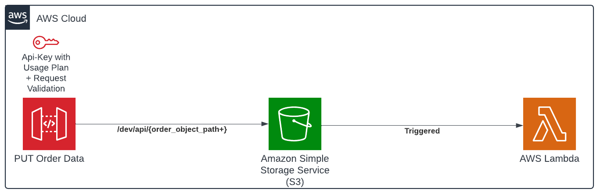

# REST API as an Amazon S3 proxy in Amazon API Gateway

This pattern uses the Serverless Framework to deploy a REST API via Amazon API Gateway, acting as an Amazon S3 proxy for write operations. 
It includes API-Key setup, request body validator, AWS Lambda function invocation on S3 events, and enables CloudWatch Logs and X-Ray tracing for API Gateway and Lambda using Powertools for AWS Lambda.

Learn more about this pattern
at [Serverless Land Patterns](https://serverlessland.com/patterns/apigw-s3-lambda-sls-py).

**Important**: this application uses various AWS services and there are costs associated with these services after the Free
Tier usage - please see the [AWS Pricing page](https://aws.amazon.com/pricing/) for details. You are responsible for any
AWS costs incurred. No warranty is implied in this example.

## Requirements

* [Create an AWS account](https://portal.aws.amazon.com/gp/aws/developer/registration/index.html) if you do not already
  have one and log in. The IAM user that you use must have sufficient permissions to make necessary AWS service calls
  and manage AWS resources.
* [AWS CLI](https://docs.aws.amazon.com/cli/latest/userguide/install-cliv2.html) installed and configured
* [Git](https://git-scm.com/book/en/v2/Getting-Started-Installing-Git) installed
* [Python 3](https://www.python.org/downloads/) installed
* [Serverless Framework](https://www.serverless.com/framework/docs/getting-started) installed
* [Powertools for AWS Lambda (Python)](https://docs.powertools.aws.dev/lambda/python/latest/)

## Setup and Deployment Instructions

1. Create a new directory, navigate to that directory in a terminal and clone the GitHub repository:
    ```commandline
    git clone https://github.com/aws-samples/serverless-patterns
    ```
2. Change directory to the pattern directory:
    ```commandline
    cd apigw-s3-lambda-sls-py
    ```
3. Install dependencies:
    ```commandline
    pipenv install
    ```
4. Install following Serverless (sls) Framework plugins:
    ```commandline
    sls plugin install -n serverless-python-requirements
    ```
   - `serverless-python-requirements` plugin will automatically detect `Pipfile` and pipenv installed and generate a `requirements.txt` file

5. Deploy the services specified in [serverless.yml](./serverless-compose.yml) by running:
   ```commandline
      sls deploy --stage dev --verbose
   ```
6. The outputs from the Serverless deployment process contain the resource names, IDs and/or ARNs which are used for
   testing.


## How it works

The high-level diagram below serves to visually represent this pattern.



This setup involves creating and launching a REST API using API Gateway, allowing direct writing to an Amazon S3 bucket without additional services. 
It utilizes the open-source Serverless framework for deployment. The pattern includes setting up API keys with Usage Plan, Request Body Validator, and triggering Lambda functions on S3 events.
Additionally, this setup establishes Cloudwatch logs and X-Ray tracing for both API Gateway and Lambda, harnessing the capabilities of Powertools specifically for Lambda functions.

## Testing

#### I. Happy Path

This setup can be tested using the [curl command](https://github.com/curl/curl/blob/master/docs/MANUAL.md) or  [xh utility](https://github.com/ducaale/xh)  by accessing the `PUT /dev/api/{order_object_path+}
` endpoint. 

In this context, the inclusion of 'suffix' alongside 'order_object_path' suggests that we have the flexibility to substitute multiple folders in place of 'order_object_path'.

```commandline
xh put https://${ApiGatewayRestApi}.execute-api.${AWS::Region}.amazonaws.com/${sls:stage}/api/orders_recevied/order001.json X-Api-Key:<Api-Key> orderDate=2024-02-06 orderPaymentAmount:=23.99 orderPaymentCurrency=USD customerId:=10002
```
_Or_

```commandline

curl --request PUT \
  --url https://${ApiGatewayRestApi}.execute-api.${AWS::Region}.amazonaws.com/${sls:stage}/api/orders_recevied/order001.json \
  --header 'x-api-key:<Api-Key>' \
  --data '{
		"orderId": 10023,
		"orderDate": "2024-02-03",
		"orderPaymentAmount": 23.99,
		"orderPaymentCurrency": "USD",
		"customerId": 100023
}'
```
Response:

```commandline
HTTP/2.0 200 OK
content-length: 0
content-type: application/json
date: Wed, 07 Feb 2024 01:54:37 GMT
x-amz-apigw-id: SvhitG7XoAMEifg=
x-amzn-requestid: 1dd4f2f1-f5ac-46d6-8f65-0d60d4370f0b
x-amzn-trace-id: Root=1-65c2e2dd-737319bc469770c954e78a1c

```

#### II. Testing Request Validator:
In this scenario, a value of "ZZZ" is passed for `orderPaymentCurrency` in the request body, which is not among the permitted values.

```commandline
xh put https://${ApiGatewayRestApi}.execute-api.${AWS::Region}.amazonaws.com/${sls:stage}/api/orders_recevied/order001.json X-Api-Key:<Api-Key> orderDate=2024-02-06 orderPaymentAmount:=23.99 orderPaymentCurrency=ZZZ customerId:=10002
```
_Or_

```commandline

curl --request PUT \
  --url https://${ApiGatewayRestApi}.execute-api.${AWS::Region}.amazonaws.com/${sls:stage}/api/orders_recevied/order001.json \
  --header 'x-api-key:<Api-Key>' \
  --data '{
		"orderId": 10023,
		"orderDate": "2024-02-03",
		"orderPaymentAmount": 23.99,
		"orderPaymentCurrency": "ZZZ",
		"customerId": 100023
}'
```
Response:

```commandline
HTTP/2.0 400 Bad Request
content-length: 35
content-type: application/json
date: Wed, 07 Feb 2024 03:20:21 GMT
x-amz-apigw-id: SvuGdFUPIAMERkg=
x-amzn-errortype: BadRequestException
x-amzn-requestid: 08b9ba47-24f1-430c-8568-cf7c52f39b1f
x-amzn-trace-id: Root=1-65c2f6f5-79d73edc65b20ee1272f2fb0

{
    "message": "Invalid request body"
}
```

#### III. Test without/incorrect API Key:
```commandline
xh put https://${ApiGatewayRestApi}.execute-api.${AWS::Region}.amazonaws.com/${sls:stage}/api/orders_recevied/order001.json orderDate=2024-02-06 orderPaymentAmount:=23.99 orderPaymentCurrency=USD customerId:=10002
```
_Or_

```commandline

curl --request PUT \
  --url https://${ApiGatewayRestApi}.execute-api.${AWS::Region}.amazonaws.com/${sls:stage}/api/orders_recevied/order001.json \
  --data '{
		"orderId": 10023,
		"orderDate": "2024-02-03",
		"orderPaymentAmount": 23.99,
		"orderPaymentCurrency": "USD",
		"customerId": 100023
}'
```
Response:

```commandline
HTTP/2.0 403 Forbidden
content-length: 23
content-type: application/json
date: Wed, 07 Feb 2024 03:32:23 GMT
x-amz-apigw-id: Svv3PHS_oAMEP6Q=
x-amzn-errortype: ForbiddenException
x-amzn-requestid: a3e5283d-827b-4e32-b1cc-9e4b28154bce
x-amzn-trace-id: Root=1-65c2f9c7-6fa15f204c6b011527ee7c54

{
    "message": "Forbidden"
}
```

## Cleanup

1. Delete the stack
    ```commandline
    sls remove --verbose
    ```
----
Copyright 2024 Amazon.com, Inc. or its affiliates. All Rights Reserved.

SPDX-License-Identifier: MIT-0
