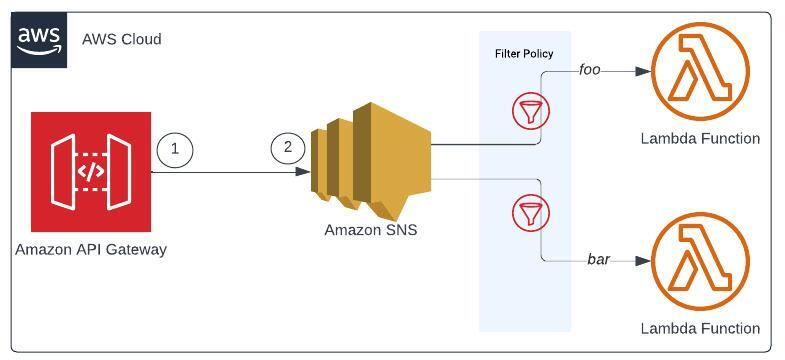

# REST API as an Amazon SNS proxy in Amazon API Gateway with SNS Filter Policy

This pattern leverages the Serverless Framework to deploy a REST API via Amazon API Gateway, functioning as an Amazon SNS proxy. It incorporates SNS Filter Policy for triggering Lambda functions based on MessageBody filters. Additionally, it enables CloudWatch Logs and X-Ray tracing for both API Gateway and Lambda through the Powertools for AWS Lambda developer toolkit.

Learn more about this pattern
at [Serverless Land Patterns](https://serverlessland.com/patterns/apigw-sns-filter-policy-lambda-sls-py).

**Important**: this application uses various AWS services and there are costs associated with these services after the Free
Tier usage - please see the [AWS Pricing page](https://aws.amazon.com/pricing/) for details. You are responsible for any
AWS costs incurred. No warranty is implied in this example.

## Requirements

* [Create an AWS account](https://portal.aws.amazon.com/gp/aws/developer/registration/index.html) if you do not already
  have one and log in. The IAM user that you use must have sufficient permissions to make necessary AWS service calls
  and manage AWS resources.
* [AWS CLI](https://docs.aws.amazon.com/cli/latest/userguide/install-cliv2.html) installed and configured
* [Git](https://git-scm.com/book/en/v2/Getting-Started-Installing-Git) installed
* [Python 3](https://www.python.org/downloads/) installed
* [Serverless Framework](https://www.serverless.com/framework/docs/getting-started) installed
* [Powertools for AWS Lambda (Python)](https://docs.powertools.aws.dev/lambda/python/latest/)

## Setup and Deployment Instructions

1. Create a new directory, navigate to that directory in a terminal and clone the GitHub repository:
    ```commandline
    git clone https://github.com/aws-samples/serverless-patterns
    ```
2. Change directory to the pattern directory:
    ```commandline
    cd apigw-sns-filter-policy-lambda-sls-py
    ```
3. Install dependencies:
    ```commandline
    pipenv install
    ```
4. Install following Serverless (sls) Framework plugins:
    ```commandline
    sls plugin install -n serverless-python-requirements
    sls plugin install -n serverless-apigateway-service-proxy
    ```
   - `serverless-python-requirements` plugin will automatically detect `Pipfile` and pipenv installed and generate a `requirements.txt` file
   - `serverless-apigateway-service-proxy` plugin supports the AWS service proxy integration feature of API Gateway

5. Deploy the services specified in [serverless.yml](./serverless-compose.yml) by running:
   ```commandline
      sls deploy --verbose
   ```
6. The outputs from the Serverless deployment process containing the resource names, IDs and/or ARNs which are used for
   testing.


## How it works

The high-level diagram below serves to visually represent this pattern.



This pattern enables the ingestion of API Gateway payloads, which are then forwarded to AWS Simple Notification Service (SNS). 
Subsequently, SNS triggers Lambda functions with a filter policy scoped on the MessageBody for processing. 
This pattern uses AWS Lambda Powertools, a framework providing built-in support for Event Source integration, CloudWatch Logging, and X-Ray Tracing. 

## Testing

This setup can be tested using the [curl command](https://github.com/curl/curl/blob/master/docs/MANUAL.md) or  [xh utility](https://github.com/ducaale/xh)  by accessing the `POST /dev/notify-status
` endpoint. 

#### I. Happy Path: Processing _foo_ status

In this case, the SNS Event `filterPolicy` triggers the Lambda function [process_foo_status.py](./functions/process_foo_status.py)

```commandline
xh post https://${ApiGatewayRestApi}.execute-api.${AWS::Region}.amazonaws.com/${sls:stage}/notify-status status=foo id:=1234
```
_Or_
```commandline

curl --request POST \
  --url https://${ApiGatewayRestApi}.execute-api.${AWS::Region}.amazonaws.com/${sls:stage}/notify-status \
  --data '{ "status": "foo", "id": 1234 }'
```
Response:

```commandline
HTTP/2.0 200 OK
access-control-allow-origin: *
content-length: 25
content-type: application/json
date: Sun, 18 Feb 2024 03:21:13 GMT
via: 1.1 7c77abdf1c625c25627fe2a24e660a34.cloudfront.net (CloudFront)
x-amz-apigw-id: TT-ijFJGoAMERTA=
x-amz-cf-id: F-BiUAoBavUHDtNICCn2bsjS5_bTn9_RZOmoWDb0F9_kNoyun87p8A==
x-amz-cf-pop: IAD12-P3
x-amzn-requestid: 1018e5b4-f1d9-4e5c-bdd4-8e20ab850558
x-amzn-trace-id: Root=1-65d177a9-69642f763f4c955339553fc5
x-cache: Miss from cloudfront

{
    "message": "accepted"
}

```

#### II. Happy Path: Processing _bar_ status

In this case, the SNS Event `filterPolicy` triggers the Lambda function [process_bar_status.py](./functions/process_bar_status.py)


```commandline
xh post https://${ApiGatewayRestApi}.execute-api.${AWS::Region}.amazonaws.com/${sls:stage}/notify-status status=bar id:=3456
```
_Or_
```commandline

curl --request POST \
  --url https://${ApiGatewayRestApi}.execute-api.${AWS::Region}.amazonaws.com/${sls:stage}/notify-status \
  --data '{ "status": "bar", "id": 3456 }'
```
Response:

```commandline
HTTP/2.0 200 OK
content-length: 25
content-type: application/json
date: Thu, 07 Mar 2024 01:28:54 GMT
via: 1.1 25e2963eb5d8a7965bc8b98c455aab48.cloudfront.net (CloudFront)
x-amz-apigw-id: UPC9nGpgIAMEVJA=
x-amz-cf-id: sMyaiXv8-3bruolw3xE4jf6f8ZivTR__OAxSmhUGqeFdrpnOHW28FQ==
x-amz-cf-pop: IAD66-C2
x-amzn-requestid: 35684aff-dded-437e-9cf2-cf01261fc879
x-amzn-trace-id: Root=1-65e91856-37946f7a6b13a89b07dcc7dc
x-cache: Miss from cloudfront

{
    "message": "accepted"
}

```


#### III. Testing Request Validator:

In this scenario, a value of "fooo" is passed for `status` in the request body, which is not among the permitted values.

```commandline
xh post https://${ApiGatewayRestApi}.execute-api.${AWS::Region}.amazonaws.com/${sls:stage}/notify-status status=fooo id:=999
```
_Or_
```commandline

curl --request POST \
  --url https://${ApiGatewayRestApi}.execute-api.${AWS::Region}.amazonaws.com/${sls:stage}/notify-status \
  --header 'x-api-key: ndaIVEw5lW2UjuhOnO3n8134g5yqqRPW37uhOaha' \
  --data '{ "status": "fooo", "id": 999 }'
```
Response:

```commandline
HTTP/2.0 400 Bad Request
content-length: 35
content-type: application/json
date: Thu, 07 Mar 2024 01:25:03 GMT
via: 1.1 91edf3d46098c7786cee1900c8e34990.cloudfront.net (CloudFront)
x-amz-apigw-id: UPCZdES-IAMErsQ=
x-amz-cf-id: mO30ngbgTHl12b7iJtkuvqqhCPlt07eyHHCZ3krFOr-1nDZMICJefA==
x-amz-cf-pop: IAD66-C2
x-amzn-errortype: BadRequestException
x-amzn-requestid: 37cae0c7-8d0e-4d76-bb91-1a1e7f511c45
x-amzn-trace-id: Root=1-65e9176f-54f1ef9c4480ac037089386e
x-cache: Error from cloudfront

{
    "message": "Invalid request body"
}
```
## Cleanup

1. Delete the stack
    ```commandline
    sls remove --verbose
    ```
----
Copyright 2024 Amazon.com, Inc. or its affiliates. All Rights Reserved.

SPDX-License-Identifier: MIT-0
