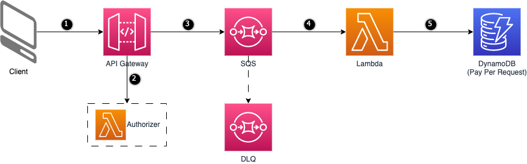

# Amazon API Gateway to Amazon SQS to AWS Lambda to Amazon DynamoDB

This pattern explains how to deploy an application with Amazon API Gateway, Amazon SQS, AWS Lambda, AWS Secrets Manager and Amazon DynamoDB through AWS CDK with Python.

This pattern is useful to accept and respond to requests quickly but offloading the processing as asynchronous process e.g., webhook endpoints. Once the request is placed in SQS, API gateway responds back to the caller immediately without waiting for those messages to be processed.

When an HTTP POST request is made to the Amazon API Gateway endpoint, Gateway authorizes the request by checking Basic auth credentials against values in AWS Secrets manager. When credentials are valid, request payload is sent to Amazon Simple Queue Service. AWS Lambda function consumes event from the Queue and inserts the event/payload into the Amazon DynamoDB table. Amazon Simple Queue Service is also configured with a Dead Letter Queue where events are sent when retries to process those messages are repeatedly failed.

Key Benefits:
- Operations: AWS services used in this pattern can scale easily and quickly based on incoming traffic.
- Security: The APIs created with Amazon API Gateway expose HTTPS endpoints only. All user data stored in Amazon DynamoDB and Amazon SQS is fully encrypted at rest. Secrets are securely stored in AWS Secrets Manager.
- Reliability: A dead-letter queue ensures no messages are lost due to issues. Helps debugging failed messages and once underlying issue is resolved, messages can be redrived back to source queues for processing.
- Performance: AWS Lambda supports batching with Amazon SQS. Lambda reads messages in batches and invokes the function once for each batch.
- Cost: Pay only for what you use. No minimum fee.


Important: this application uses various AWS services and there are costs associated with these services after the Free Tier usage - please see the [AWS Pricing page](https://aws.amazon.com/pricing/) for details. You are responsible for any AWS costs incurred. No warranty is implied in this example.

## Requirements

* [Create an AWS account](https://portal.aws.amazon.com/gp/aws/developer/registration/index.html) if you do not already have one and log in. The IAM user that you use must have sufficient permissions to make necessary AWS service calls and manage AWS resources.
* [AWS CLI](https://docs.aws.amazon.com/cli/latest/userguide/install-cliv2.html) installed and configured
* [Git](https://git-scm.com/book/en/v2/Getting-Started-Installing-Git) installed
* [Python](https://www.python.org/downloads/) Python 3.7 or later including pip and virtualenv
* [Node.js](https://nodejs.org/en/download) installed in order to use npm for installing the AWS CDK
* [AWS CDK](https://docs.aws.amazon.com/cdk/v2/guide/getting_started.html#getting_started_prerequisites) installed


## Deployment Instructions

1. Create a new directory, navigate to that directory in a terminal and clone the GitHub repository:
    ```
    git clone https://github.com/aws-samples/serverless-patterns
    ```
1. Change directory to the pattern directory:
    ```
    cd apigw-sqs-lambda-ddb-cdk
    ```
1. Create a virtual environment for Python
    ```
    python3 -m venv .venv
    ```
1. Activate the virtual environment (Linux)
    ```
    source .venv/bin/activate
    ```
    Activate the virtual environment (Windows/Powershell)
    ```
    .venv\Scripts\activate.ps1
    ```
1. Install the Python required dependencies:
    ```
    pip install -r requirements.txt
    ```
1. Make sure you are properly authenticated in your AWS CLI for your AWS Account:
    ```
    aws sts get-caller-identity
    ```
1. Bootstrap your AWS Account. Bootstrapping is the process of creating containers in the AWS account and region you are deploying to. Many of the AWS CDK stacks you deploy include assets and external files, such as AWS Lambda functions or Docker images. The CDK uploads these assets and files to the containers created during bootstrapping, so they can be available to AWS CloudFormation during deployment.
    ```
    cdk bootstrap
    ```
1. Everything should be ready for deployment. Lets first validate our code with `cdk synth`. This will generate the cloud formation template, based on our python code. This step is not mandatory, but advised:
    ```
    cdk synth
    ```
1. No errors should appeared in the previous step. Now lets deploy the application:
    ```
    cdk deploy
    ```
    All changes that CDK will perform are displayed. Confirm with `y` to continue.


## How it works



- This pattern deploys an Amazon API Gateway HTTP API with route /submit configured with basic authentication.
- On receiving a request, API Gateway will invoke a Lambda authorizer which validates the request and returns a policy informing API Gateway to accept or deny the request.
- When request is accepted, API Gateway sends the message payload to a queue in SQS. SQS uses another queue as Dead Letter Queue to send the messages in case of continued failures to process the messages from downstream lambda.
- Messages from SQS is posted to a lambda function to process them.
- Lambda function receives the messages from SQS and saves them into a DynamoDB table.

## Testing

Once the application is deployed, follow the below steps to test this pattern:

### Retrieve Information
- Retrieve the HttpApiEndpoint value from CloudFormation Outputs
- Retrieve the username and password from Secrets Manager in AWS Console. Base64 encoding of username and password joined by a single colon : will be used as {Credential} in Authorization header.

Example Base64 Encode (Linux):
```
echo -n "myUsername:myPassword" | base64
```

Example Base64 Encode (Windows/Powershell):
```
[System.Convert]::ToBase64String([System.Text.Encoding]::UTF8.GetBytes("myUsername:myPassword"))
```
### Construct Request
- Replace the placeholders in the Curl request given below with retrieved values.
- Region: AWS Region used for deployment e.g., us-east-1

Example POST Request (Linux):
```
curl --location 'https://{HttpApiEndpoint}.execute-api.{Region}.amazonaws.com/submit' \
--header 'Content-Type: application/json' \
--header 'Authorization: Basic {Credentials}' \
--data '{
    "eventId": "f5337ee6-e13e-4bcb-8082-872898b5d1a8",
    "message": "Sample message for testing"
}'
```

Example POST Request (Windows):
```
curl --location 'https://{HttpApiEndpoint}.execute-api.{Region}.amazonaws.com/submit' `
--header 'Content-Type: application/json' `
--header 'Authorization: Basic {Credentials}' `
--data '{
    "eventId": "f5337ee6-e13e-4bcb-8082-872898b5d1a8",
    "message": "Sample message for testing"
}'
```

### Verify
- Execute the fully formed Curl request and verify that you received a successful response with an XML message. Response is basically an XML representation of SQS SendMessage response.
Example:
```
<?xml version="1.0"?>
<SendMessageResponse xmlns="http://queue.amazonaws.com/doc/2012-11-05/">
    <SendMessageResult>
        <MessageId>9c22e4eb-09f6-4374-95b8-f6030f33da33</MessageId>
        <MD5OfMessageBody>93355f3c10001c53dcae387ea9d5b71e</MD5OfMessageBody>
    </SendMessageResult>
    <ResponseMetadata>
        <RequestId>84728dba-affe-50d7-8e62-d08a5bb32a38</RequestId>
    </ResponseMetadata>
</SendMessageResponse>
```

- View the contents of DynamoDB Table "EventTable" from AWS Console and verify that JSON data used in your payload is saved as a record.


### Steps To Verify Dead-Letter Queue

- Messages should be moved to Dead-Letter Queue when there's repeated failures in processing the message by Lambda function.
- Lambda which consumes the message from source queue (BufferingQueue) expects the message to be in JSON format. When the message is not in JSON format, it will fail to process it. To verify that messages are moved to Dead-Letter Queue, use a request which doesn't use a JSON payload. Example (Linux):
```
curl --location 'https://{HttpApiEndpoint}.execute-api.{Region}.amazonaws.com/submit' \
--header 'Content-Type: application/json' \
--header 'Authorization: Basic {Credentials}' \
--data 'Test Message'
```

Example (Windows):
```
curl --location 'https://{HttpApiEndpoint}.execute-api.{Region}.amazonaws.com/submit' `
--header 'Content-Type: application/json' `
--header 'Authorization: Basic {Credentials}' `
--data 'Test Message'
```
- After few minutes, login to AWS console and verify that the Dead-Letter queue (DeadLetterQueue) has available messages greater than 0. You can also try "Poll for messages" in this queue to verify the message body.

## Cleanup

Delete the stack
```bash
cdk destroy
```

----
Copyright 2023 Amazon.com, Inc. or its affiliates. All Rights Reserved.

SPDX-License-Identifier: MIT-0