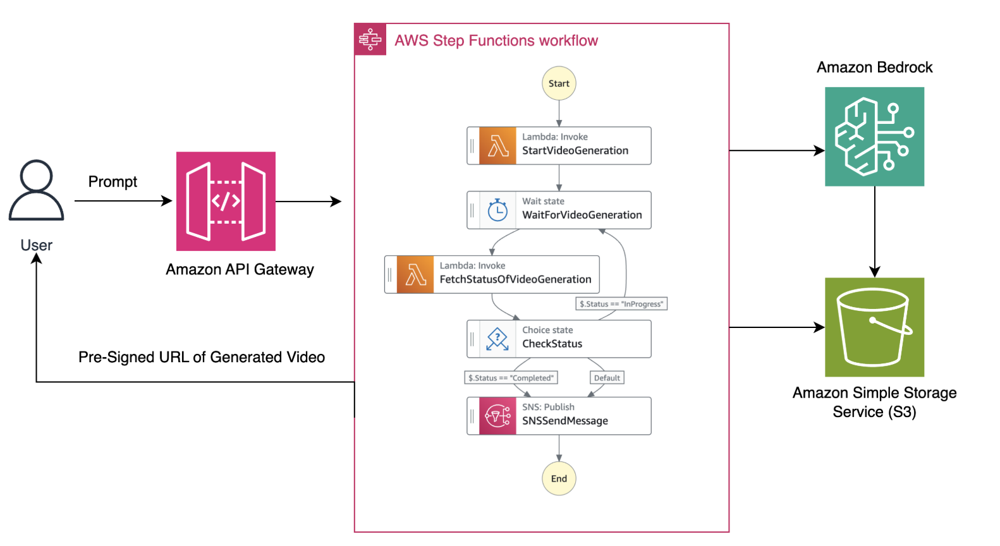
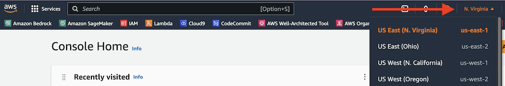
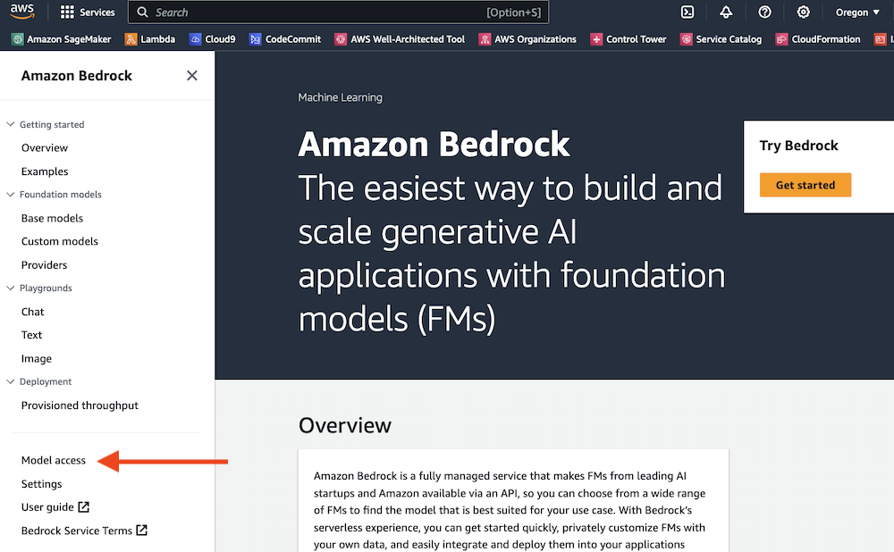
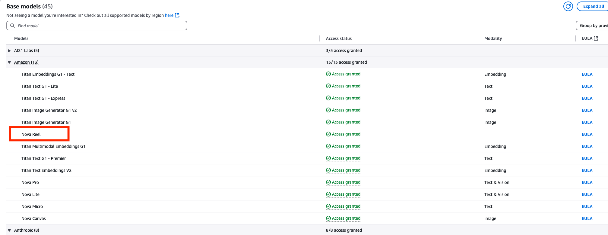
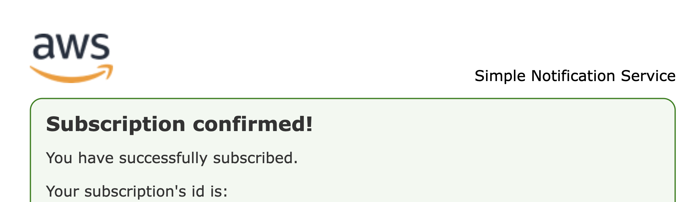

# Serverless video generation



This pattern demonstrates how to generate state-of-art videos with a serverless workflow using Amazon Bedrock [Nova Reel model](https://www.aboutamazon.com/news/aws/amazon-nova-artificial-intelligence-bedrock-aws) and upload the videos to Amazon S3. The pattern also publishes an email with the Pre-Signed URL once the generated video is ready in the S3 bucket. The user email address needs to be provided through a parameter while deploying the pattern.

Note: this pattern includes an AWS Lambda function deployment package with a custom version of boto3. Using an outdated boto3 version will result in an API not supported error.


Important: this application uses various AWS services and there are costs associated with these services after the Free Tier usage - please see the [AWS Pricing page](https://aws.amazon.com/pricing/) for details. You are responsible for any AWS costs incurred. No warranty is implied in this example.

### Requirements

* [Create an AWS account](https://portal.aws.amazon.com/gp/aws/developer/registration/index.html) if you do not already have one and log in. The IAM user that you use must have sufficient permissions to make necessary AWS service calls and manage AWS resources.
* [AWS CLI](https://docs.aws.amazon.com/cli/latest/userguide/install-cliv2.html) installed and configured
* [Git Installed](https://git-scm.com/book/en/v2/Getting-Started-Installing-Git)
* [AWS Cloud Development Kit](https://docs.aws.amazon.com/cdk/v2/guide/getting_started.html) installed
* [Amazon Bedrock Nova Reel Access](https://docs.aws.amazon.com/bedrock/latest/userguide/model-access.html#add-model-access)

## Amazon Bedrock setup instructions
You must request access to Amazon Nova Reel model before you can use it. If you try to use the model (with the API or console) before you have requested access to it, you receive an error message. For more information, see [Model access](https://docs.aws.amazon.com/bedrock/latest/userguide/model-access.html).

1. In the AWS console, select the region from which you want to access Amazon Bedrock. At the time of writing, Amazon Bedrock is available in us-east-1 (N. Virginia) and us-west-2 (Oregon) regions.

    

1. Find **Amazon Bedrock** by searching in the AWS console.

    

1. Expand the side menu.

    

1. From the side menu, select **Model access**.

    

1. Select the **Edit** button.

    

6. Use the checkboxes to select the models you wish to enable. Review the applicable EULAs as needed. Click **Save changes** to activate the models in your account. For this pattern we only need Nova Reel /  model id: amazon.nova-reel-v1:0.

## Deployment Instructions

1. Create a new directory, navigate to that directory in a terminal and clone the GitHub repository:
    ``` 
    git clone https://github.com/aws-samples/serverless-patterns
    ```
1. Change directory to the pattern directory:
    ```
    cd serverless-patterns/apigw-stepfunctions-lambda-bedrock-s3-sns
    ```
1. Create virtual environment for Python
    ```
    python3 -m venv .venv
    ```
    For a Windows platform, activate the virtualenv like this:
    ```
    .venv\Scripts\activate.bat
    ```
    For a OSX / Linux platform, activate the virtualenv like this:
    ```
    source .venv/bin/activate
    ```
1. Install the Python required dependencies:
    ```
    pip install -r requirements.txt
    ```
1. Run the command below to bootstrap your account. CDK needs it to deploy
    ```
    cdk bootstrap
    ```
1. Review the CloudFormation template CDK generates for you stack using the following AWS CDK CLI command:
    ```
    cdk synth
    ```
1. From the command line, use AWS CDK to deploy the AWS resources.
    ```
    cdk deploy --parameters EmailParameter=replace-your-email-here@example.com
    ```
1. After deployment completes, a message is delivered to the email address provided. This email is to confirm the subscription of this email to the SNS Topic. Click on the confirm subscription link to confirm your subscription. The following image shows a successful subscription.
    
    

1. Take a look at the Outputs section after the CDK deployment completes. There will be an entry containing the URL of the Amazon API Gateway resource you just created. Copy that URL as you'll need it for your tests.

    The format of the URL will be something like `https://{id}.execute-api.{region}.amazonaws.com/prod`


## How it works

CDK will create an Amazon API Gateway with a resource and a POST method. This method starts execution of a AWS Step Functions state machine. The workflow will invoke an AWS Lambda function with the provided prompt and invoke the Amazon Bedrock Nova Reel model asynchronously. The state machine invokes another Lambda function that checks if the video is uploaded to the Amazon S3 bucket. Once the video is ready in S3, a Pre-Signed URL is generated and pushed to Amazon SNS topic. The topic then publishes an email to user containing the Pre-Signed URL for the video generated by the Amazon Nova Reel model.


## Testing

We'll be making requests to the *generateVideo* endpoint with a desired prompt.

Follow the example below and replace `{your-api-url}` with your api url from step 9. 

    ```
    curl -X POST \
    {your-api-url}/generateVideo \
    -H "Content-Type: application/json" \
    -d '{"prompt": "video of a car made up of fruits"}'
    ```

## Review results

Within 4-5 minutes, you would be receiving an email with Amazon S3 Pre-Signed URL. Enter the complete Pre-Signed URL into browser to download the generated Video. Additionally, you can also access the video from the Amazon S3 bucket.

## Cleanup
 
1. Run below script in the `apigw-stepfunctions-lambda-bedrock-s3-sns` directory to delete AWS resources created by this sample stack.
    ```bash
    cdk destroy
    ```

## Extra Resources
* [Bedrock Api Reference](https://docs.aws.amazon.com/bedrock/latest/APIReference/welcome.html)

----
Copyright 2024 Amazon.com, Inc. or its affiliates. All Rights Reserved.

SPDX-License-Identifier: MIT-0