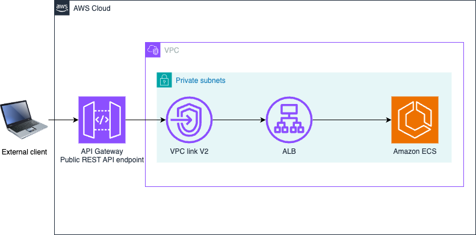

# REST APIs using Amazon API Gateway private integration with Application Load Balancer

This sample project demonstrates how API Gateway connects to Application Load Balancer using VPV Link V2.

## Requirements

- [Create an AWS account](https://portal.aws.amazon.com/gp/aws/developer/registration/index.html) if you do not already have one and log in. The IAM user that you use must have sufficient permissions to make necessary AWS service calls and manage AWS resources.
- [AWS CLI](https://docs.aws.amazon.com/cli/latest/userguide/install-cliv2.html) installed and configured
- [Git Installed](https://git-scm.com/book/en/v2/Getting-Started-Installing-Git)
- [AWS Serverless Application Model](https://docs.aws.amazon.com/serverless-application-model/latest/developerguide/serverless-sam-cli-install.html) (AWS SAM) installed
- [Node 24 or above](https://nodejs.org/en/download) installed
- [Docker] installed

## Deployment Instructions

1. Create a new directory, navigate to that directory in a terminal and clone the GitHub repository:

   ```bash
   git clone https://github.com/aws-samples/serverless-patterns
   ```

2. Change directory to the pattern directory:

   ```bash
   cd serverless-patterns/apigw-vpclink-alb-ecs
   ```

3. Create an ECR repository:

   ```bash
   aws ecr create-repository --repository-name products-api --region <your-region>
   ```

4. Get the login token and authenticate Docker:

   ```bash
   aws ecr get-login-password --region <your-region> | docker login --username AWS --password-stdin <account-id>.dkr.ecr.<your-region>.amazonaws.com
    ```

5. Install dependencies:

   ```bash
   npm install
   ```

6. Build the Docker image and push it to ECR:

    ```bash
    # Build the Docker image
    docker build --platform linux/amd64 -t products-api .

    # Tag the image for ECR
    docker tag products-api:latest <account-id>.dkr.ecr.<your-region>.amazonaws.com/products-api:latest

    # Push the image to ECR
    docker push <account-id>.dkr.ecr.<your-region>.amazonaws.com/products-api:latest
    ```

7. From the command line, run the following commands:

   ```bash
   sam build
   sam deploy --guided
   ```

8. During the prompts:

   - Enter a stack name
   - Enter the desired AWS Region e.g. `us-east-1`.
   - Enter VpcCidr - keep the default value
   - Enter ECRImageURI - Replace with your ECR URI e.g. <account-id>.dkr.ecr.<your-region>.amazonaws.com/products-api:latest
   - Allow SAM CLI to create IAM roles with the required permissions.
   - Keep default values to the rest of the parameters.

   Once you have run `sam deploy --guided` mode once and saved arguments to a configuration file (samconfig.toml), you can use `sam deploy` in future to use these defaults.

9. Note the outputs from the SAM deployment process. These contain the resource names and/or ARNs which are used for next step as well as testing.

## How it works

The SAM template deploys the following resources:



Here's a breakdown of the steps:

1. **Amazon API Gateway**: The API Gateway exposes a REST API endpoint. The API Gateway connects to Application Load Balancer using VPC link V2.

## Testing

### Using EC2 Instance test internal ALB 

1. Open a terminal in your laptop and use [curl](https://curl.se/) to send a HTTP GET request to the `InternalALBEndpoint`. Replace the value of `InternalALBEndpoint` from `sam deploy` output.

```bash
curl -X GET <InternalALBEndpoint>
```

Expected Response:
This request will timeout and you will not get any response. This is an internal ALB endpoint. Hence, this is not accessible over public internet.

2. Launch an EC2 instance in one of the private subnets within the same VPC

3. SSH into the instance

4. Install curl if not available:

```bash
# Amazon Linux/RHEL/CentOS
sudo yum install -y curl

# Ubuntu/Debian
sudo apt-get update && sudo apt-get install -y curl
```

5. Test the  products endpoint functionality

```bash
curl -X GET <InternalALBEndpoint>
```

Expected Response:

```json
{
  "products": [
    {
      "id": "1",
      "name": "Sample Product",
      "description": "A demo product for testing",
      "price": 29.99,
      "category": "Electronics"
    },
    {
      "id": "2",
      "name": "Demo Widget", 
      "description": "Another test product",
      "price": 15.50,
      "category": "Gadgets"
    },
    {
      "id": "3",
      "name": "Test Item",
      "description": "Third demo product", 
      "price": 99.99,
      "category": "Tools"
    }
  ]
}
```

6. Now, test the API Gateway API endpoint. Replace `APIEndpoint` with the value from `sam deploy` output.

```bash
curl -X GET <APIEndpoint>
```

Expected Response:

```json
{
  "products": [
    {
      "id": "1",
      "name": "Sample Product",
      "description": "A demo product for testing",
      "price": 29.99,
      "category": "Electronics"
    },
    {
      "id": "2",
      "name": "Demo Widget", 
      "description": "Another test product",
      "price": 15.50,
      "category": "Gadgets"
    },
    {
      "id": "3",
      "name": "Test Item",
      "description": "Third demo product", 
      "price": 99.99,
      "category": "Tools"
    }
  ]
}
```

## Cleanup

1. To delete the resources deployed to your AWS account via AWS SAM, run the following command:

```bash
sam delete
```

---

Copyright 2026 Amazon.com, Inc. or its affiliates. All Rights Reserved.

SPDX-License-Identifier: MIT-0