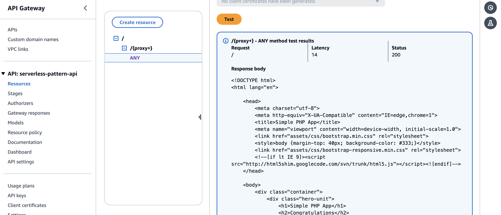

# Amazon API Gateway to AWS Fargate via VPC Link and Network load balancer

This pattern helps connect a public API Gateway endpoint to a private Network Load Balancer alongside an ECS Fargate cluster. It keeps the private subnet resources safe from exposure and only allows access through a VPC Link, ensuring security. The pattern will create API Gateway, VPC Link, private Network load balancer, VPC along with a private subnet and a ECS fargate cluster.

Important: this application uses various AWS services and there are costs associated with these services after the Free Tier usage - please see the [AWS Pricing page](https://aws.amazon.com/pricing/) for details. You are responsible for any AWS costs incurred. No warranty is implied in this example.

## Requirements

* [Create an AWS account](https://portal.aws.amazon.com/gp/aws/developer/registration/index.html) if you do not already have one and log in. The IAM user that you use must have sufficient permissions to make necessary AWS service calls and manage AWS resources.
* [AWS CLI](https://docs.aws.amazon.com/cli/latest/userguide/install-cliv2.html) installed and configured
* [Git Installed](https://git-scm.com/book/en/v2/Getting-Started-Installing-Git)
* [AWS CDK](https://docs.aws.amazon.com/cdk/v2/guide/cli.html)
* [Python, pip, virtualenv](https://docs.aws.amazon.com/cdk/latest/guide/work-with-cdk-python.html) installed


## Deployment Instructions

1. Create a new directory, navigate to that directory in a terminal and clone the GitHub repository:
    ``` 
    git clone https://github.com/aws-samples/serverless-patterns
    ```
2. Change directory to the pattern directory:
    ```
    cd apigw-vpclink-pvtnlb-fargate-cdk-python
    ```
3. Create a virtual environment for Python:
   ```
   python3 -m venv .venv
   ```
4. Activate the virtual environment
   ```
   source .venv/bin/activate
   ```
   For a Windows platform, activate the virtualenv like this:
   ```
   .venv\Scripts\activate.bat
5. Install the Python required dependencies:
   ```
   pip install -r requirements.txt
   ```
6. Review the CloudFormation template the cdk generates for you stack using the following AWS CDK CLI command:
   ```
   cdk synth
   ```
7. Run the command below to bootstrap your account CDK needs it to deploy
    ```
    cdk bootstrap
    ```
8. From the command line, use CDK to deploy the AWS resources for the pattern. You'll be prompted to approve security related changes during the deployment.
    ```
    cdk deploy
    ```

## How it works

* This pattern helps connect a public API Gateway endpoint to a private Network Load Balancer alongside an ECS Fargate cluster.
  It keeps the private subnet resources safe from exposure and only allows access through a VPC Link, ensuring security. The pattern will create API Gateway, VPC Link, private Network load balancer, VPC along with a private subnet and a ECS fargate cluster.

## Testing

1. In the AWS Console, browse to the API Gateway and find the `serverless-pattern-api` that is created. Once the API is opened, go to `Resources` then select method `ANY`. Select inbuild `Test` feature to `Submit a GET request`.
2. Wait for the service execution and you should get back a 200 response from the `ECS fargate service - ApigwVpclinkPvtnlbFargateCdkPyStack-Service**` as shown below




## Cleanup
 
1. Delete the stack
    ```
    cdk destroy
    ```

2. Confirm the stack has been deleted. Login to the AWS console and navigate to the AWS Cloudformation service page "CdkServerlessInfraStack" is deleted or run the below 
    ```bash
    aws cloudformation list-stacks --query "StackSummaries[?contains(StackName 'ApigwVpclinkPvtnlbFargateCdkPyStack')].StackStatus"
    ```

You should expect to see a message confirming `DELETE_COMPLETE`.

----
Copyright 2024 Amazon.com, Inc. or its affiliates. All Rights Reserved.

SPDX-License-Identifier: MIT-0
