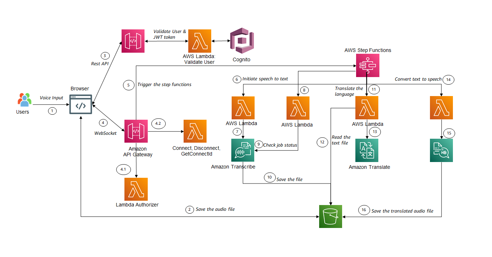

<!--
layout: Doc
framework: v3
platform: AWS
language: nodeJS
priority: 1
-->

# Language translator using secure synchronous state-machines

### Building a secure instantaneous language translator using AWS serverless services

The SAM template deploys - an Amazon API Gateway REST API endpoint for getting Authentication token
Amazon WebSockets for authenticating users and invoking Synchronous Step-function

Learn more about this pattern at Serverless Land Patterns: [https://serverlessland.com/patterns](https://serverlessland.com/patterns)

Important: this application uses various AWS services and there are costs associated with these services after the Free Tier usage - please see the [AWS Pricing page](https://aws.amazon.com/pricing/) for details. You are responsible for any AWS costs incurred. No warranty is implied in this example.

## Requirements

- [Create an AWS account](https://portal.aws.amazon.com/gp/aws/developer/registration/index.html) if you do not already have one and log in. The IAM user that you use must have sufficient permissions to make necessary AWS service calls and manage AWS resources.
- [AWS CLI](https://docs.aws.amazon.com/cli/latest/userguide/install-cliv2.html) installed and configured
- [Git Installed](https://git-scm.com/book/en/v2/Getting-Started-Installing-Git)
- [AWS Serverless Application Model](https://docs.aws.amazon.com/serverless-application-model/latest/developerguide/serverless-sam-cli-install.html) (AWS SAM) installed

## Deployment Instructions

1. Create a new directory, navigate to that directory in a terminal and clone the GitHub repository:
   ```
   git clone https://github.com/aws-samples/serverless-patterns
   ```
2. Change directory to the pattern directory:
   ```
   cd apigw-websocket-api-cognito-sfn-sync
   ```
3. From the command line, use AWS SAM to deploy the AWS resources for the pattern as specified in the template.yml file:

   ```
   sam build
   sam deploy --guided --capabilities CAPABILITY_NAMED_IAM
   ```

   During the prompts:

   - Enter a stack name
   - Select the desired AWS Region
   - Allow SAM to create roles with the required permissions if needed.

   Once you have run guided mode once, you can use `sam deploy` in future to use these defaults.

## Architecture



## Testing

1. Create Cognito user using the hosted UI Url ( which is listed in the Output )
2. Invoke a POST request with newly created user credentials and API Key. This will return JWT token, refresh token and user in a JSON object
3. Open Websocket with Authorization as Query param
   ```bash
   wscat -c   wss://<API-ID>.execute-api.<REGION>.amazonaws.com/dev?Authorizer=<JWT TOKEN>
   ```
4. Get the connection id
   ```bash
   {"action": "getConnectionId" }
   ```
5. Invoke the Step-function: NOTE: Upload an OGG media format file

   ```bash
   { "bucketName": "<Bucket name starting with translator-dev-translatorbucket>", "objectKey": <Qualified Key of Voice message>, "inputLanguageCode": "<Transcribe Language Code>", "outputLanguageCode" : "<Language|PollyCode>" }

   ```

6. The output is a signed S3 url, which contains the translated audio-file (ready to be played on browser)

## Cleanup

1. Delete the stack
   ```bash
   sam delete
   ```
2. Confirm the stack has been deleted
   ```bash
   aws cloudformation list-stacks --query "StackSummaries[?contains(StackName,'STACK_NAME')].StackStatus"
   ```

---

Copyright 2023 Amazon.com, Inc. or its affiliates. All Rights Reserved.

SPDX-License-Identifier: MIT-0
