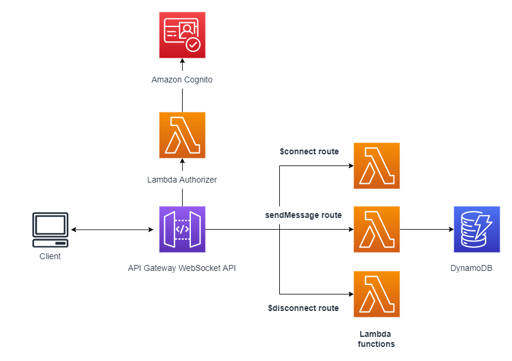

# WebSocket API Cognito authentication using Lambda Authorizer

This pattern demonstrates how to integrate Amazon Cognito authentication with Amazon API Gateway WebSocket API.

It includes the Lambda implementations for Lambda Authorizer, Lambda functions for $connect, $disconnect and custom route, and AWS Serverless Application Model (SAM) code to deploy backend infrastructure.

Learn more about this pattern at Serverless Land Patterns: https://serverlessland.com/patterns/apigw-websocket-api-lambda-authorizer

## Why Lambda Authorizer, not Cognito Authorizer?
API Gateway Websocket API doesn't support [Cognito authorizer](https://docs.aws.amazon.com/apigateway/latest/developerguide/apigateway-enable-cognito-user-pool.html) as of now. To enable Cognito authentication for API Gateway Websocket API you need to create a Lambda authorizer instead of using the built-in Cognito authorizer.

## Requirements

* [Create an AWS account](https://portal.aws.amazon.com/gp/aws/developer/registration/index.html) if you do not already have one and log in. The IAM user that you use must have sufficient permissions to make necessary AWS service calls and manage AWS resources.
* [AWS CLI](https://docs.aws.amazon.com/cli/latest/userguide/install-cliv2.html) installed and configured
* [Git Installed](https://git-scm.com/book/en/v2/Getting-Started-Installing-Git)
* [AWS Serverless Application Model](https://docs.aws.amazon.com/serverless-application-model/latest/developerguide/serverless-sam-cli-install.html) (AWS SAM) installed
* [.NET 6.0](https://dotnet.microsoft.com/en-us/download/dotnet/6.0)

## Architecture


## Deployment Instructions

1. Create a new directory, navigate to that directory in a terminal and clone the GitHub repository:
    ``` 
    git clone https://github.com/aws-samples/serverless-patterns
    ```
2. Change directory to the pattern directory:
    ```
    cd apigw-websocket-api-lambda-authorizer
    ```
3. From the command line, use AWS SAM to build and deploy the AWS resources for the pattern as specified in the template.yaml file:
    ```
    sam build
    sam deploy --guided
    ```
4. During the prompts:
    * Enter a stack name
    * Enter the desired AWS Region
    * Allow SAM CLI to create IAM roles with the required permissions.

    Once you have run `sam deploy -guided` mode and saved arguments to a configuration file (samconfig.toml), you can use `sam deploy` in future to use these defaults.

5. Note the outputs from the SAM deployment process. These contain the WebSocketURI, UserpoolId, and ClientId which are used for testing.

## Testing
In order to test, follow the steps given below:

### Step 1. Create a user in Cognito user pool
> Note: For production workloads, you should use a strong password; the password given below is simply for demonstration purposes.

```bash
# perform sign-up
aws cognito-idp sign-up \
  --region YOUR_COGNITO_REGION \
  --client-id YOUR_COGNITO_APP_CLIENT_ID  \
  --username admin@example.com \
  --password Passw0rd! 

# confirm sign-up  
aws cognito-idp admin-confirm-sign-up \
  --region YOUR_COGNITO_REGION \
  --user-pool-id YOUR_COGNITO_USER_POOL_ID \
  --username admin@example.com  

```
### Step 2. Obtain ID Token for the user
Run the following command to get the Cognito tokens for the user.

```bash
# run the initiate-auth command to get cognito tokens
aws cognito-idp initiate-auth \
  --auth-flow USER_PASSWORD_AUTH \
  --auth-parameters USERNAME=YOUR_USERNAME,PASSWORD=YOUR_PASSWORD \
  --client-id your_app_client_id \
  --region YOUR_COGNITO_REGION
```
Copy the ID Token for use in the following step.

### Step 3. Invoke WebSocket API with ID Token
An easy way to test the WebSocket after deploying is to use the tool [wscat](https://github.com/websockets/wscat) from NPM. To install the tool from NPM
use the following command:
```
npm install -g wscat
```
> Note: It is important to understand that only the initial web-socket connect request (handshake) that establishes a WebSocket connection between client and server requires authentication. Once the channel has been established, subsequent requests work just fine.

To continue testing, follow the steps below:
1. Run the below command (in more than one window) to establish websocket connections with the API Gateway.
    ```
    wscat -c wss://{YOUR-API-ID}.execute-api.{YOUR-REGION}.amazonaws.com/{STAGE}?ID_Token={ID_TOKEN}
    ```
    The url to connect to can also be found as the output parameter of the CloudFormation stack.
 2. Just for your information, query parameter `ID_Token` is case sensitive. If you want to change it, then update it in `template.yaml` file at `route.request.querystring.ID_Token`.
2. If the token is valid, the response is `Connected`; otherwise, the response is 401 unauthorized or 403 forbidden. 
3. Optionally, to perform a negative test, send an invalid value for `ID_Token` and verify you get 401 or 403 in the response.
4. In one of the windows use the following command to send a message to the WebSocket which will broadcast the message to all other open console windows:
    ```
    $ wscat -c wss://{YOUR-API-ID}.execute-api.{YOUR-REGION}.amazonaws.com/prod
    connected (press CTRL+C to quit)
    > {"message":"sendmessage", "data":"hello world"}
    < hello world
    ```

## Cleanup
1. Delete the stack
    ```bash
    sam delete
    ```
2. Confirm the stack has been deleted
    ```bash
    aws cloudformation list-stacks --query "StackSummaries[?contains(StackName,'STACK_NAME')].StackStatus"
    ```
----
Copyright 2024 Amazon.com, Inc. or its affiliates. All Rights Reserved.

SPDX-License-Identifier: MIT-0