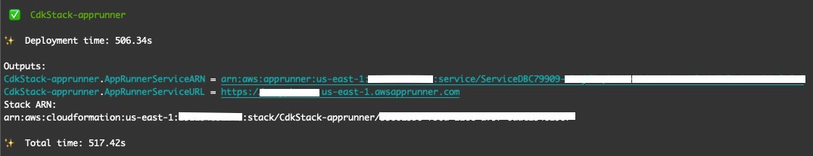
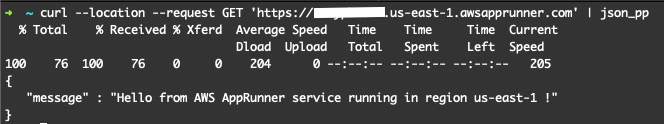

# AWS App Runner Service

AWS App Runner is an AWS service that provides a fast, simple, and cost-effective way to deploy from source code or a container image directly to a scalable and secure web application in the AWS Cloud. You don't need to learn new technologies, decide which compute service to use, or know how to provision and configure AWS resources.

App Runner connects directly to your code or image repository. It provides an automatic integration and delivery pipeline with fully managed operations, high performance, scalability, and security.

This project contains a sample AWS Cloud Development Kit (AWS CDK) template for deploying an AWS App Runner service. 
This template showes how to add a custom image for AWS App Runner service to use without having to pre-push the image to Amazon Elastic Container Registry (ECR) or another container library. This makes use of the in-built `apprunner.Source.fromAsset` method.
The custom image used is a simple hello world Node Js application. This project also provides an example of how to pass an environment variable to the image. Note that the image can be changed to other images that suit your use case by changing the codes found in the src directory.

Learn more about this pattern at Serverless Land Patterns: https://serverlessland.com/patterns/apprunner.

Important: this application uses various AWS services and there are costs associated with these services after the Free Tier usage - please see the [AWS Pricing page](https://aws.amazon.com/pricing/) for details. You are responsible for any AWS costs incurred. No warranty is implied in this example.

## Requirements

- [Create an AWS account](https://portal.aws.amazon.com/gp/aws/developer/registration/index.html) if you do not already have one and log in. The IAM user that you use must have sufficient permissions to make necessary AWS service calls and manage AWS resources.
- [AWS CLI](https://docs.aws.amazon.com/cli/latest/userguide/install-cliv2.html) installed and configured
- [Git Installed](https://git-scm.com/book/en/v2/Getting-Started-Installing-Git)
- [AWS CDK](https://docs.aws.amazon.com/cdk/latest/guide/cli.html) installed and configured

## Deployment Instructions

1. Create a new directory, navigate to that directory in a terminal and clone the GitHub repository:
   ```bash
   git clone https://github.com/aws-samples/serverless-patterns
   ```
2. Change directory to the pattern directory:
   ```bash
   cd serverless-patterns/apprunner-cdk/cdk
   ```
3. Install dependencies:
   ```bash
   npm install
   ```
4. From the command line, configure AWS CDK:
   ```bash
   cdk bootstrap ACCOUNT-NUMBER/REGION # e.g.
   cdk bootstrap 1111111111/us-east-1
   cdk bootstrap --profile test 1111111111/us-east-1
   ```
5. From the command line, use AWS CDK to deploy the AWS resources for the pattern as specified in the `lib/cdk-stack.ts` file:
   ```bash
   cdk deploy
   ```
6. Note the outputs from the CDK deployment process. This contains the service URL that is used to make GET request.

## How it works

- The image is constructed directly from sources on disk when `cdk deploy` is executed
- The image is automatically pushed to Amazon ECR
- An AWS App Runner service is created using the image pushed to ECR

## Testing

Retrieve the App Runner Service URL from the `cdk deploy` output. Example of the output is:

```
CdkStack-apprunner.AppRunnerServiceURL = https://abcde12345.us-east-1.awsapprunner.com
```

For reference:



The service has only one endpoint `/` and making a GET request to this endpoint returns a JSON with a hello message. For example:

```bash
curl --location --request GET '<REPLACE WITH FARGATE SERVICE URL>/' | json_pp
# Example
curl --location --request GET 'https://abcde12345.us-east-1.awsapprunner.com/' | json_pp
```

Running the request above should produce the following output:




## Cleanup

1. Delete the stack
   ```bash
   cdk destroy
   ```

2. Navigate to ECR in the AWS console and delete the container images created


## Documentation and useful references
- [AWS App Runner Documentation](https://docs.aws.amazon.com/apprunner/latest/dg/what-is-apprunner.html)
- [AWS App Runner CDK](https://docs.aws.amazon.com/cdk/api/v1/docs/aws-apprunner-readme.html)
