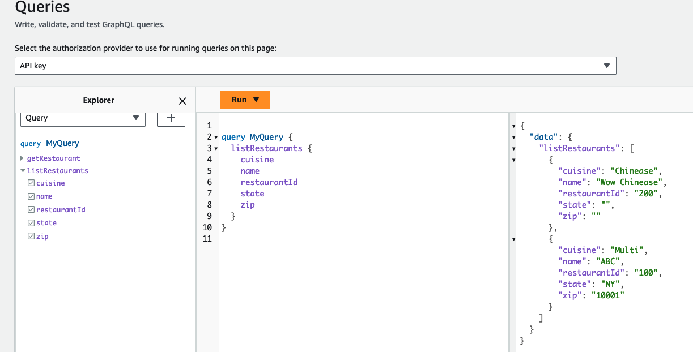
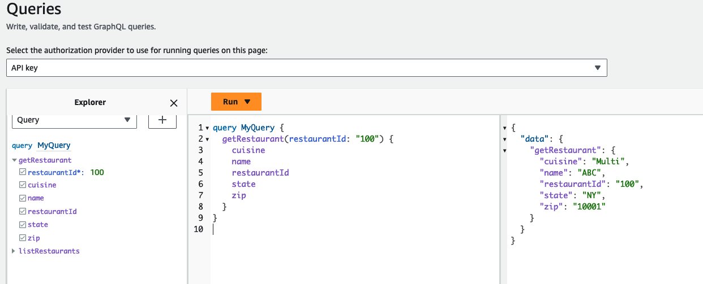

# AWS Appsync to Amazon API Gateway (AWS_IAM Auth) to DynamoDB

This pattern shows how to access an AWS_IAM protected Amazon APIGateway REST API from AWS Appsync using HTTP Resolvers. The Amazon APIGateway REST API is directly integrated with Amazon DynamoDB using AWS Service integration and has the capability to read/create/update/delete restaurant data from the table.

Learn more about this pattern at Serverless Land Patterns: https://serverlessland.com/patterns/appsync-apigateway-dynamodb-sam

Important: this application uses various AWS services and there are costs associated with these services after the Free Tier usage - please see the [AWS Pricing page](https://aws.amazon.com/pricing/) for details. You are responsible for any AWS costs incurred. No warranty is implied in this example.

## Requirements

* [Create an AWS account](https://portal.aws.amazon.com/gp/aws/developer/registration/index.html) if you do not already have one and log in. The IAM user that you use must have sufficient permissions to make necessary AWS service calls and manage AWS resources.
* [AWS CLI](https://docs.aws.amazon.com/cli/latest/userguide/install-cliv2.html) installed and configured
* [Git Installed](https://git-scm.com/book/en/v2/Getting-Started-Installing-Git)
* [AWS Serverless Application Model](https://docs.aws.amazon.com/serverless-application-model/latest/developerguide/serverless-sam-cli-install.html) (AWS SAM) installed

## Deployment Instructions

1. Create a new directory, navigate to that directory in a terminal and clone the GitHub repository:
    ``` 
    git clone https://github.com/aws-samples/serverless-patterns
    ```
1. Change directory to the pattern directory:
    ```
    cd appsync-apigateway-dynamodb-sam
    ```
1. From the command line, use AWS SAM to deploy the AWS resources for the pattern as specified in the template.yml file:
    ```
    sam deploy --guided
    ```
1. During the prompts:
    * Enter a stack name
    * Enter the desired AWS Region
    * Allow SAM CLI to create IAM roles with the required permissions.

    Once you have run `sam deploy --guided` mode once and saved arguments to a configuration file (samconfig.toml), you can use `sam deploy` in future to use these defaults.

1. Note the outputs from the SAM deployment process. These contain the resource names and/or ARNs which are used for testing.

## How it works

This pattern creates an AWS Appsync GraphQL API which is integrated with Amazon API Gateway REST API using HTTP Resolvers (Sigv4 Auth). The Amazon API Gateway REST API is protected with Resource policy and AWS_IAM authentication. The REST API is integrated directly with Amazon DynamoDB table and supports DynamoDB [GetItem](https://docs.aws.amazon.com/amazondynamodb/latest/APIReference/API_GetItem.html), [Scan](https://docs.aws.amazon.com/amazondynamodb/latest/APIReference/API_Scan.html), [UpdateItem](https://docs.aws.amazon.com/amazondynamodb/latest/APIReference/API_UpdateItem.html) and [DeleteItem](https://docs.aws.amazon.com/amazondynamodb/latest/APIReference/API_DeleteItem.html) actions. The demo application uses a simple Restaurant API.

## Testing

The easiest way to test the AppSync API is with the AppSync console at https://console.aws.amazon.com/appsync/home#/apis (change to your appropriate region).

1) Click on the API you created and visit the Queries tab.
2) To add a new restaurant entry, paste the following command in the query editor tab. Likewise you can update, delete restaurant using updateRestaurant and deleteRestaurant mutations.
    ```graphql
        mutation MyMutation {
            addRestaurant(input: {cuisine: Multi, name: "ABC", restaurantId: "100", state: "NY", zip: "10001"}) {
                data {
                cuisine
                name
                restaurantId
                state
                zip
                }
                message
            }
        }
    ```

    

3) To get the list of restaurants, paste the following command in the query editor tab.

    ```graphql
        query MyQuery {
            listRestaurants {
                cuisine
                name
                restaurantId
                state
                zip
            }
        }
    ```

    

4) To get restaurant based on restaurant ID, paste the following command in the query editor tab.

    ```graphql
        query MyQuery {
            getRestaurant(restaurantId: "100") {
                cuisine
                name
                restaurantId
                state
                zip
            }
        }
    ```

    

## Cleanup
 
1. Delete the stack
    ```bash
    aws cloudformation delete-stack --stack-name STACK_NAME
    ```
1. Confirm the stack has been deleted
    ```bash
    aws cloudformation list-stacks --query "StackSummaries[?contains(StackName,'STACK_NAME')].StackStatus"
    ```
----
Copyright 2023 Amazon.com, Inc. or its affiliates. All Rights Reserved.

SPDX-License-Identifier: MIT-0