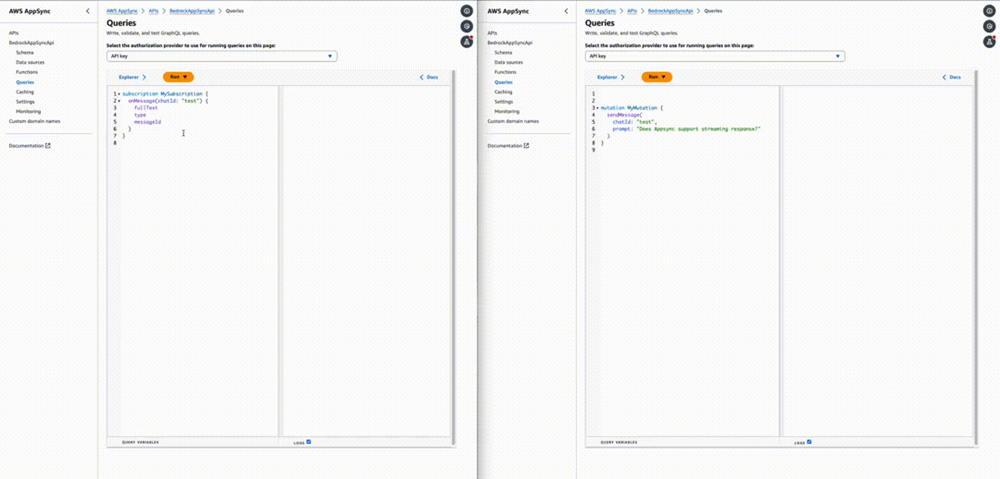

# Amazon DynamoDB Streams to AppSync Subscription

This pattern creates an AppSync API allowing you to listen to invoke Anthropic Claude V3 Haiku through a mutation and listen to the response being streamed through a subscription.

Learn more about this pattern at ServerlessLand Patterns: https://serverlessland.com/patterns/appsync-bedrock-streaming-sam

Important: this application uses various AWS services and there are costs associated with these services after the Free Tier usage - please see the [AWS Pricing page](https://aws.amazon.com/pricing/) for details. You are responsible for any AWS costs incurred. No warranty is implied in this example.

## Requirements

* [Create an AWS account](https://portal.aws.amazon.com/gp/aws/developer/registration/index.html) if you do not already have one and log in. The IAM user that you use must have sufficient permissions to make necessary AWS service calls and manage AWS resources.
* [AWS CLI](https://docs.aws.amazon.com/cli/latest/userguide/install-cliv2.html) installed and configured
* [Git Installed](https://git-scm.com/book/en/v2/Getting-Started-Installing-Git)
* [AWS Serverless Application Model](https://docs.aws.amazon.com/serverless-application-model/latest/developerguide/serverless-sam-cli-install.html) (AWS SAM) installed
* Make sure to enable the **Anthropic - Claude V3 Haiku** model on the [Bedrock console](https://console.aws.amazon.com/bedrock/home#/modelaccess).

## Deployment Instructions

1. Create a new directory, navigate to that directory in a terminal and clone the GitHub repository:
    ``` 
    git clone https://github.com/aws-samples/serverless-patterns
    ```
2. Change directory to the pattern directory:
    ```
    cd appsync-bedrock-streaming-sam
    ```
3. From the command line, use AWS SAM to deploy the AWS resources for the pattern as specified in the template.yml file:
    ```
    sam build
    sam deploy --guided
    ```
4. During the prompts:
    * Enter a stack name
    * Enter the desired AWS Region
    * Allow SAM CLI to create IAM roles with the required permissions.

    Once you have run `sam deploy --guided` mode once and saved arguments to a configuration file (samconfig.toml), you can use `sam deploy` in future to use these defaults.

## How it works

This template creates an AWS AppSync API along with a AWS Lambda function. The API exposes a mutation that can be called and will trigger an async lambda function invocation (thus bypassing the 30s timeout of AppSync) that will call Anthropic Claude V3 Haiku through Amazon Bedrock and stream the response back to the end user through an AppSync subscription.

## Testing

The easiest way to test the AppSync API is with the AppSync console at https://console.aws.amazon.com/appsync/home#/apis (change to your appropriate region)

1. Click on the API you created (it should be named `BedrockAppSyncApi`) and visit the Queries tab
2. Subscribe to `onMessage` as follows
  ```graphql
  subscription MySubscription {
    onMessage (chatId: "test") {
      messageId
      type
      fullText
    }
  }
  ```
3. Open another Queries tab in another browser tab
4. Run the `sendMessage` mutation as follows
  ```graphql
  mutation MyMutation {
    sendMessage(
      chatId: "test", 
      prompt: "Does AppSync support streaming responses ?"
    )
  }
  ```
5. In the subscription tab, you should see the response being streamed
  

## Cleanup
 
1. Delete the stack
  ```bash
  sam delete
  ```
----
Copyright 2024 Amazon.com, Inc. or its affiliates. All Rights Reserved.

SPDX-License-Identifier: MIT-0