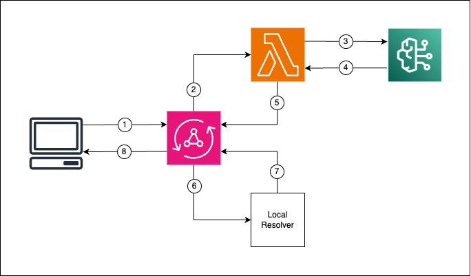
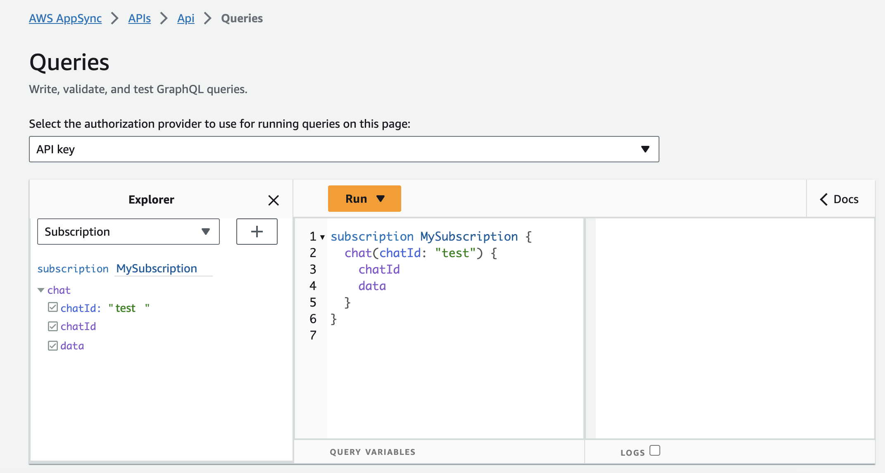
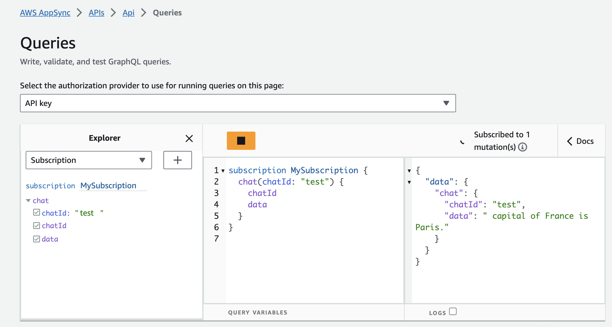

# Stream Amazon Bedrock completions via AWS AppSync Subscriptions

This pattern shows how to stream Amazon Bedrock completions via AWS AppSync Subscriptions.

Learn more about this pattern at Serverless Land Patterns: https://serverlessland.com/patterns/appsync-bedrock-subscriptions

Important: this application uses various AWS services and there are costs associated with these services after the Free Tier usage - please see the [AWS Pricing page](https://aws.amazon.com/pricing/) for details. You are responsible for any AWS costs incurred. No warranty is implied in this example.


## Requirements
* [Create an AWS account](https://portal.aws.amazon.com/gp/aws/developer/registration/index.html) if you do not already have one and log in. The IAM user that you use must have sufficient permissions to make necessary AWS service calls and manage AWS resources.
* [AWS CLI](https://docs.aws.amazon.com/cli/latest/userguide/install-cliv2.html) installed and configured
* [Git Installed](https://git-scm.com/book/en/v2/Getting-Started-Installing-Git)
* [Node and NPM](https://nodejs.org/en/download/) installed
* [AWS Cloud Development Kit](https://docs.aws.amazon.com/cdk/v2/guide/cli.html) (AWS CDK) installed
* Make sure to enable the **Anthropic - Claude V2** model on the [Bedrock console](https://console.aws.amazon.com/bedrock/home#/modelaccess).


## How it works

1. The Client subscribes to `chat` and performs the `ask` mutation passing the prompt as an argument via its API KEY;
2. The [Lambda Resolver](src/ask.ts) takes the input prompt and establishes a connection with Bedrock through the [Response Stream API](https://docs.aws.amazon.com/bedrock/latest/APIReference/API_runtime_InvokeModelWithResponseStream.html) via [Langchain streaming](https://js.langchain.com/docs/modules/model_io/models/chat/how_to/streaming);
3. The prompt is sent to Bedrock;
4. The Lambda receives multiple completion chunks in a stream;
5. The Lambda performs the `send` mutation every time it receives a new completion chunk from Bedrock;
6. The `send` mutation is attached to a Local Resolver;
7. The [Local Resolver](src/send.js) simply returns the input data;
8. The client receives the completion data in chunks via the `chat` subscription.


### Permissions and Security
* Every GraphQL operation requires a `chatId` argument that is used to uniquely identify the chat session;
* The GraphQL [schema](src/schema.gql) uses [multiple authorization types](https://aws.amazon.com/blogs/mobile/using-multiple-authorization-types-with-aws-appsync-graphql-apis/) to ensure that:
  * The Client is only able to perfom the `ask` mutation and the `chat` subscription via its API_KEY;
  * The Lambda is only able to perform the `send` mutation via IAM.


## Deployment Instructions

1. Create a new directory, navigate to that directory in a terminal and clone the GitHub repository:
```sh
git clone https://github.com/aws-samples/serverless-patterns
```
2. Change directory to the pattern directory:
```sh
cd appsync-bedrock-subscriptions-cdk
```
3. Install the required dependencies:
```sh
npm install
```
4. Deploy the stack to your default AWS account and region:
```sh
npm run deploy
```

## Testing
Open the AWS Management console and use the API KEY authentication method to subscribe to the `chat` subscription by providing the `chatId` parameter:


Run tests with jest:
```sh
npm run test
```

The completion chunks will appear one by one in the console:


## Cleanup
 
Delete the stack:
```sh
cdk destroy --all
```
----
Copyright 2023 Amazon.com, Inc. or its affiliates. All Rights Reserved.
SPDX-License-Identifier: MIT-0