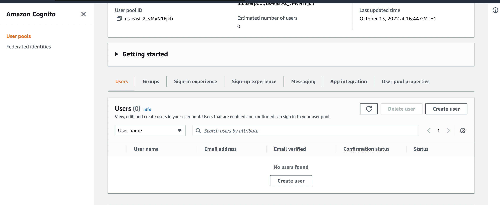
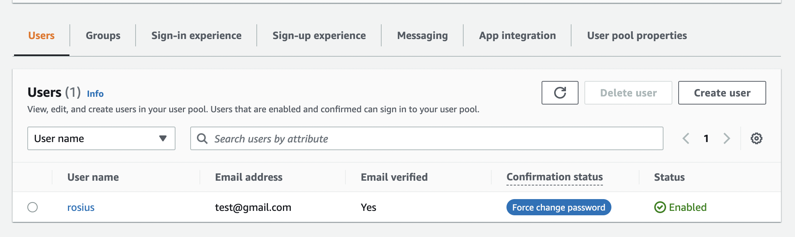

# Authenticating an AppSync API using Amazon Cognito

This CDK template deploys an AWS AppSync API and a Cognito userpool.
You'll need to create a user in Cognito before being able to have authorized access to the api.

Learn more about this pattern at Serverless Land Patterns: https://serverlessland.com/patterns/cognito-appsync-lambda-cdk

Important: this application uses various AWS services and there are costs associated with these services after the Free Tier usage - please see the [AWS Pricing page](https://aws.amazon.com/pricing/) for details. You are responsible for any AWS costs incurred. No warranty is implied in this example.

## Requirements

- [Create an AWS account](https://portal.aws.amazon.com/gp/aws/developer/registration/index.html) if you do not already have one and log in. The IAM user that you use must have sufficient permissions to make necessary AWS service calls and manage AWS resources.
- [AWS CLI](https://docs.aws.amazon.com/cli/latest/userguide/install-cliv2.html) installed and configured
- [Git Installed](https://git-scm.com/book/en/v2/Getting-Started-Installing-Git)
- [AWS Cloud Development Kit](https://docs.aws.amazon.com/cdk/api/v2/) (AWS CDK) installed

## Deployment Instructions

1. Create a new directory, navigate to that directory in a terminal and clone the GitHub repository:
   ```
   git clone https://github.com/aws-samples/serverless-patterns
   ```
2. Change directory to the pattern directory:
   ```
   cd ./serverless-patterns/cognito-appsync-lambda-cdk/
   ```
3. Navigate to `/cognito-appsync-lambda-cdk/bin/cognito-auth-cdk.ts` and change the `account` and `region` environment variables to suit your values.

```typescript
env: { account: "13xxxxxxxxxx", region: "us-east-2" },
```

5. From the command line, use AWS CDK to deploy the AWS resources for the pattern as specified in the `./cognito-appsync-lambda-cdk/lib/cognito-auth-cdk-stack.ts` file:

   ```bash
   npx aws-cdk deploy
   ```

## Testing

Sign in to your AWS console and search for appsync. Open up appsync and click on your newly deployed project.

- On the left hand side menu, click on `Settings` and create a new `API_KEY`.
- Click on `Queries` on the left hand side menu to create and run the `getUserAccount` query.

- You should get an `unauthorized access` error.

This occurs because we applied the appsync directive `@aws_cognito_user_pools` to the Query endpoint in `schema.graphql`.
That appsync directive ensures that, that query can only be accessed by authenticated cognito users.

So let's go ahead and create a new user in cognito. See screenshots.

- Type Cognito in the aws console search bar and open it up.
  

- Search for your cognito project by name or by filtering and open it up.
- Create a new user
  
  
  

Once user has been created, go back to your project in appsync, click on `Login with User Pools`

Sign in with the credentials you used when creating the user in cognito.


You'll be prompted to create a new password for the user


Once you've successfully logged in, run your query again, and you should successfully get a response.

Congratulations, you've successfully created and tested an authenticated appsync api.

## Cleanup

run the command `npx aws-cdk destory` from your local terminal.

---

Copyright 2021 Amazon.com, Inc. or its affiliates. All Rights Reserved.

SPDX-License-Identifier: MIT-0
