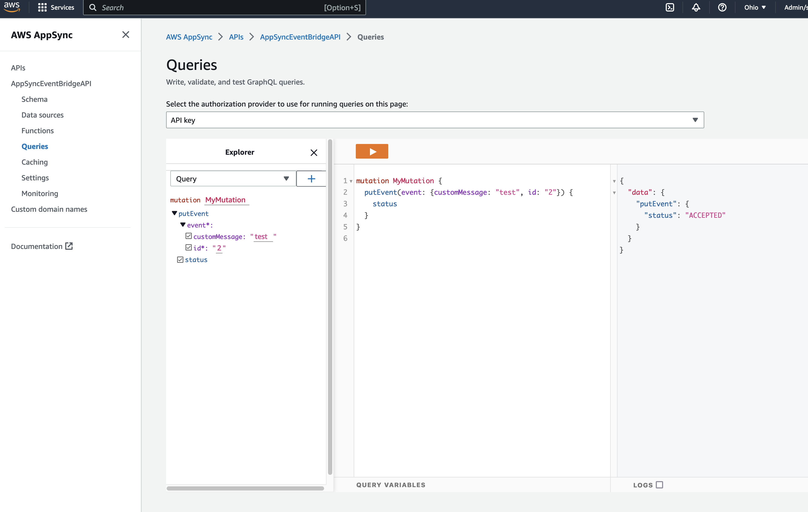

# Appsync to EventBridge Datasource 

This pattern demonstrates sending events directly to Event Bus by integrating Appsync with EventBridge Datasource.

Learn more about this pattern at Serverless Land Patterns: https://serverlessland.com/patterns/appsync-eventbridge-datasource

Important: this application uses various AWS services and there are costs associated with these services after the Free Tier usage - please see the [AWS Pricing page](https://aws.amazon.com/pricing/) for details. You are responsible for any AWS costs incurred. No warranty is implied in this example.

## Architecture

## Requirements

- [Create an AWS account](https://portal.aws.amazon.com/gp/aws/developer/registration/index.html) if you do not already have one and log in. The IAM user that you use must have sufficient permissions to make necessary AWS service calls and manage AWS resources.
- [AWS CLI](https://docs.aws.amazon.com/cli/latest/userguide/install-cliv2.html) installed and configured
- [Git Installed](https://git-scm.com/book/en/v2/Getting-Started-Installing-Git)
- [Node and NPM](https://nodejs.org/en/download/) installed
- [AWS CDK](https://docs.aws.amazon.com/cdk/v2/guide/getting_started.html) (AWS CDK) installed

## Deployment Instructions

1. Create a new directory, navigate to that directory in a terminal and clone the GitHub repository:
   ```bash
   git clone https://github.com/aws-samples/serverless-patterns
   ```
2. Change directory to the pattern directory:
   ```bash
   cd serverless-patterns/appsync-eventbridge-datasource/cdk
   ```
3. Install dependencies:
   ```bash
   npm install
   ```
4. From the command line, configure AWS CDK:
   ```bash
   cdk bootstrap
   ```
5. From the command line, use AWS CDK to deploy the AWS resources for the pattern as specified in the `lib/appsync-eventbridge-datasource-stack.ts` file:
   ```bash
   cdk deploy
   ```
6. This command will take sometime to run. After successfully completing, it will print out a few output variables.  Your output should look something like this which contain the resource names which are used for testing.
```
Outputs:
AppSyncEventBridgeStack.AppsyncApiKey = xxxxxx
AppSyncEventBridgeStack.AppsyncGraphqlUrl = https://xxxxxxxx.appsync-api.xxxxx.amazonaws.com/graphql
```

## How it works

This pattern demonstrates sending events directly to Event Bus by integrating Appsync with EventBridge datasource.

Once the pattern is deployed to AWS, you will have the following resources created with the described capabilities

- An EventBridge Custom EventBus   
- Appsync API with the EventBridge as a DataSource
- Appsync JS Function "PutEventFunction" which is connected to the EventBridge Custom EventBus as as datasource

## Testing
### Send "putEvent" mutation request

In the AWS Console, browse to the AWS Appsync Service and find the `AppSyncEventBridgeAPI` that is created. 

1. Navigate to Queries page and pick the explorer option to Mutation
2. Select "PutEvent" mutation and fill the required input 
3. Click the execute query button on the top
4. The event get published to the custom event bus and the success response should appear on the right side. 



## Delete stack

```bash
cdk destroy
```

---

Copyright 2023 Amazon.com, Inc. or its affiliates. All Rights Reserved.

SPDX-License-Identifier: MIT-0
