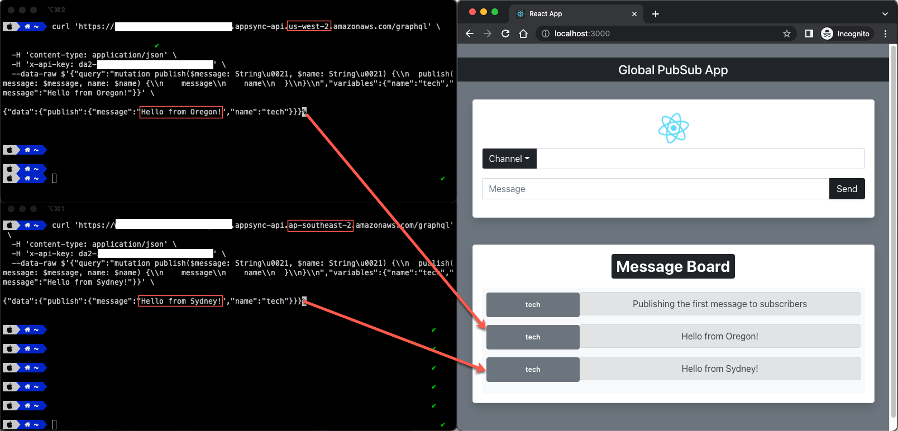

# Global Serverless / Functionless WebSockets PubSub API 
## with AWS AppSync and Amazon EventBridge


This is an implementation of a multi-region PubSub real-time API based on Serverless/Functionless WebSockets where clients are subscribed to a specific channel and messages are pushed automatically to clients listening/subscribed to the channel in both regions. Connections management, scalability, fan-out and broadcasting are all automatically handled by the regional AppSync APIs.
<br/>
<br/>

## Requirements

* [Create an AWS account](https://portal.aws.amazon.com/gp/aws/developer/registration/index.html) if you do not already have one and log in. The IAM user that you use must have sufficient permissions to make necessary AWS service calls and manage AWS resources.
* [Git installed](https://git-scm.com/book/en/v2/Getting-Started-Installing-Git)
* [Node and NPM](https://nodejs.org/en/download/) installed
* [AWS Cloud Development Kit](https://docs.aws.amazon.com/cdk/latest/guide/cli.html) (AWS CDK) installed
* [Amplify CLI](https://docs.amplify.aws/cli/start/install/), only required to generate code as the backend deployment is done via AWS CDK
<br/>
<br/>

## Deploy APIs and Event Buses to the cloud

1. Clone the project to your local working directory:

   ```sh
   git clone https://github.com/awsed/globalWSAPI
   ```

2. Change the working directory to:

   ```sh
   cd globalWSAPI/cdk
   ```

3. Install the project dependencies:

   ```sh
   npm install
   ```

4. Deploy the 4 CDK stacks with a single command to your default AWS account. Regions for each stack are defined [here](https://github.com/awsed/globalWSAPI/blob/main/cdk/bin/multiregionsubs.ts). After deployment, the output of the 2 first stacks display the GraphQL APIs endpoint, API IDs, and API keys. Take note of all the details as they are needed to setup clients later:

   ```sh
   cdk deploy --all
   ```
<br/>
<br/>

## Enhanced Filtering and Invalidation

<p align="center">
  
</p>


The APIs are configured to allow only 5 channels using backend [Enhanced Filtering](https://docs.aws.amazon.com/appsync/latest/devguide/aws-appsync-real-time-enhanced-filtering.html) logic:

https://github.com/awsed/globalWSAPI/blob/76934587e8ca5c1dcc69d5cd8695d3d681566f00/cdk/lib/globalSubs-region1-stack.ts#L160

A backend process or service can be used to [unsubscribe](https://docs.aws.amazon.com/appsync/latest/devguide/aws-appsync-real-time-invalidation.html) clients from a channel by calling an `unsubscribe` mutation and informing the channel name:

```
mutation Unsubscribe {
  unsubscribe(name: "tech") {
    name
  }
}
```

This will forcibly close their WebSocket connection. Clients are authorized using API Keys however the invalidation mutation is configured so it can only be invoked with IAM authorization so clients cannot unsubscribe other clients. Either a backend service with the proper permissions or the [AWS Appsync Console](https://console.aws.amazon.com/appsync/home) can be used as an administrative tool to invoke the mutation to invalidate/unsubscribe clients in a given channel by selecting AWS IAM in the Queries section.

<br/>
<br/>

## Configure the React.js client


1. Change the working directory to the `client` folder:

   ```sh
   cd ../client
   ```

2. Install the project dependencies:

   ```sh
   npm install
   ```

3. Open the file `src/App.js` and update the [AppSync API congifuration details](https://github.com/awsed/globalWSAPI/blob/064f6d3012e66a486185b56404a8fa92048589c2/client/src/App.js#L11) based on the output of the previous `cdk deploy`. You can connect the client to your API of choice (Oregon or Sydney). You could also duplicate the `client` folder and have a different instance of each client connecting to a different API in order to test multi-region subscriptions.

4. Generate the necessary code to interact with the API using the [Amplify CodeGen](https://docs.amplify.aws/cli/graphql-transformer/codegen/) with the API ID output of the previous `cdk deploy`. There's no need to create an Amplify CLI project, however you'll need to download the API schema from the [AWS Appsync Console](https://console.aws.amazon.com/appsync/home). Select the API `GlobalWS-API` in one of the regions your account and, in the Schema section, select **Export schema**. Download and copy the schema file to the root of the `/client` folder, where you need to execute the following command accepting all defaults:

   ```sh
   amplify add codegen --apiId xxxxxxxxxxxxxxxxxxxxxx
   ```

6. Execute the application and access it from multiple browser tabs/windows at <http://localhost:3000> :

    ```bash
    npm start
    ```

7. Select a channel from the drop-down, send messages from one client and get it broadcasted to all browser windows. You can also type a different channel name in the form and try to send a message, however no messages will be published as filtering in AppSync is blocking other channels. Since AWS AppSync automatically scales to demand, you can have thousands of clients broadcasting messages data. 

## Cleanup

Run the given command to delete the resources that were created. It might take some time for the CloudFormation stack to get deleted.

```
cdk destroy
```

## References

1. <https://aws.amazon.com/blogs/mobile/multi-region-websocket-api/>

----
Copyright 2021 Amazon.com, Inc. or its affiliates. All Rights Reserved.

SPDX-License-Identifier: MIT-0
