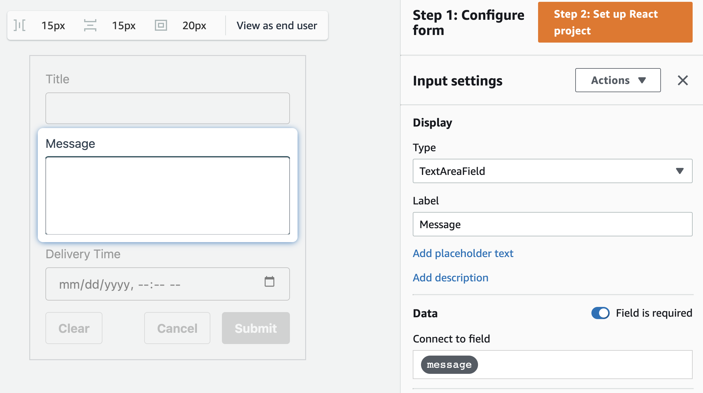
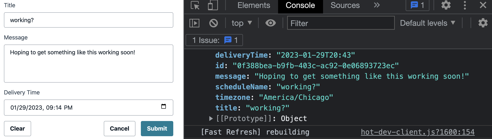

# AWS AppSync to EventBridge Sceduler to SNS

This pattern uses AWS AppSync to dynamically create an EventBridge Schedule that publishes a message to SNS.

Learn more about this pattern at Serverless Land Patterns: https://serverlessland.com/patterns/appsync-eventbridge-scheduler-sns-cdk

Important: this application uses various AWS services and there are costs associated with these services after the Free Tier usage - please see the [AWS Pricing page](https://aws.amazon.com/pricing/) for details. You are responsible for any AWS costs incurred. No warranty is implied in this example.

## Requirements

- [Create an AWS account](https://portal.aws.amazon.com/gp/aws/developer/registration/index.html) if you do not already have one and log in. The IAM user that you use must have sufficient permissions to make necessary AWS service calls and manage AWS resources.
- [AWS CLI](https://docs.aws.amazon.com/cli/latest/userguide/install-cliv2.html) installed and configured
- [Git Installed](https://git-scm.com/book/en/v2/Getting-Started-Installing-Git)
- [AWS CDK](https://docs.aws.amazon.com/cdk/v2/guide/getting_started.html#getting_started_install) (AWS CDK) installed

## Deployment Instructions

1. Clone the repo locally
2. Change into the pattern

```bash
cd serverless-patterns/appsync-eventbridge-scheduler-sns/cdk
```

3. Install the dependencies with `npm i`
4. Deploy the application with `npx aws-cdk deploy`

## How it works

Using the AWS CDK, an AppSync API is created that uses an HTTP datasource to dynamically create and EventBridge Scheduler. The scheduler is tied to an SNS topic that then publishes the message to topic subscribers at the specified time.

## Testing

Feel free to test this integration by visiting the AWS AppSync console, however following are instructions to create a frontend that calls the our API

> This project does not have an endpoint to add subscribers. To add a subscriber, such as an email, service, or otherwise, find the _reminderTopic_ in the AWS Console under the SNS service. From there, follow the steps to add an email subscriber.

## Frontend setup

1. Create a react project. I'll use NextJS but feel free to use a different framework.
   In a folder outside of our CDK project, run the following:
   `npx create-next-app scheduler-frontend`

   > When asked if wanting to use TypeScript, select "no".

2. Install the Amplify component library and the JS libraries

`npm i @aws-amplify/ui-react aws-amplify`

3. Update the 2 files below with the relevant code snippets

```jsx
// _app.js file
import '@aws-amplify/ui-react/styles.css'
import { ThemeProvider } from '@aws-amplify/ui-react'
import { Amplify } from 'aws-amplify'
Amplify.configure({
	aws_appsync_graphqlEndpoint:
		'https://YOUR_API_ID.appsync-api.YOUR_API_REGION.amazonaws.com/graphql',
	aws_appsync_region: 'YOUR_API_REGION',
	aws_appsync_authenticationType: 'API_KEY', // Literally the string "API_KEY"
	aws_appsync_apiKey: 'YOUR_API_KEY', // Your actual API Key
})

export default function App({ Component, pageProps }) {
	return (
		<ThemeProvider>
			<Component {...pageProps} />
		</ThemeProvider>
	)
}
```

```jsx
//pages/index.js file
import { API } from 'aws-amplify'
import { MyForm } from '../ui-components'

const createSchedule = /* GraphQL */ `
	mutation CreateSchedule($input: ScheduleInput) {
		createSchedule(input: $input) {
			id
			title
			message
			timezone
			deliveryTime
			scheduleName
		}
	}
`

export default function Home() {
	const handleSubmit = async ({ title, message, deliveryTime }) => {
		const timezone = Intl.DateTimeFormat().resolvedOptions().timeZone

		const res = await API.graphql({
			query: createSchedule,
			variables: {
				input: {
					title,
					message,
					deliveryTime,
					timezone,
				},
			},
		})
		console.log(res.data.createSchedule)
	}
	return (
		<>
			<MyForm onSubmit={handleSubmit} />
		</>
	)
}
```

4. Create the form: Head to the [Amplify Form Builder page](https://sandbox.amplifyapp.com/ui-library/form/edit) and create a form as shown in the screenshot below:



5. Once done creating the form, continue with the steps on the page until the Form Builder downloads a zip file containing your React components. Unzip the file and store the folder next to the `pages` folder in your application.

6. Run the application to view a page similar to the screenshot below:

`npm run dev`

> The application defaults to running on localhost:3000



## Cleanup

```bash
npx aws-cdk destroy
```

---

Copyright 2023 Amazon.com, Inc. or its affiliates. All Rights Reserved.

SPDX-License-Identifier: MIT-0
