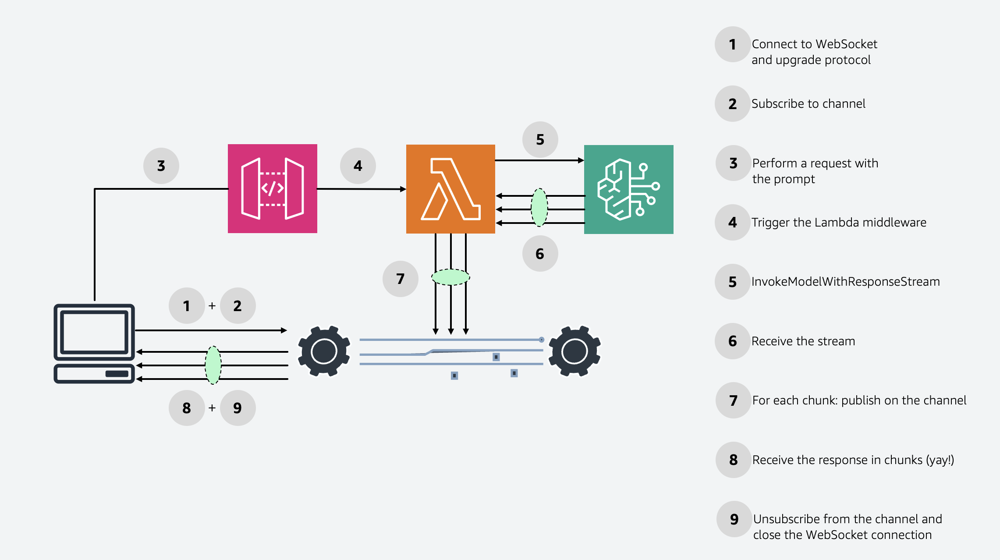
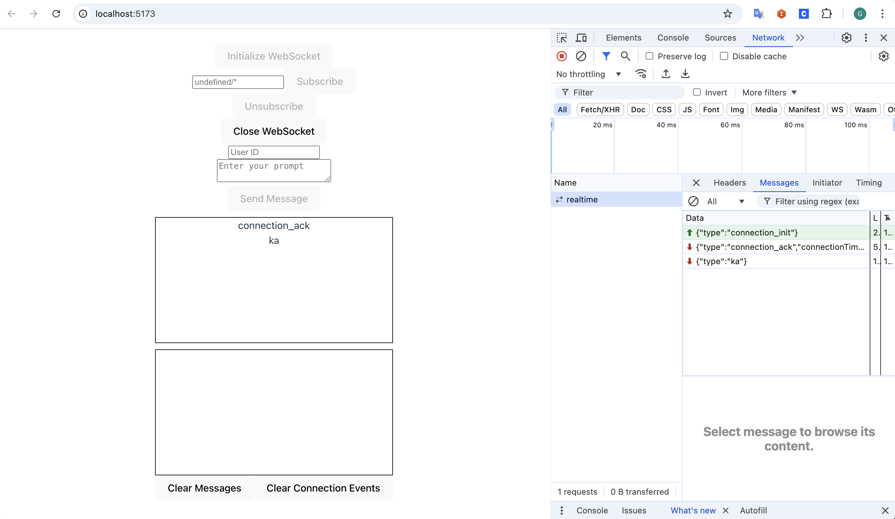
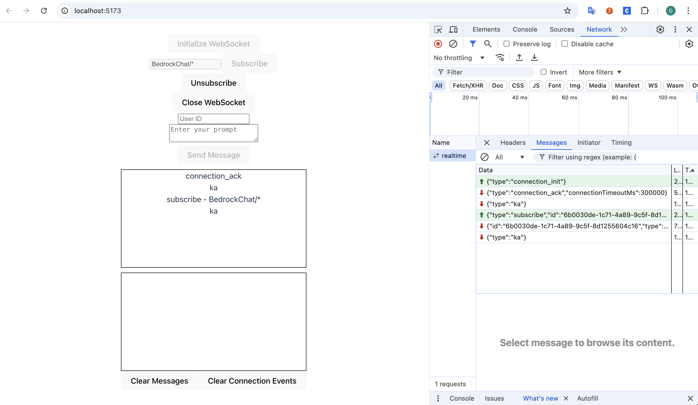
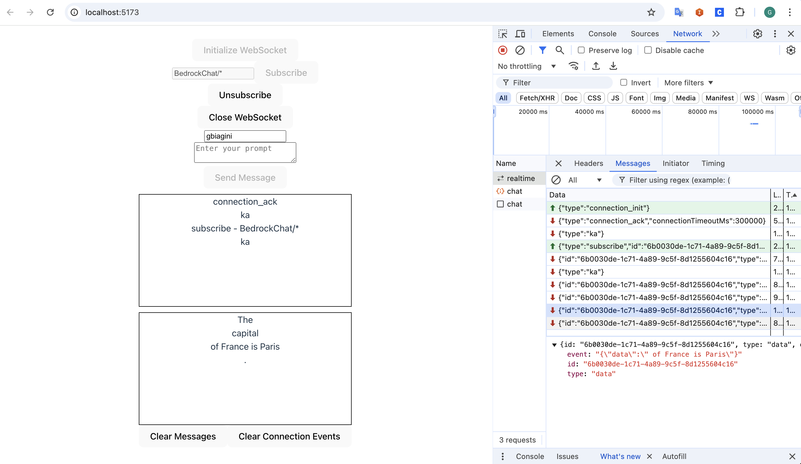

# Stream Amazon Bedrock completions via AWS AppSync Events API

This pattern shows how to stream Amazon Bedrock completions via AWS AppSync Events API.

Learn more about this pattern at Serverless Land Patterns: https://serverlessland.com/patterns/appsync-events-bedrock

Important: this application uses various AWS services and there are costs associated with these services after the Free Tier usage - please see the [AWS Pricing page](https://aws.amazon.com/pricing/) for details. You are responsible for any AWS costs incurred. No warranty is implied in this example.


## Requirements
* [Create an AWS account](https://portal.aws.amazon.com/gp/aws/developer/registration/index.html) if you do not already have one and log in. The IAM user that you use must have sufficient permissions to make necessary AWS service calls and manage AWS resources.
* [AWS CLI](https://docs.aws.amazon.com/cli/latest/userguide/install-cliv2.html) installed and configured
* [Git Installed](https://git-scm.com/book/en/v2/Getting-Started-Installing-Git)
* [Node and NPM](https://nodejs.org/en/download/) installed
* [AWS Cloud Development Kit](https://docs.aws.amazon.com/cdk/v2/guide/cli.html) (AWS CDK) installed
* Make sure to enable the **Anthropic - Claude 3 Haiku** model on the [Bedrock console](https://console.aws.amazon.com/bedrock/home#/modelaccess).


## How it works

1. The client connects to the WebSocket using the AWS Amplify client or a custom made library following the [instructions described in the documentation](https://docs.aws.amazon.com/appsync/latest/eventapi/event-api-websocket-protocol.html);
2. The client chooses a namespace or a channel (or a segment) and subscribes to it. [Additional info the documentation](https://docs.aws.amazon.com/appsync/latest/eventapi/event-api-websocket-protocol.html);
3. The client performs a request towards the Amazon API Gateway that exposes a `/chat` route passing the `userId` and `prompt` parameters. The `userId` will be used as a segment for the channel. The prompt will be used for GenAI completions on Bedrock;
4. The triggered Lambda function receives payload;
5. The Lambda function proceeds to invoke a Bedrock model using the streaming API;
6. The Lambda function will receive the completion `chunks` as soon as they are available;
7. For each completion chunk, the Lambda function will publish them through the [Publish HTTP API on AppSync Events](https://docs.aws.amazon.com/appsync/latest/eventapi/publish-http.html);
8. The client is now able to retrieve the completion chunks from AppSync Events;
9. The client can finally unsubscribe from the channel and close the Websocket connection.

### Permissions and Security
In this demo the client is only able to subscribe to the AppSync Event WebSocket via the API_KEY. The same API_KEY will be used by the Lambda function to perform publish requests.


## Deployment Instructions

1. Create a new directory, navigate to that directory in a terminal and clone the GitHub repository:
```sh
git clone https://github.com/aws-samples/serverless-patterns
```
2. Change directory to the pattern directory:
```sh
cd appsync-events-bedrock-cdk
```
3. Install the required dependencies:
```sh
npm install
```
4. Deploy the stack to your default AWS account and region:
```sh
npm run deploy
```
5. Export the environment variables for the demo web app:
```sh
npm run export-outputs
```
6. Install dependencies for the demo web app:
```sh
cd demo-app && npm install
```
7. Launch the demo web app
```sh
npm run dev
```

## Testing
Integration tests can be ran with jest from the pattern's root directory:
```sh
npm run test
```

From the demo app it's possible to see all connection events and data events in a structured way.
First of all connect to the WebSocket


Then subscribe to the namespace. Please note: The default namespace is `BedrockChat`. By inserting `BedrockChat/*` you will be able to receive all the messages in the sub-segments.


Finally, insert your username (the final segment will become `BedrockChat/username`) and your prompt.


By clicking on the `realtime` entry on the networking tab and selecting `messages` you will see all the messages exchanged between the client demo app and AppSync Event API. For convienence I've setup two scrollable boxes that display the same data.


## Cleanup
Close the demo web app by hitting `^C` on MacOs.

Return to the pattern's root folder and delete the stack:
```sh
cdk destroy --all
```
----
Copyright 2024 Amazon.com, Inc. or its affiliates. All Rights Reserved.
SPDX-License-Identifier: MIT-0
