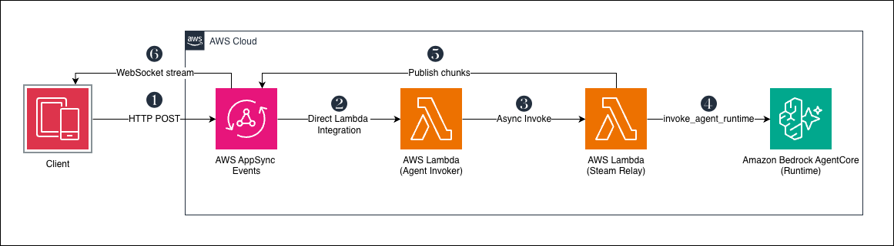
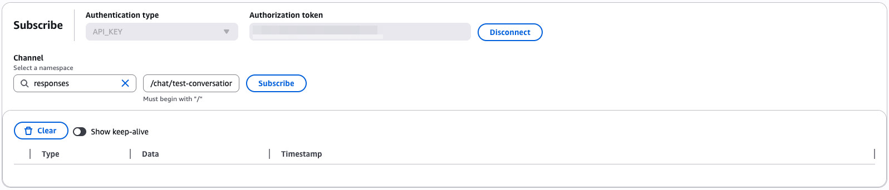
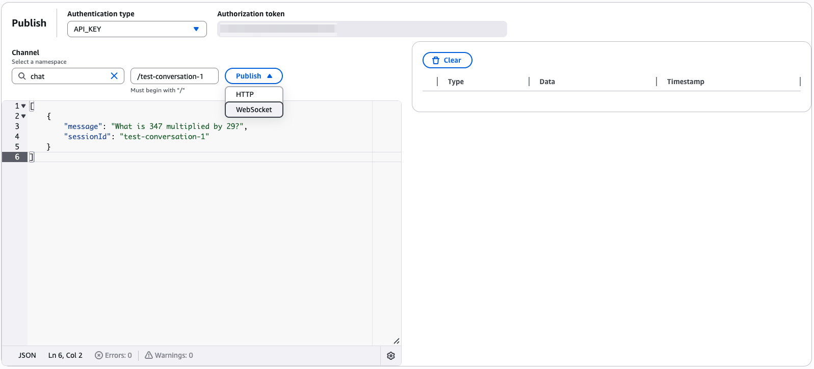
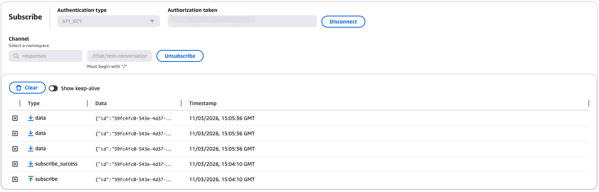

# AWS AppSync Events integration with AWS Lambda and Amazon Bedrock AgentCore

This pattern deploys a real-time streaming chat service using AWS AppSync Events with AWS Lambda to invoke a Strands agent running on Amazon Bedrock AgentCore Runtime.

Learn more about this pattern at Serverless Land Patterns: https://serverlessland.com/patterns/appsync-events-lambda-agentcore-cdk

Important: this application uses various AWS services and there are costs associated with these services after the Free Tier usage - please see the [AWS Pricing page](https://aws.amazon.com/pricing/) for details. You are responsible for any AWS costs incurred. No warranty is implied in this example.

## Requirements

* [Create an AWS account](https://portal.aws.amazon.com/gp/aws/developer/registration/index.html) if you do not already have one and log in. The IAM user that you use must have sufficient permissions to make necessary AWS service calls and manage AWS resources.
* [AWS CLI installed and configured](https://docs.aws.amazon.com/cli/latest/userguide/install-cliv2.html)
* [Git installed](https://git-scm.com/book/en/v2/Getting-Started-Installing-Git)
* [Python 3.14](https://www.python.org/downloads/) with [pip](https://pip.pypa.io/en/stable/installation/)
* [Node.js 22](https://nodejs.org/en/download/)
* [AWS CDK v2](https://docs.aws.amazon.com/cdk/v2/guide/getting_started.html) (`npm install -g aws-cdk`)
* [Finch](https://runfinch.com/) or [Docker](https://docs.docker.com/get-docker/) (used for CDK bundling)

## Deployment Instructions

1. Create a new directory, navigate to that directory in a terminal and clone the GitHub repository:
    ```
    git clone https://github.com/aws-samples/serverless-patterns
    ```
1. Change directory to the pattern directory:
    ```
    cd appsync-events-lambda-agentcore-cdk
    ```
1. Create and activate a Python virtual environment:
    ```
    python -m venv .venv
    source .venv/bin/activate        # On Windows: .venv\Scripts\activate
    ```
1. Install Python dependencies:
    ```
    pip install -r requirements.txt
    ```
1. Set your target AWS region (must be a region where [Bedrock AgentCore](https://docs.aws.amazon.com/general/latest/gr/bedrock_agentcore.html) is available):
    ```
    export AWS_REGION=eu-west-1     # On Windows: set AWS_REGION=eu-west-1
    ```
    ```
    export AWS_REGION=eu-west-1      # On Windows: set AWS_REGION=eu-west-1
    ```
1. If you are using [Finch](https://runfinch.com/) instead of Docker, set the `CDK_DOCKER` environment variable:
    ```
    export CDK_DOCKER=finch          # On Windows: set CDK_DOCKER=finch
    ```
1. Bootstrap CDK in your account/region (if not already done):
    ```
    cdk bootstrap
    ```
1. Deploy the stack:
    ```
    cdk deploy
    ```
1. Note the outputs from the CDK deployment process. These contain the AppSync Events HTTP endpoint, WebSocket endpoint, and API key needed for testing.

## How it works



Figure 1 - Architecture

1. The client publishes a message to the inbound channel (`/chat/{conversationId}`) via HTTP POST to AppSync Events.
2. AppSync Events triggers the agent invoker Lambda via direct Lambda integration.
3. The agent invoker validates the payload, invokes the stream relay Lambda asynchronously, and returns immediately. This two-Lambda split is necessary because AppSync invokes the handler synchronously — a long-running stream would block the response.
4. The stream relay calls `invoke_agent_runtime` on the Bedrock AgentCore Runtime, which hosts a Strands agent container, and consumes the Server-Sent Events (SSE) stream.
5. The stream relay publishes each chunk back to the response channel on AppSync Events (`/responses/chat/{conversationId}`).
6. The client receives agent response tokens in real time via the WebSocket subscription.

The client subscribes to the response channel before publishing. Separate channel namespaces (`chat` for inbound, `responses` for outbound) ensure the stream relay's publishes do not re-trigger the agent invoker.

The agent is a Strands-based research assistant with access to `http_request`, `calculator`, and `current_time` tools, backed by S3 session persistence for multi-turn conversations.

## Testing

### Automated tests

Install the test dependencies:

```bash
pip install -r requirements-dev.txt
```

Run the tests:

```bash
pytest tests/unit -v                  # unit tests (no deployed stack needed)
pytest tests/integration -v -s        # integration tests with streaming output
```

### Using the AppSync Pub/Sub Editor

You can test the deployed service directly from the AWS Console using the AppSync Events built-in Pub/Sub Editor. No additional tooling required.

1. Open the [AWS AppSync console](https://console.aws.amazon.com/appsync/) in the region you deployed to (e.g. `eu-west-1`).
1. Select the Event API created by the stack (look for the API with "EventApi" in the name).
1. Choose the **Pub/Sub Editor** tab.
1. Scroll to the bottom of the page. The API key is pre-populated in the authorization token field. Choose **Connect** to establish a WebSocket connection.
1. In the **Subscribe** panel, select `responses` from the namespace dropdown, then enter the path:
    ```
    /chat/test-conversation-1
    ```
1. Click **Subscribe**.

    
    
    Figure 2 - AppSync Pub/Sub Editor - Subscribe panel

1. Scroll back to the top of the page to the **Publish** panel. Select `chat` from the namespace dropdown, then enter the path:
    ```
    /test-conversation-1
    ```
    Enter this JSON as the event payload:
    ```json
    [
        {
            "message": "What is 347 multiplied by 29?",
            "sessionId": "test-conversation-1"
        }
    ]
    ```
    Click **Publish**. When prompted, choose **WebSocket** as the publish method.

    
    
    Figure 3 - AppSync Pub/Sub Editor - Publish panel

1. Scroll back down to the bottom of the page to watch the subscription panel — you should see streaming chunk events arrive in real time, followed by a final completion event containing the full response.

    
    
    Figure 4 - AppSync Pub/Sub Editor - Subscribe results


A few things to note:

- The `sessionId` value ties messages to a conversation. Use the same `sessionId` across publishes to test multi-turn conversation with session persistence.
- The subscribe channel must be prefixed with `/responses` — the agent invoker publishes responses to `/responses/chat/{conversationId}` to avoid re-triggering itself.
- You can try different prompts to exercise the agent's tools: ask it to fetch a URL (`http_request`), do arithmetic (`calculator`), or tell you the current time (`current_time`).

## Authentication

This example uses an API key for authentication to keep things simple. API keys are suitable for development and testing but are not recommended for production workloads.

AppSync Events supports several authentication methods that are better suited for production:

- **Amazon Cognito user pools** — ideal for end-user authentication in web and mobile apps.
- **AWS IAM** — best for server-to-server or backend service communication.
- **OpenID Connect (OIDC)** — use with third-party identity providers.
- **Lambda authorizers** — for custom authorization logic.

You can configure multiple authorization modes on a single API and apply different modes per channel namespace. See the [AppSync Events authorization and authentication](https://docs.aws.amazon.com/appsync/latest/eventapi/configure-event-api-auth.html) documentation for details.

## Cleanup

1. Delete the stack
    ```
    cdk destroy
    ```

----
Copyright 2025 Amazon.com, Inc. or its affiliates. All Rights Reserved.

SPDX-License-Identifier: MIT-0
