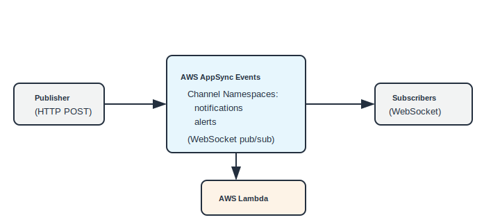

# AWS AppSync Events with AWS Lambda

This pattern deploys an AWS AppSync Events API for real-time WebSocket pub/sub with an AWS Lambda event handler.

Learn more about this pattern at Serverless Land Patterns: https://serverlessland.com/patterns/appsync-events-lambda-cdk

Important: this application uses various AWS services and there are costs associated with these services after the Free Tier usage - please see the [AWS Pricing page](https://aws.amazon.com/pricing/) for details.

## Requirements

* [AWS CLI](https://docs.aws.amazon.com/cli/latest/userguide/install-cliv2.html) installed and configured
* [Node.js 22+](https://nodejs.org/en/download/) installed
* [AWS CDK v2](https://docs.aws.amazon.com/cdk/v2/guide/getting-started.html) installed

## Architecture



## How it works

1. Publishers send events via HTTP POST to the AWS AppSync Events endpoint.
2. The AWS Lambda function processes and enriches events before delivery.
3. AWS AppSync Events delivers messages to all WebSocket subscribers on that channel.
4. Channel namespaces (`notifications`, `alerts`) organize topics.

## Deployment

1. Clone the repository and navigate to the pattern directory:
   ```bash
   git clone https://github.com/aws-samples/serverless-patterns
   cd serverless-patterns/appsync-events-lambda-cdk
   ```

2. Install dependencies:
   ```bash
   npm install
   ```

3. Bootstrap CDK (one-time per account/region):
   ```bash
   cdk bootstrap
   ```

4. Deploy the stack:
   ```bash
   cdk deploy
   ```

## Testing

```bash
# Publish an event (replace values from cdk deploy output)
curl -X POST "https://<HttpEndpoint>/event" \
  -H "x-api-key: <ApiKeyValue>" \
  -H "Content-Type: application/json" \
  -d '{"channel":"notifications/general","events":["{\"message\":\"Hello from CDK\"}"]}'
```

## Cleanup

```bash
cdk destroy
```
