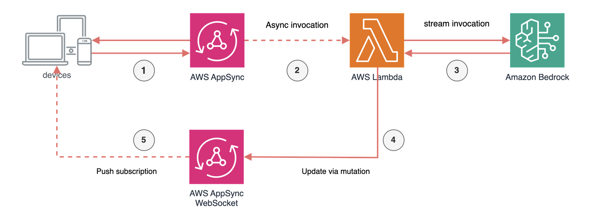

# Long running invocations of Amazon Bedrock using Amazon AppSync and AWS Lambda streaming

This pattern demonstrates how to implement [long-running invocations](https://docs.aws.amazon.com/appsync/latest/devguide/resolver-reference-bedrock-js.html#long-running-invocations)  with Amazon Bedrock using AWS AppSync subscriptions and AWS Lambda in Event Mode, following the official AWS AppSync documentation pattern.

Learn more about this pattern at [Serverless Land Patterns](https://serverlessland.com/patterns/appsync-lambda-bedrock-async-stream-subscription-cdk).

Important: this application uses various AWS services and there are costs associated with these services after the Free Tier usage - please see the [AWS Pricing page](https://aws.amazon.com/pricing/) for details. You are responsible for any AWS costs incurred. No warranty is implied in this example.

## Requirements

* [Create an AWS account](https://portal.aws.amazon.com/gp/aws/developer/registration/index.html) if you do not already have one and log in. The IAM user that you use must have sufficient permissions to make necessary AWS service calls and manage AWS resources.
* [AWS CLI](https://docs.aws.amazon.com/cli/latest/userguide/install-cliv2.html) installed and configured
* [Git Installed](https://git-scm.com/book/en/v2/Getting-Started-Installing-Git)
* [Node and NPM](https://nodejs.org/en/download/) installed
* [AWS Cloud Development Kit](https://docs.aws.amazon.com/cdk/v2/guide/cli.html) (AWS CDK) installed
* Enable the **Anthropic - Claude Sonnet 3.5 V2** model in **us-east-1** region through the [Bedrock console](https://console.aws.amazon.com/bedrock/home#/modelaccess). This implementation uses the [cross-region inference profile](https://docs.aws.amazon.com/bedrock/latest/userguide/inference-profiles-support.html#inference-profiles-support-system) from us-east-1.

## How it works

The pattern implements an asynchronous [streaming architecture](https://docs.aws.amazon.com/appsync/latest/devguide/resolver-reference-bedrock-js.html#long-running-invocations) where:

1. Client initiates a WebSocket subscription and makes a request to AppSync
2. AppSync invokes Lambda function in Event mode, enabling asynchronous processing
3. Lambda function streams responses from Bedrock using ConverseStream
4. Lambda sends updates via mutations to AppSync
5. Updates are delivered to client through WebSocket subscription



**Key Benefits**
- **Asynchronous Processing**: AppSync immediately returns a response while Lambda processes the request asynchronously, preventing timeouts for long-running operations
- **Real-time Updates**: Clients receive progressive updates through WebSocket subscriptions as the model generates responses
- **Scalable Architecture**: Event-driven design allows handling multiple concurrent requests without blocking
- **Enhanced User Experience**: Progressive updates enable responsive interfaces even during lengthy AI model invocations

## Deployment Instructions

1. Clone the repository:
```sh
git clone https://github.com/aws-samples/serverless-patterns
```
2. Navigate to pattern directory:
```sh
cd appsync-lambda-bedrock-async-stream-subscription-cdk
```

3. Install dependencies:
```sh
npm install
```

4. Bootstrap CDK (if needed):
```sh
cdk bootstrap
```

5. Deploy stack:
```sh
npm run deploy
```

### Important: 
Note the GraphQL API URL and API Key from the stack outputs - you'll need these for testing.

## Testing

After deployment, you can test the Bedrock streaming integration using the provided test script. The script demonstrates:
- WebSocket subscription initialization
- Conversation start with Bedrock
- Real-time streaming chunks display
- Graceful cleanup on exit

1. Configure test credentials:
```sh
    Open test/test.ts
    Replace APPSYNC_API_URL with the API URL from stack outputs
    Replace APPSYNC_API_KEY with the API Key from stack outputs
```

2.  Run the test:
```sh
npx tsx test/test.ts  
```

3. Expected Output:
```sh
Starting subscription...
Starting conversation...
StartConversation response: {
data: {
startConversation: {
conversationId: '123e4567-e89b-12d3-a456-426614174000',
status: 'STARTED'
}
}
}
Received chunk: {
conversationId: '123e4567-e89b-12d3-a456-426614174000',
chunk: "Here's a joke for you: Why don't scientists trust atoms? Because they make"
}
Received chunk: {
conversationId: '123e4567-e89b-12d3-a456-426614174000',
chunk: 'up everything!'
}
```

If you do not receive any response, please check your Bedrock Model access for Claude Sonnet 3.5 V2 in us-east-1 region.

4. Stop the test:
```sh
Press Ctrl+C to terminate the process
```


## Cleanup
 
1. Delete the stack
```sh
cdk destroy --all
```

## Author bio
Kaustav Dey,
https://www.linkedin.com/in/kaustavbecs/
Solution Architect

----
Copyright 2024 Amazon.com, Inc. or its affiliates. All Rights Reserved.

SPDX-License-Identifier: MIT-0

