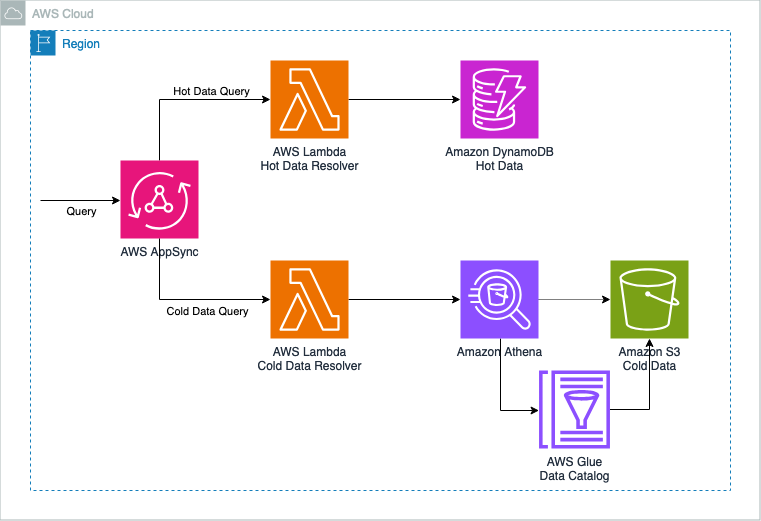

# GraphQL API with Hot and Cold Data Storage using AWS AppSync, Lambda, DynamoDB, and S3/Glue/Athena

This pattern demonstrates how to implement a GraphQL API using AWS AppSync with separate storage solutions for hot and cold data. It uses AWS Lambda for resolvers, Amazon DynamoDB for hot data storage, and Amazon S3 with Amazon Athena for cold data querying. This architecture showcases an efficient approach to managing data with varying access patterns.

Learn more about this pattern at Serverless Land Patterns: https://serverlessland.com/patterns/appsync-lambda-dynamodb-dotnet-cdk

Important: this application uses various AWS services and there are costs associated with these services after the Free Tier usage - please see the [AWS Pricing page](https://aws.amazon.com/pricing/) for details. You are responsible for any AWS costs incurred. No warranty is implied in this example.

## Architecture


## Requirements
* [Create an AWS account](https://portal.aws.amazon.com/gp/aws/developer/registration/index.html) if you do not already have one and log in. The IAM user that you use must have sufficient permissions to make necessary AWS service calls and manage AWS resources.
* [AWS CLI](https://docs.aws.amazon.com/cli/latest/userguide/install-cliv2.html) installed and configured
* [Git Installed](https://git-scm.com/book/en/v2/Getting-Started-Installing-Git)
* [Node and NPM](https://nodejs.org/en/download/) installed
* [AWS Cloud Development Kit](https://docs.aws.amazon.com/cdk/latest/guide/cli.html) (AWS CDK) installed
* [.NET](https://dotnet.microsoft.com/en-us/download/dotnet/8.0) (.NET 8.0) installed

## Deployment Instructions

1. Create a new directory, navigate to that directory in a terminal and clone the GitHub repository:
   ```
   git clone https://github.com/aws-samples/serverless-patterns
   ```
2. Change directory to the pattern directory:
   ```
   cd appsync-lambda-dynamodb-dotnet-cdk
   ```
3. Build the .NET Lambda functions:
   ```
   dotnet build src
   ```
4. Deploy the stack to your default AWS account and region:
   ```
   cdk deploy
   ```
5. Other useful commands:
    ```
    cdk diff         compare deployed stack with current state    
    cdk synth        emits the synthesized CloudFormation template
    ```
    
## How it works

This pattern sets up a GraphQL API using AWS AppSync. It uses two Lambda functions as resolvers: one for querying hot data from DynamoDB and another for querying cold data from S3 using Athena. The API provides two queries: `getHotData` and `getColdData`, each utilizing its respective data store.

The AWS CDK is used to define and deploy all the necessary AWS resources, including the AppSync APIs, Lambda functions, DynamoDB tables, S3 Bucket, Glue Database and Table and associated IAM roles and permissions.

## Testing

1. After deployment, note the GraphQL API URL and API Key from the CDK output.
2. You can use tools like [Postman](https://www.postman.com/) or [GraphQL Playground](https://github.com/graphql/graphql-playground) to interact with your API.
3. Example query for hot data:
   ```graphql
   query {
     getHotData(id: "123") {
       id
       content
       timestamp
     }
   }
   ```
4. Additional unit and integration tests are located in the `test` directory under each Lambda function's directory. There is also an integration tests available to run tests against AppSync APIs. 
    - Make sure to update `S3 Bucket Name`, `DynamoDB Table Names`, `Glue Database and Table Name` if you have changed them before deployment.
    - Make sure to update `_apiUrl` and `_apiKey` in integration tests which you can find from deployment output.
    - These tests can be run locally to verify the behavior of individual components:
   ```
   dotnet test src
   ```

## Cleanup

1. Run the given command to delete the resources that were created. It might take some time for the CloudFormation stack to get deleted.
   ```
   cdk destroy
   ```
---

Copyright 2024 Amazon.com, Inc. or its affiliates. All Rights Reserved.

SPDX-License-Identifier: MIT-0
