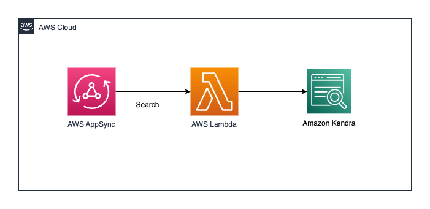

# AWS AppSync to AWS Lambda to Amazon Kendra

This pattern demonstrates integration of AppSync, Lambda and Kendra



Learn more about this pattern at Serverless Land Patterns: https://serverlessland.com/patterns/appsync-lambda-kendra-sam

Important: this application uses various AWS services and there are costs associated with these services after the Free Tier usage - please see the [AWS Pricing page](https://aws.amazon.com/pricing/) for details. You are responsible for any AWS costs incurred. No warranty is implied in this example.

## Requirements

* [Create an AWS account](https://portal.aws.amazon.com/gp/aws/developer/registration/index.html) if you do not already have one and log in. The IAM user that you use must have sufficient permissions to make necessary AWS service calls and manage AWS resources.
* [AWS CLI](https://docs.aws.amazon.com/cli/latest/userguide/install-cliv2.html) installed and configured
* [Git Installed](https://git-scm.com/book/en/v2/Getting-Started-Installing-Git)
* [AWS Serverless Application Model](https://docs.aws.amazon.com/serverless-application-model/latest/developerguide/serverless-sam-cli-install.html) (AWS SAM) installed

## Deployment Instructions

1. Create a new directory, navigate to that directory in a terminal and clone the GitHub repository:
    ``` 
    git clone https://github.com/aws-samples/serverless-patterns
    ```
1. Change directory to the pattern directory:
    ```
    cd appsync-lambda-kendra
    ```
1. From the command line, use AWS SAM to deploy the AWS resources for the pattern as specified in the template.yml file:
    ```
    sam deploy --guided
    ```
1. During the prompts:
    * Enter a stack name
    * Enter the desired AWS Region
    * Allow SAM CLI to create IAM roles with the required permissions.

    Once you have run `sam deploy --guided` mode once and saved arguments to a configuration file (samconfig.toml), you can use `sam deploy` in future to use these defaults.

1. Note the outputs from the SAM deployment process. These contain the resource names and/or ARNs which are used for testing.

## How it works

The architecture of this application is as follows:

1. AWS AppSync: Provides the GraphQL API for performing search queries.
2. AWS Lambda: Handles the AppSync requests, performs the search queries on Kendra, caches the results in MemoryDB, and returns the results.
3. Amazon Kendra: Indexes the documents and performs the actual search queries.

## Testing

1. Create a key in the S3 bucket that is provisioned for you. The bucket name will start with 

```
aws-kendra-{your-aws-account_id}
```

2. Upload the 4 documents inside the documents key that are provided with the template. It can be found within the documents folder within the appsync-lambda-kendra folder.

```
aws s3 cp documents/ s3://aws-kendra-{your-aws-account-id}/documents/
```

3. After this, you need to list all the indices from kendra

```
aws kendra list-indices
```

This will give you the Id, copy it as this will be used for triggering the sync job

Next, we need to list the data sources for Kendra

```
aws kendra list-data-sources --index-id <Id>
```

This will give the data source Id. Keep that handy.

Finally, 

we will sync the job using

```
aws kendra start-data-source-sync-job --id <Data source id> --index-id <Index ID>
```

Similary, you can also start the sync job from AWS console also.

4. Once this is done, you need to sync the kendra datasource.

After you have deployed the application, you can perform search queries by sending GraphQL requests to the AppSync API. The queries should be in the following format:

```graphql
query MyQuery {
  searchKendra(query: "Who are the authors.")
}
```

5. Tail Logs from All Support Resources and X-Ray

```
sam logs --stack-name <stack_name> --tail --include-traces
```

## Cleanup
 
1. Delete the stack
    ```bash
    sam delete
    ```
----
Copyright 2023 Amazon.com, Inc. or its affiliates. All Rights Reserved.

SPDX-License-Identifier: MIT-0
