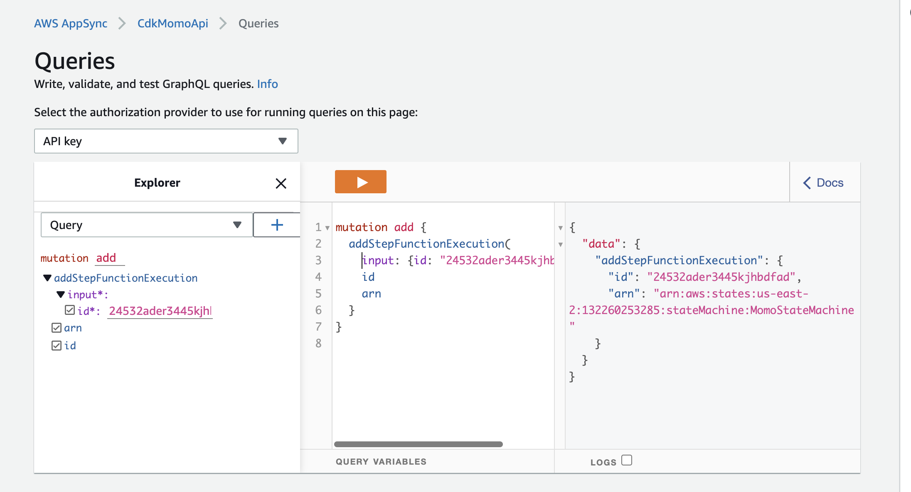

# Invokiing step functions workflows using appsync and direct lambda resolvers

This CDK template deploys an AWS Appsync API,a DynamoDB table and a step functions workflow.
You can invoke the step functions workflow by sending a random Id number as input to a mutation in the appsync api.

Learn more about this pattern at Serverless Land Patterns: https://serverlessland.com/patterns/appsync-lambda-sfn-sam.

Important: this application uses various AWS services and there are costs associated with these services after the Free Tier usage - please see the [AWS Pricing page](https://aws.amazon.com/pricing/) for details. You are responsible for any AWS costs incurred. No warranty is implied in this example.

## Requirements

* [Create an AWS account](https://portal.aws.amazon.com/gp/aws/developer/registration/index.html) if you do not already have one and log in. The IAM user that you use must have sufficient permissions to make necessary AWS service calls and manage AWS resources.
* [AWS CLI](https://docs.aws.amazon.com/cli/latest/userguide/install-cliv2.html) installed and configured
* [Git Installed](https://git-scm.com/book/en/v2/Getting-Started-Installing-Git)
* [AWS Serverless Application Model](https://docs.aws.amazon.com/serverless-application-model/latest/developerguide/serverless-sam-cli-install.html) (AWS SAM) installed

## Deployment Instructions

1. Create a new directory, navigate to that directory in a terminal and clone the GitHub repository:
    ``` 
    git clone https://github.com/aws-samples/serverless-patterns
    ```
2. Change directory:
    ```
     cd ./serverless-patterns/appsync-lambda-sfn-cdk/
    ```
3. Navigate to `/appsync-lambda-sfn-cdk/cdk_momo/app.py` and change the `account` and `region` environment variables to suit your values.
```python
env=cdk.Environment(account="13xxxxxxxxxx", region='us-east-2'),
```

5. From the command line, use AWS CDK to deploy the AWS resources for the pattern as specified in the `cdk_momo/cdk_momo_stack.py` file:
   ```bash
   cdk deploy
   ```

## Testing
Sign in to your AWS console and search for appsync. Open up appsync and click on your newly deployed appsync project.
Enter any unique string as  `Id` in the mutation `addStepfunctionExecution` and run



## Cleanup
 
1. Delete the stack
    ```bash
    aws cloudformation delete-stack --stack-name STACK_NAME
    ```
1. Confirm the stack has been deleted
    ```bash
    aws cloudformation list-stacks --query "StackSummaries[?contains(StackName,'STACK_NAME')].StackStatus"
    ```
----
Copyright 2021 Amazon.com, Inc. or its affiliates. All Rights Reserved.

SPDX-License-Identifier: MIT-0
