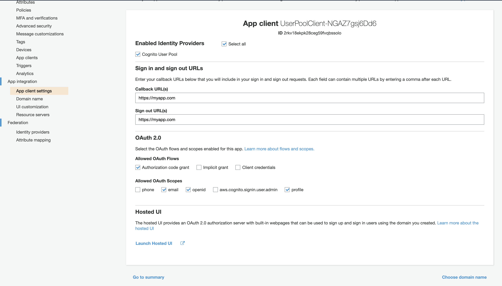
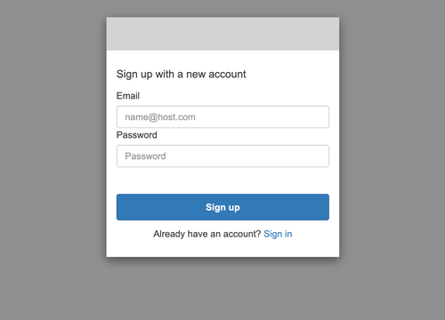
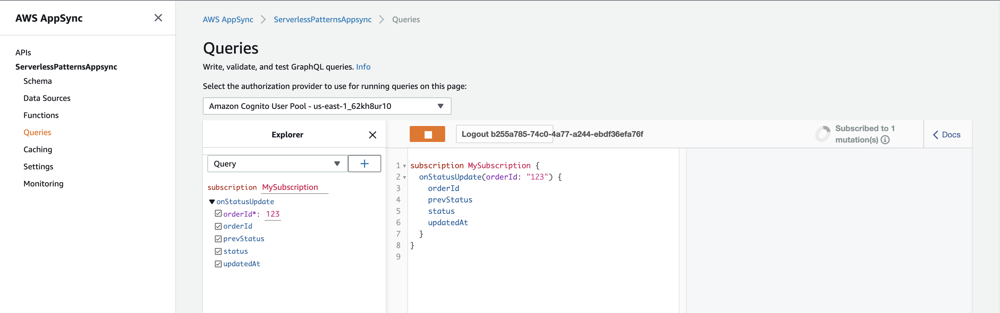
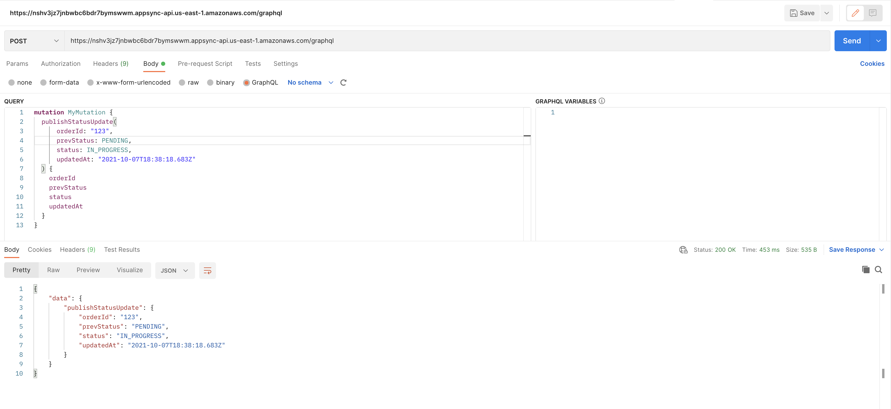
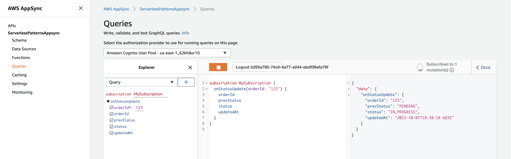
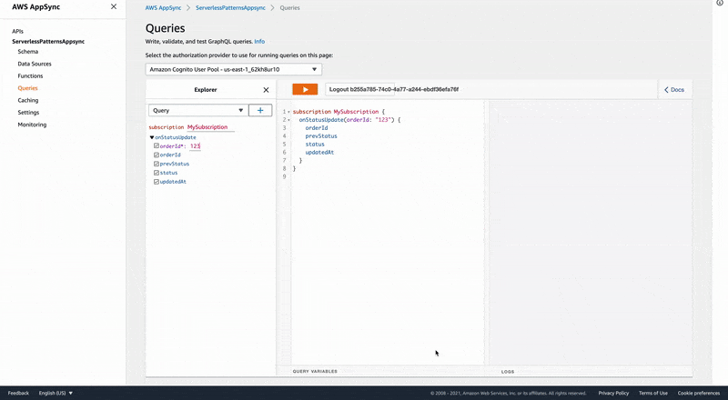
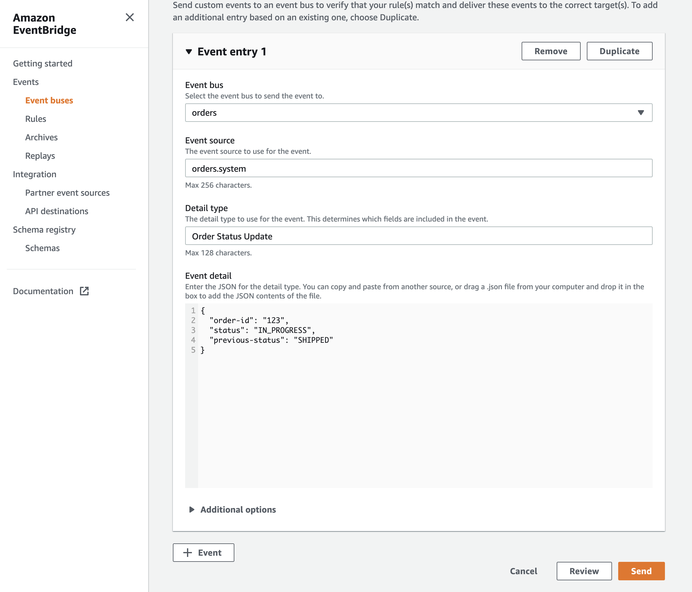
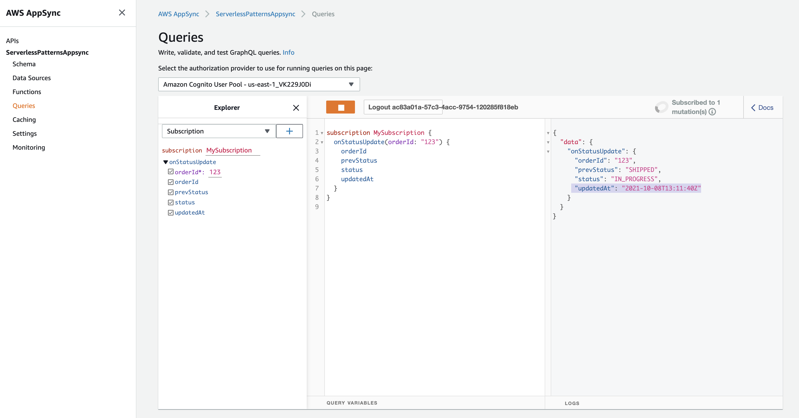
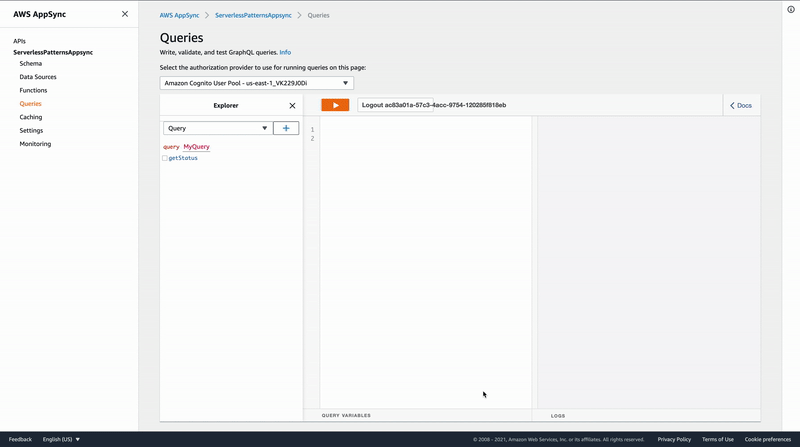

# Notifying AWS AppSync subscribers of external database updates that aren't performed by client-side mutations

The SAM template deploys a nested stack with authentication configured using Cognito. It also deploys an AppSync configured with AMAZON_COGNITO_USER_POOLS, API_KEY and IAM for authorization.

Note: when deploying this pattern, both *CAPABILITY_AUTO_EXPAND* and *CAPABILITY_IAM* are required.

Learn more about this pattern at: https://serverlessland.com/patterns/appsync-lambda-graphql.

Important: this application uses various AWS services and there are costs associated with these services after the Free Tier usage - please see the [AWS Pricing page](https://aws.amazon.com/pricing/) for details. You are responsible for any AWS costs incurred. No warranty is implied in this example.

## Requirements

* [Create an AWS account](https://portal.aws.amazon.com/gp/aws/developer/registration/index.html) if you do not already have one and log in. The IAM user that you use must have sufficient permissions to make necessary AWS service calls and manage AWS resources.
* [AWS CLI](https://docs.aws.amazon.com/cli/latest/userguide/install-cliv2.html) installed and configured
* [Git Installed](https://git-scm.com/book/en/v2/Getting-Started-Installing-Git)
* [AWS Serverless Application Model](https://docs.aws.amazon.com/serverless-application-model/latest/developerguide/serverless-sam-cli-install.html) (AWS SAM) installed

## Deployment Instructions Part 1

1. Create a new directory, navigate to that directory in a terminal and clone the GitHub repository:
    ```
    git clone https://github.com/aws-samples/serverless-patterns
    ```
2. Change directory:
    ```
    cd ./serverless-patterns/appsync-notify-subscribers-of-database-updates/1-http
    ```
3. From the command line, use AWS SAM to deploy the AWS resources for the pattern as specified in the template.yml file:
    ```
    sam deploy -g --capabilities CAPABILITY_AUTO_EXPAND CAPABILITY_IAM
    ```
4. During the prompts:
    * Enter a stack name
    * Select the desired AWS Region
    * Enter a CognitoUserPoolName
    * Enter an CognitoUserPoolClientName
    * Enter an AppSyncName
    * Enter a client domain
    * Allow SAM to create roles with the required permissions.

    Once you have run guided mode once, you can use `sam deploy` in future to use these defaults.

5. Note the outputs from the SAM deployment process. These contain **AppSyncEndpoint**, **AppSyncApiId**, **AppSyncApiKey** which are used for testing and further deployment proccess.
## Deployment Instructions Part 2
(can be done after - Testing Part 1)

6. Change directory:
    ```
    cd ./serverless-patterns/appsync-notify-subscribers-of-database-updates/2-eventbridge
    ```
7. Deploy new stack
    ```
    sam deploy -g --capabilities CAPABILITY_IAM
    ```
8. During the prompts:
    * Enter a stack name
    * Select the same AWS Region which was chosen in step 4
    * Enter a AppSyncEndpoint from step 5
    * Enter an AppSyncApiKey from step 5
    * Allow SAM to create roles with the required permissions.

9. Note the outputs from the SAM deployment process. These contain **OrdersEventBusName**, **OrdersEventBusArn**.

## Deployment Instructions Part 3
10. Change directory:
    ```
    cd ./serverless-patterns/appsync-notify-subscribers-of-database-updates/3-lambda
    ```
11. Build:
    ```
    sam build
    ```
12. Deploy:
    ```
    sam deploy -g --capabilities CAPABILITY_IAM
    ```

## Testing Part 1 - notify via HTTP Request

For this test you will use the **AppSyncEndpoint**, **AppSyncApiKey**.

1.1 Go to Cognito User Pool find HostedUI to create user.


1.2 Sign Up - Create user in User Pool.



1.3 Open AppSync, login using Cognito User Pool and created user, launch subscription.



1.4 Make http POST request using postman.
Configure postman authorization - add header "x-api-key".
Set request body:
```
mutation MyMutation {
  publishStatusUpdate(
      orderId: "123",
      prevStatus: PENDING,
      status: IN_PROGRESS,
      updatedAt: "2021-10-07T20:38:18.683Z"
  ) {
    orderId
    prevStatus
    status
    updatedAt
  }
}
```



1.5 Return to AppSync to check result



1.6 Demo:



## Testing Part 2 - notify via EventBridge
2.1 - Open AppSync, login using Cognito User Pool and created user, launch subscribtion (see picture from step 1.3).

2.2 Open EventBridge in AWS Console. Choose tab - "Events/Event buses" and choose EventBus - "orders", click on button "Send events". Send event with the next attributes:

Event source:
```
orders.system
```

Detail type:
```
Order Status Update
```

Event detail:
```
{
    "order-id": "123",
    "status": "IN_PROGRESS",
    "previous-status": "SHIPPED"
}
```



2.3 Return to AppSync to check result



2.3 Demo:



## Testing Part 3 - notify via Lambda
3.1 - Open AppSync, log in using Cognito User Pool and created user, launch subscription (see a picture from step 1.3).

3.2 - Open lambda in AWS console, create test event (dummy event), click test.

3.3 - Return to AppSync to check the result.

3.4 - Repeat test for each lambda.

Note: EventBridge does not guarantee "only once event delivery" but the client can cache the value of attribute "updatedAt" and does not notify subscribers if "updatedAt" from the current event is older than the previous one.

## Cleanup

1. Delete the stacks
    ```bash
    aws cloudformation delete-stack --stack-name STACK_NAME
    ```
2. Confirm the stacks have been deleted
    ```bash
    aws cloudformation list-stacks --query "StackSummaries[?contains(StackName,'STACK_NAME')].StackStatus"
    ```

## Resources
1. https://aws.amazon.com/premiumsupport/knowledge-center/appsync-notify-subscribers-real-time/

2. https://www.youtube.com/watch?v=KrmFAcucjzQ

3. https://aws.amazon.com/blogs/mobile/appsync-eventbridge/

4. https://aws.amazon.com/blogs/mobile/using-multiple-authorization-types-with-aws-appsync-graphql-apis/

5. https://github.com/aws-samples/serverless-patterns/tree/main/cognito-httpapi

6. https://www.youtube.com/watch?v=J0qfMYRmQcc

7. https://docs.aws.amazon.com/wellarchitected/latest/serverless-applications-lens/serverless-event-submission-with-status-updates.html

8. https://www.youtube.com/watch?v=CeeoFqE2OU0&t=335s
