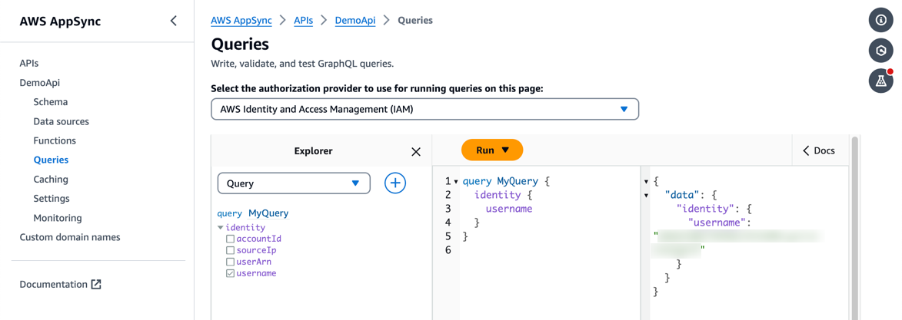
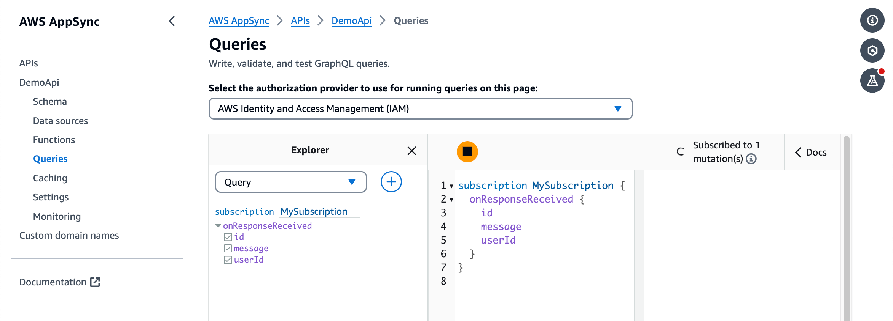
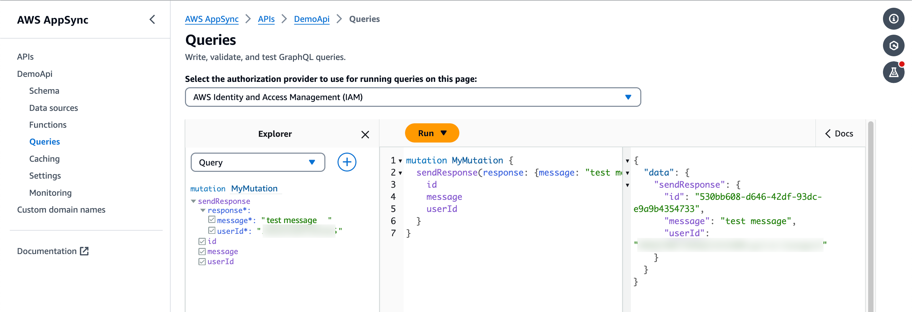
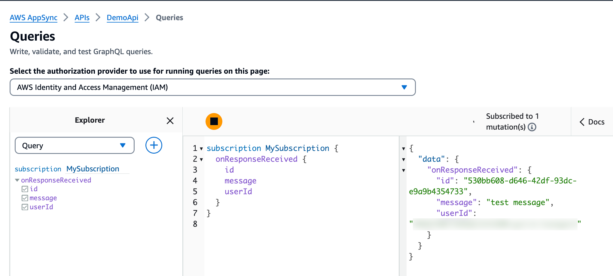

# AWS AppSync subscription enhanced filtering

This project contains a sample AWS CDK template for implementing an enhanced subscription filtering pattern for [AWS AppSync](https://aws.amazon.com/appsync/). Additionally, the project demonstrates using TypeScript for creating [AppSync JavaScript resolvers](https://docs.aws.amazon.com/appsync/latest/devguide/resolver-reference-overview-js.html) so that developers can benefit from using the type definitions that are available in the [@aws-appsync/utils](https://www.npmjs.com/package/@aws-appsync/utils) module.

This pattern illustrates how the current identity information can be used as a filter to send real-time notification messages to a specific user when using AWS AppSync subscriptions.

The demo code uses IAM authorization and the currently connected user's username to filter real-time subscription messages. Additional support for other authorization providers can be added but may require using different identity attributes.

GraphQL schema defines the following:

- `Query.identity` - this query returns the current user's IAM-based identity details. This query can be used for testing purposes - the `username` property shows the expected `userId` for sending the responses.
- `Mutation.sendResponse` - this mutation will trigger the `onResponseReceived` subscription. The `userId` property value will be used to determine whether the response should be sent to the current user.
- `Subscription.onResponseReceived` - real-time subscription that will send messages only if the `userId` field, which was provided when invoking the `sendResponse` mutation, matches the current user's `username` property on the IAM identity context.

Important: this application uses various AWS services, and there are costs associated with these services after the Free Tier usage - please see the [AWS Pricing page](https://aws.amazon.com/pricing/) for details. You are responsible for any AWS costs incurred. No warranty is implied in this example.

## Requirements

- [Create an AWS account](https://portal.aws.amazon.com/gp/aws/developer/registration/index.html) if you do not already have one and log in. The IAM user you use must have sufficient permissions to make necessary AWS service calls and manage AWS resources.
- [AWS CLI](https://docs.aws.amazon.com/cli/latest/userguide/install-cliv2.html) installed and configured
- [Git Installed](https://git-scm.com/book/en/v2/Getting-Started-Installing-Git)
- [Node and NPM](https://nodejs.org/en/download/) installed
- [AWS Cloud Development Kit](https://docs.aws.amazon.com/cdk/latest/guide/cli.html) (AWS CDK) installed

## Deploy

1. Clone the project to your local working directory

   ```sh
   git clone https://github.com/aws-samples/serverless-patterns
   ```

1. Change the working directory to this pattern's directory

   ```sh
   cd appsync-subscription-filter-cdk
   ```

1. Install the project dependencies

   ```sh
   npm install
   ```

1. Deploy the stack to your default AWS account and region

   ```sh
   cdk deploy --require-approval never
   ```

## Test

### Use AWS Console

- Open [AWS Console](https://console.aws.amazon.com/appsync/) and switch to the region where you deployed the `DemoApi` instance.
- Click on the `DemoApi` instance name and navigate to the `Queries` tab in the left-side navigation bar.

### Get your current username

- Use Query Explorer to run the following GraphQL query:

    ```graphql
    query MyQuery {
        identity {
            username
        }
    }
    ```

    

- Make a note of the returned identity string - we will need it for sending real-time messages

### Subscribe to notifications

- Open a new [AWS Console](https://console.aws.amazon.com/appsync/) window and navigate to the same Query Explorer for the `DemoApi` (you can copy/paste the current Query Explorer URL in a new window)
- Subscribe to the `onResponseReceived` subscription by selecting Subscription in the Query Explorer's drop-down list and running the following GraphQL statement:

    ```graphql
    subscription MySubscription {
        onResponseReceived {
            id
            message
            userId
        }
    }
    ```

    

- Arrange both AWS Console windows side-by-side so that you can watch subscription results when submitting mutation requests

### Submit mutations

- Switch back to the first AWS Console window and run the mutation. Replace the placeholder with the value you received when running the `identity` query.

    ```graphql
    mutation MyMutation {
        sendResponse(response: {message: "test message", userId: "<YOUR_USERNAME>"}) {
            id
            message
            userId
        }
    }
    ```

    

- Observe that the second AWS Console window displays the received subscription message

    

- Execute the same mutation with different parameters and validate that subscription messages are received ONLY when the `userId` parameter is equal to your current IAM identity `username` value.

## Cleanup

Run the given command to delete the resources that were created. It might take some time for the CloudFormation stack to get deleted.

```sh
cdk destroy -f
```

## References

1. [Enhanced subscription filtering](https://docs.aws.amazon.com/appsync/latest/devguide/aws-appsync-real-time-enhanced-filtering.html)
1. [AppSync JavaScript resolvers](https://docs.aws.amazon.com/appsync/latest/devguide/resolver-reference-overview-js.html)
1. [JavaScript runtime features for resolvers and functions](https://docs.aws.amazon.com/appsync/latest/devguide/resolver-util-reference-js.html)
1. [Authorization use cases | Real-time data](https://docs.aws.amazon.com/appsync/latest/devguide/security-authorization-use-cases.html#security-real-time-data)

----
Copyright 2024 Amazon.com, Inc. or its affiliates. All Rights Reserved.

SPDX-License-Identifier: MIT-0
