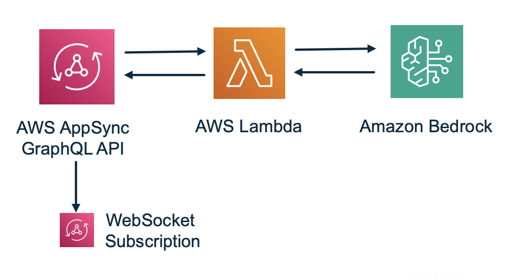

# AI Chat Application using AWS AppSync (WebSockets), AWS Lambda, and Amazon Bedrock.

This AI chat application works through a simple request-response flow. A client sends a GraphQL mutation to the AWS AppSync API endpoint. AWS AppSync then routes the request to the AWS Lambda function via the configured data source and resolver. The AWS Lambda function receives the user's input message, then constructs a properly formatted request for Amazon Bedrock's Claude model (including the Anthropic API version, token limit, and user message). This is then sent to Amazon Bedrock using the AWS SDK, waits for the AI response, and returns the generated text back to AWS AppSync. AWS AppSync then delivers this response to the client, while the subscription feature enables real-time notifications to connected clients when new responses are available, creating an interactive chat experience where users can send messages and receive AI-generated replies in real-time.


Learn more about this pattern at [Serverless Land Patterns](https://serverlessland.com/patterns/appsync-ws-lambda-bedrock-sam)

Important: this application uses various AWS services and there are costs associated with these services after the Free Tier usage - please see the [AWS Pricing page](https://aws.amazon.com/pricing/) for details. You are responsible for any AWS costs incurred. No warranty is implied in this example.

## Prerequisites

* [Create an AWS account](https://portal.aws.amazon.com/gp/aws/developer/registration/index.html) if you do not already have one and log in. The IAM user that you use must have sufficient permissions to make necessary AWS service calls and manage AWS resources.
* [AWS CLI](https://docs.aws.amazon.com/cli/latest/userguide/install-cliv2.html) installed and configured
* [Git Installed](https://git-scm.com/book/en/v2/Getting-Started-Installing-Git)
* [AWS Serverless Application Model](https://docs.aws.amazon.com/serverless-application-model/latest/developerguide/serverless-sam-cli-install.html) (AWS SAM) installed
* [NOTE! Ensure you have access to a model prior to testing ! See Manage Access to Amazon Bedrock Foundation Models](https://docs.aws.amazon.com/bedrock/latest/userguide/model-access.html)


## Deployment Instructions 
1. Create a new directory, navigate to that directory in a terminal and clone the GitHub repository:
    ``` 
    git clone https://github.com/aws-samples/serverless-patterns
    ```
2. Change directory to the pattern directory:
    ```
    cd appsync-ws-lambda-bedrock-sam
    ```
3. Install dependencies
    ```
    cd lambda_function && npm install && cd ..
    ```    
4. From the command line, use AWS SAM build to prepare an application for subsequent steps in the developer workflow, such as local testing or deploying to the AWS Cloud:
    ```
    sam build
    ```    
5. From the command line, use AWS SAM to deploy the AWS resources for the pattern as specified in the template.yml file:
    ```
    sam deploy --guided
    ```
6. During the prompts: 
    * Enter a stack name
    * Enter the desired AWS Region
    * Enter the desired ModelId
    * Enter the desired BedrockRegion
    * Allow SAM to create roles with the required permissions if needed.

7. Note the outputs **GraphQLAPIURL** and **GraphQLAPIKey** from the SAM deployment process. 
These contain the resource names and/or ARNs which are used for testing.


## Architecture



## How it Works
Client Request Flow:
1. Client sends a GraphQL mutation invokeModel(input: "user message") to the AppSync API endpoint using the provided API key.
2. AppSync receives the mutation and routes it through the InvokeModelResolver to the LambdaDataSource.
3. The resolver triggers the Lambda function, passing the user's input as event.arguments.input.

Lambda Processing:

4. Lambda function receives the event and extracts the user message from event.arguments.input.
5. Creates a Bedrock request payload with Claude's required format: anthropic_version, max_tokens (1000), and the user message in a messages array.
6. Uses BedrockRuntimeClient to send an InvokeModelCommand to the specified Claude model.
7. Waits synchronously for Bedrock's response, then parses the JSON response and extracts the AI-generated text from result.content[0].text.

Response Delivery:

8. Lambda returns the AI text response to AppSync.
9. AppSync delivers the response back to the client through the GraphQL mutation response.
10. Clients subscribed to onModelResponse receive real-time notifications of new AI responses via WebSocket connections.

The architecture uses AppSync's built-in WebSocket capabilities for real-time subscriptions, eliminating the need for manual connection management.

## Testing

### Interactive Web Interface
```
To use the test interface:
1. Deploy the application using SAM
2. Copy the GraphQLAPIURL Value and GraphQLAPIKey Value from the deployment outputs
3. Open 'test.html'
4. Update the 'API_URL' variable with your GraphQLAPIURL
5. Update the 'API_KEY' variable with your GraphQLAPIKey
6. Save 'test.html'
7. Open the HTML file in a browser
8. Click "Connect" to establish a WebSocket connection
9. Type your message and click "Send"
```

### AWS AppSync Console
* Go to AWS AppSync console → Your API → Queries
* Use the built-in GraphQL explorer
* Run this mutation:
```bash
mutation {
  invokeModel(input: "What is AWS Lambda?")
}
```

### Terminal using curl
```bash
curl -X POST \
  -H "Content-Type: application/json" \
  -H "x-api-key: YOUR_API_KEY" \
  -d '{"query": "mutation { invokeModel(input: \"What is AWS Lambda?\") }"}' \
  YOUR_GRAPHQL_API_URL
```

## Cleanup
1. Delete the stack
    ```bash
    sam delete
    ```
2. Confirm the stack has been deleted
    ```bash
    aws cloudformation list-stacks --query "StackSummaries[?contains(StackName,'STACK_NAME')].StackStatus"
    ```
----
Copyright 2025 Amazon.com, Inc. or its affiliates. All Rights Reserved.

SPDX-License-Identifier: MIT-0