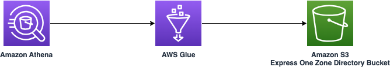

# Querying Amazon S3 Express One Zone directory bucket using Amazon Athena

This sample project demonstrates how to query Amazon S3 Express One Zone directory bucket using Amazon Athena. 

Learn more about this pattern at Serverless Land Patterns: https://serverlessland.com/patterns/athena-glue-s3-sam

Important: this application uses various AWS services and there are costs associated with these services after the Free Tier usage - please see the [AWS Pricing page](https://aws.amazon.com/pricing/) for details. You are responsible for any AWS costs incurred. No warranty is implied in this example.

## Requirements

- [Create an AWS account](https://portal.aws.amazon.com/gp/aws/developer/registration/index.html) if you do not already have one and log in. The IAM user that you use must have sufficient permissions to make necessary AWS service calls and manage AWS resources.
- [AWS CLI](https://docs.aws.amazon.com/cli/latest/userguide/install-cliv2.html) installed and configured
- [Git Installed](https://git-scm.com/book/en/v2/Getting-Started-Installing-Git)
- [AWS Serverless Application Model](https://docs.aws.amazon.com/serverless-application-model/latest/developerguide/serverless-sam-cli-install.html) (AWS SAM) installed

## Prerequisite
1. Please refer to the [list of Regions and availability zones where Amazon S3 Express One Zone is currently supported](https://docs.aws.amazon.com/AmazonS3/latest/userguide/s3-express-Endpoints.html) and choose one.
2. Execute the below from command line and make a note of the `ZoneName` and `ZoneId`. It will be required during deployment:
   ```bash
   aws ec2 describe-availability-zones --region {region-name}
   ```


## Deployment Instructions

1. Create a new directory, navigate to that directory in a terminal and clone the GitHub repository:
   ```bash
   git clone https://github.com/aws-samples/serverless-patterns
   ```
2. Change directory to the pattern directory:
   ```bash
   cd serverless-patterns/athena-glue-s3-sam
   ```
3. From the command line, use AWS SAM to deploy the AWS resources for the pattern as specified in the template.yml file:
   ```bash
   sam deploy --guided
   ```
4. During the prompts:

   - Enter a stack name
   - Enter the desired AWS Region. Please refer to the prerequisite 1 and choose a region.
   - Enter `AvailabilityZoneId` as per the prerequisite 2.
   - Allow SAM CLI to create IAM roles with the required permissions.

   Once you have run `sam deploy --guided` mode once and saved arguments to a configuration file (samconfig.toml), you can use `sam deploy` in future to use these defaults.

5. Note the outputs from the SAM deployment process. These contain the resource names and/or ARNs which are used for next step as well as testing.


## How it works

Please refer to the architecture diagram below:



Amazon S3 Express One Zone is a high-performance, single-Availability Zone storage class purpose-built to deliver consistent, single-digit millisecond data access for your most frequently accessed data and latency-sensitive applications.
* Catalog the Amzon S3 Express One Zone directory bucket using AWS Glue Data Catalog.
* Upload your data to Amzon S3 Express One Zone storage.
* Query the data using Amazon Athena.


## Testing

1. Upload the `data.csv` file using the following command into Amazon S3 Express One Zone diretory bucket. Please replace `MyInputBucketExpressOneZone` from the `sam deploy -g` output. Also please replace `your-region`.
   ```bash
   aws s3 cp data.csv s3://{MyInputBucketExpressOneZone}/data.csv --region {your-region}

   ```

2. Now, execute Amazon Athena query using the following command. Please replace `MyOutputBucketExpressOneZone` from the `sam deploy -g` output. Also please replace `your-region`.
   ```bash
   aws athena start-query-execution --query-string 'SELECT name, age FROM "mydatabase"."mytable" where age < 30 limit 10' --query-execution-context Database=database --result-configuration OutputLocation=s3://{MyOutputBucketExpressOneZone}/ --region {your-region}
   ```

3. Execute the below command to get the current status of the Amazon Athena query execution. Please replace `QueryExecutionId` from the previous command output. Also please replace `your-region`. You need may need to run it multiple times until you see `"State": "SUCCEEDED"`

   ```bash
   aws athena get-query-execution --query-execution-id {QueryExecutionId}  --region {your-region}
   ```

4. Once, the Athena query execution completes successfully, execute the below command to validate the result. Please replace `QueryExecutionId` from the previous command output. Also please replace `your-region`.

   ```bash
   aws athena get-query-results --query-execution-id {QueryExecutionId}  --region {your-region}
   ```
5. Log into [Amazon S3 Console](https://s3.console.aws.amazon.com/s3/buckets), select your region, navigate to the directory bucket `MyOutputBucketExpressOneZone`. Please download and the validate the content of the generated CSV file as per the Amazon Athena execution query above.  

## Cleanup

1. Delete the content in the Amazon S3 bucket using the following command. Please *ensure* that the correct bucket name is provided to avoid accidental data loss:
   ```bash
   aws s3 rm s3://{MyInputBucketExpressOneZone} --recursive --region {my-region}
   aws s3 rm s3://{MyOutputBucketExpressOneZone} --recursive --region {my-region}
   ```

2. To delete the resources deployed to your AWS account via AWS SAM, run the following command:
   ```bash
   sam delete
   ```

---

Copyright 2024 Amazon.com, Inc. or its affiliates. All Rights Reserved.

SPDX-License-Identifier: MIT-0
