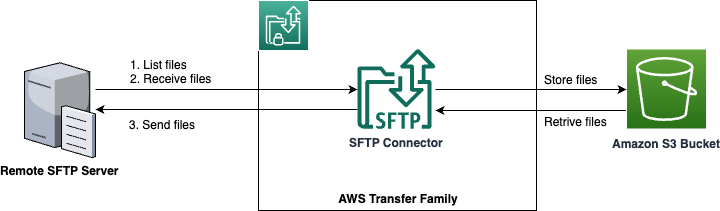

# Bidirectional selective file transfer between remote SFTP server and Amazon S3 using AWS Transfer Family Connector

This pattern shows how to setup an AWS Transfer Family SFTP connector to list files from the remote server and transfer specific files to Amazon S3 bucket. You can also transfer specific files from Amazon S3 bucket to the remote SFTP server.  

Learn more about this pattern at Serverless Land Patterns: https://serverlessland.com/patterns/awstransfer-s3-sam. 

Important: this application uses various AWS services and there are costs associated with these services after the Free Tier usage - please see the [AWS Pricing page](https://aws.amazon.com/pricing/) for details. You are responsible for any AWS costs incurred. No warranty is implied in this example.

## Requirements

* [Create an AWS account](https://portal.aws.amazon.com/gp/aws/developer/registration/index.html) if you do not already have one and log in. The IAM user that you use must have sufficient permissions to make necessary AWS service calls and manage AWS resources.
* [AWS CLI](https://docs.aws.amazon.com/cli/latest/userguide/install-cliv2.html) installed and configured
* [Git Installed](https://git-scm.com/book/en/v2/Getting-Started-Installing-Git)
* [AWS Serverless Application Model](https://docs.aws.amazon.com/serverless-application-model/latest/developerguide/serverless-sam-cli-install.html) (AWS SAM) installed
* [JQ](https://docs.aws.amazon.com/solutions/latest/dynamic-object-and-rule-extensions-for-aws-network-firewall/operation-and-customization.html#install-jq) should be installed.


## Deployment Instructions

1. Create a new directory, navigate to that directory in a terminal and clone the GitHub repository:
    ``` 
    git clone https://github.com/aws-samples/serverless-patterns
    ```

2. Change directory to the pattern directory:
    ```
    cd serverless-patterns/awstransfer-s3-sam
    ```

3. From the command line, run the below command to deploy the pattern:
    ```
    bash deploy.sh
    ```

4. During the prompts:
    * Enter a stack name
    * Enter the desired AWS Region (e.g. us-east-1)

5. The deployment script deploys both `template-sftp-server.yaml` and `template-sftp-connector.yaml`. Please make a note of the output both the deployments as they will be used during testing.


## How it works

Please refer to the architecture diagram below:



* The remote SFTP server is simulated using AWS Transfer Family SFTP Server for this pattern. In a real use case, this can be any remote SFTP server outside of AWS. 
* SFTP Connector is configured to connect to the remote server with Amazon S3 bucket using SFTP protocol. The authentication is done using SSH Key based handshake. 
* Amazon S3 bucket is used for file storage on the AWS side.
* User can list files on the remote server and selectively transfer files from the remote server to the Amazon S3 bucket using AWS Transfer Family API or CLI commands. 
* User can also transfer files from Amazon S3 to the remote server using the AWS Transfer Family API or CLI commands. 

## Testing

1. Use the endpoint to test the SFTP server with transferring a file using a client, the rest of this test steps are shown using OpenSSH. Please refer to [Transferring files over a server endpoint using a client](https://docs.aws.amazon.com/transfer/latest/userguide/transfer-file.html) for other options.

2. Test the connection using using the below command from your command line. Please replace `SFTPTransferConnector` from the deployment output:
    ```bash
    aws transfer test-connection --region {your-region} --connector-id {SFTPTransferConnector}
    ```
    It should give an output similar to below:
    ```json
    {
        "Status": "OK",
        "StatusMessage": "Connection succeeded"
    }
    ```

3. Transfer `sample1.txt` and `sample2.txt` files to the remote SFTP server (similated) using the below commands. In this sample project replace `SSHPrivateKeyFileName` and `SSHPrivateKeyFileName` with `sftpuser`. Replace the value of `TransferServerEndpoint` from the deployment output:
    ```bash
    sftp -i {SSHPrivateKeyFileName} {TransferServerUser}@{TransferServerEndpoint}
    pwd
    mkdir Remote
    cd Remote
    put sample1.txt
    put sample2.txt
    ls
    ```
    Confirm to proceed with the connection after the first command.

5. List the files on the remote SFTP server using the below command. Please replace `SFTPTransferConnector` and `MyLocalS3Bucket` from the deploy output: 

    ```bash
    aws transfer start-directory-listing --region {your-region} --connector-id {SFTPTransferConnector} --remote-directory-path /Remote --output-directory-path /{MyLocalS3Bucket}/FromRemoteSFTPServer
    ```
    
    The command invokes an asynchronous API. The output of the command will be as follows:
    ```json
    {
    "ListingId": "273e5b33-xxxx-xxxx-xxxx-xxxxx9a507f53",
    "OutputFileName": "c-cxxxxxxxx-xxxxxx-xxxx-xxxx-xxxx-xxxxxa507f53.json"
    }
    ```

6. Log into [Amazon S3 console](https://console.aws.amazon.com/s3). Open the `MyLocalS3Bucket` and navigate to `FromRemoteSFTPServer` folder. Check the content of the JSON file. It should look something like below:
    ```json
    {
    "files": [
        {
        "filePath": "/Remote/sample1.txt",
        "modifiedTimestamp": "2024-04-28T07:47:27Z",
        "size": 146
        },
        {
        "filePath": "/Remote/sample2.txt",
        "modifiedTimestamp": "2024-04-28T07:47:46Z",
        "size": 146
        }
    ],
    "paths": [],
    "truncated": false
    }
    ```

7. Transfer one of the files from the remote SFTP server to the Amazon S3 bucket using the following command:
    ```bash
    aws transfer start-file-transfer --region {your-region}  --connector-id {SFTPTransferConnector} --retrieve-file-paths /Remote/sample1.txt --local-directory-path /{MyLocalS3Bucket}/FromRemoteSFTPServer
    ```

    The output of the command should something like below:
    ```json
    {
        "TransferId": "e863xxxx-xxxx-xxxx-xxxx-xxxxa40c5ff9"
    }
    ```    

8. Log into [Amazon S3 console](https://console.aws.amazon.com/s3). Open the `MyLocalS3Bucket` and navigate to `FromRemoteSFTPServer` folder. You should be able to find the transferred `sample1.txt` file.

9. Upload a file into the `MyLocalS3Bucket` bucket using the following command. Replace the `MyLocalS3Bucket` from the deploy output:
    ```bash
    aws s3 cp sample3.txt s3://{MyLocalS3Bucket}/local/sample3.txt
    ```

10. Transfer the `sample3.txt` file Amazon S3 `MyLocalS3Bucket` bucket to the remove SPT server using the following command:
    ```bash
    aws transfer start-file-transfer  --region {your-region} --connector-id {SFTPTransferConnector}  --send-file-paths /{MyLocalS3Bucket}/local/sample3.txt --remote-directory-path /FromAmazonS3
    ```

11. Validate the file transfer by logging into the the remove SFTP server using the below commands:
    ```bash
    sftp -i {SSHPrivateKeyFileName} {TransferServerUser}@{TransferServerEndpoint}
    ls
    cd FromAmazonS3
    ls
    ```

## Cleanup

1. Delete the content in the Amazon S3 bucket using the following command. Please *ensure* that the correct bucket name is provided to avoid accidental data loss:
   ```bash
    aws s3 rm s3://{MySFTPServerS3Bucket} --recursive --region {my-region}
    aws s3 rm s3://{MyLocalS3Bucket} --recursive --region {my-region}
   ```

2. Delete the stack
    ```bash
    bash undeploy.sh
    ```

----
Copyright 2024 Amazon.com, Inc. or its affiliates. All Rights Reserved.

SPDX-License-Identifier: MIT-0
