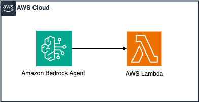

# Amazon Bedrock Agents with AWS Lambda



In this pattern, we show you how to use Amazon Bedrock Agents to call an API and get the results from it for a user. Bedrock Agents is helpful in various situations such as fetching real-time information from APIs, interacting with knowledge bases, and performing actions based on user inputs. For more information on Bedrock agents, see [Automate tasks in your application using AI agents](https://docs.aws.amazon.com/bedrock/latest/userguide/agents.html).

> [!Important]
> this application uses various AWS services and there are costs associated with these services after the Free Tier usage - please see the [AWS Pricing page](https://aws.amazon.com/pricing/) for details. You are responsible for any AWS costs incurred. No warranty is implied in this example.

## Requirements

* [Create an AWS account](https://portal.aws.amazon.com/gp/aws/developer/registration/index.html) if you do not already have one and log in. The IAM user that you use must have sufficient permissions to make necessary AWS service calls and manage AWS resources.
* [AWS CLI](https://docs.aws.amazon.com/cli/latest/userguide/install-cliv2.html) installed and configured
* [Git Installed](https://git-scm.com/book/en/v2/Getting-Started-Installing-Git)
* [Install AWS Cloud Development Kit (AWS CDK)](https://docs.aws.amazon.com/cdk/latest/guide/cli.html)
* [Install Python 3](https://www.python.org/downloads/)
* [Grant Bedrock Model Access for Claude 3 Sonnet](https://docs.aws.amazon.com/bedrock/latest/userguide/model-access.html)

## Deployment Instructions

1. Create a new directory, navigate to that directory in a terminal and clone the GitHub repository:

```
git clone https://github.com/aws-samples/serverless-patterns
```

2. Change directory to the pattern directory:

```
cd bedrock-agents-lambda-cdk
```

3. Create a virtual environment for Python:

```
python3 -m venv .venv
```

4. Activate the virtual environment:

```
source .venv/bin/activate
```

For a Windows platform, activate the virtualenv like this:

```
.venv\Scripts\activate.bat
```

5. Install the required Python dependencies:

```
pip install -r requirements.txt
```

6. Bootstrap the AWS environment, if you haven't already done so:

```
cdk bootstrap
```

7. Review the CloudFormation template AWS CDK generates for the stack:

```
cdk synth
```

8. Deploy the AWS resources:

```
cdk deploy
```


## How it works

Bedrock agent processes user input through a foundation model to determine its next steps. It then decides whether to invoke an action or query a knowledge base. For performing an action it has action groups defined, in this example we are using a Lambda function which invokes an API. It either executes the action or it gathers more information from its knowledge base or the user. The agent generates an observation from these results, which it uses to generate final response or determine if it needs more user input, allowing for dynamic and context-aware interactions.

## Testing

To test the Bedrock agent, we will need to use the AWS console. The Lambda function will call the International Space Station API to fetch its location, so it can answer questions such as “What is the current location of ISS'”, “Where is ISS?'”, “Where is the internation space station now”, etc

1. Navigate to the Amazon Bedrock Agents page on the AWS console
2. Selected the deployed agent **ISSLocationAgent**
3. If you don’t see a Test section on the right pane, click on **Test**
4. Enter a message similar to “What is the current location of ISS'” and notice that the results are returned

## Cleanup

Run below script in the `bedrock-agents-lambda-cdk` directory to delete AWS resources created by this sample stack.

```
cdk destroy
```


