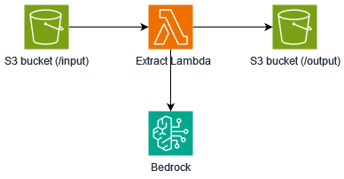

# Automatically extract text from uploaded images in Amazon S3 using Amazon Bedrock

This pattern shows how to automatically extract text from images uploaded to Amazon S3 using Amazon Bedrock.

Learn more about this pattern at Serverless Land Patterns: https://serverlessland.com/patterns/bedrock-lambda-cdk-dotnet.

Important: this application uses various AWS services and there are costs associated with these services after the Free Tier usage - please see the [AWS Pricing page](https://aws.amazon.com/pricing/) for details. You are responsible for any AWS costs incurred. No warranty is implied in this example.

## Requirements

* [Create an AWS account](https://portal.aws.amazon.com/gp/aws/developer/registration/index.html) if you do not already have one and log in. The IAM user that you use must have sufficient permissions to make necessary AWS service calls and manage AWS resources.
* [AWS CLI](https://docs.aws.amazon.com/cli/latest/userguide/install-cliv2.html) installed and configured
* [Git Installed](https://git-scm.com/book/en/v2/Getting-Started-Installing-Git)
* [.NET 8](https://dotnet.microsoft.com/en-us/download/dotnet/8.0) installed
* [AWS Cloud Development Kit](https://docs.aws.amazon.com/cdk/latest/guide/cli.html) (AWS CDK) installed

## Deployment Instructions

1. Clone the project to your local working directory
    ```
    git clone https://github.com/aws-samples/serverless-patterns
    ```
2. Change the working directory to this pattern's directory
    ```
    cd bedrock-lambda-cdk-dotnet/Cdk/
    ```
3. Build the application
    ```
    dotnet build
    ```
4. Deploy the stack to your default AWS account and region.
    ```
    cdk deploy
    ```

## How it works
When images are uploaded into the Amazon S3 bucket, notifications are sent to a Lambda function. The Lambda function utilizes that notification to identify the newly uploaded image and sends it to the Amazon Bedrock, which extracts text from the image and stores it in the S3 bucket.



## Testing

After deployment, add an image to the `input/` folder of Amazon S3 bucket. After few seconds, check the `output/` folder of S3 bucket for extracted text.

## Cleanup
Run the given command to delete the resources that were created. It might take some time for the CloudFormation stack to get deleted.
```
cdk destroy
```

----
Copyright 2024 Amazon.com, Inc. or its affiliates. All Rights Reserved.

SPDX-License-Identifier: MIT-0