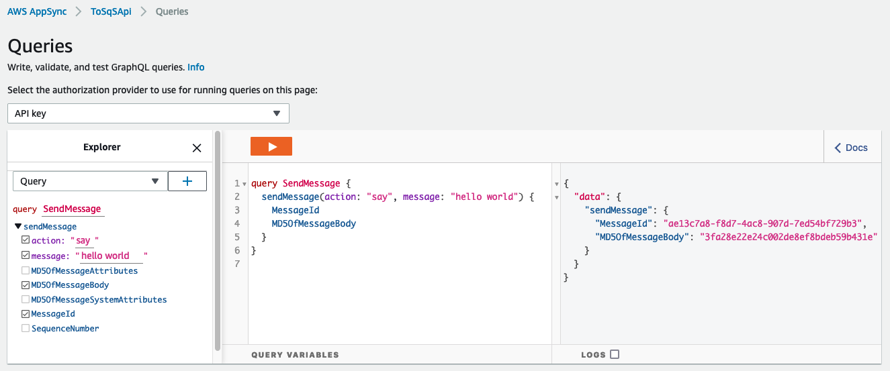

# AppSync HTTP resolver to SQS

This project contains a sample AWS CDK template for using [AWS AppSync](https://aws.amazon.com/appsync/) with [AWS SQS](https://aws.amazon.com/sqs/) as an HTTP data source.

In the given pattern, AWS AppSync provides a `sendMessage` query that sends a message to the configured SQS queue. The query returns the response MessageId, and the MD5OfMessageBody of the response.

Important: this application uses various AWS services and there are costs associated with these services after the Free Tier usage - please see the [AWS Pricing page](https://aws.amazon.com/pricing/) for details. You are responsible for any AWS costs incurred. No warranty is implied in this example.

## Requirements

* [Create an AWS account](https://portal.aws.amazon.com/gp/aws/developer/registration/index.html) if you do not already have one and log in. The IAM user that you use must have sufficient permissions to make necessary AWS service calls and manage AWS resources.
* [AWS CLI](https://docs.aws.amazon.com/cli/latest/userguide/install-cliv2.html) installed and configured
* [Git Installed](https://git-scm.com/book/en/v2/Getting-Started-Installing-Git)
* [Node and NPM](https://nodejs.org/en/download/) installed
* [AWS Cloud Development Kit](https://docs.aws.amazon.com/cdk/latest/guide/cli.html) (AWS CDK) installed

## Deploy

1. Clone the project to your local working directory

   ```sh
   git clone https://github.com/aws-samples/serverless-patterns
   ```

2. Change the working directory to this pattern's directory

   ```sh
   cd cdk-appsync-sqs/cdk
   ```

3. Install dependencies

   ```sh
   npm install
   ```

4. This project uses typescript as client language for AWS CDK. Run the given command to compile typescript to javascript

   ```sh
   npm run build
   ```

5. Deploy the stack to your default AWS account and region. The output of this command shows the GraphQL API id, URL, and API Key for your AppSync API, and the name of your queue URL of your SQS queue.

   ```sh
   cdk deploy
   ```

## Test

You can test your AppSync API and send a message to your queue from the console.



You can run a query directly from your terminal:

```sh
# install curl. https://curl.se/
# optional: install jq. https://stedolan.github.io/jq/
# replace <graphqlUrl> and <apiKey> with the outputs values from `cdk deploy`
curl --location --silent --request POST '<graphqlUrl>' \
--header 'x-api-key: <apiKey>' \
--header 'Content-Type: application/json' \
--data-raw '{"query":"query SendMessage { sendMessage(action: \"say\", message: \"hello world\") { MessageId MD5OfMessageBody }}"}' | jq
```

## Cleanup

Run the given command to delete the resources that were created. It might take some time for the CloudFormation stack to get deleted.

```sh
cdk destroy
```

## References

1. [Simplify access to multiple microservices with AWS AppSync and AWS Amplify](https://aws.amazon.com/blogs/mobile/appsync-microservices/)
2. [https://docs.aws.amazon.com/appsync/latest/devguide/tutorial-http-resolvers.html](https://docs.aws.amazon.com/appsync/latest/devguide/tutorial-http-resolvers.html)

----
Copyright 2021 Amazon.com, Inc. or its affiliates. All Rights Reserved.

SPDX-License-Identifier: MIT-0
