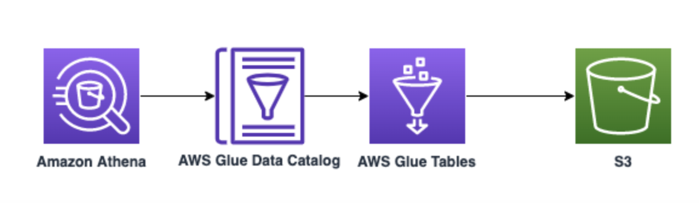

# AWS Athena -> AWS Glue

This pattern in CDK offers an example to generate an AWS Glue Tables and connect to AWS Athena to execute queries. Tables of type CSV and TSV are created with the help of CFNTable.



Learn more about this pattern at Serverless Land Patterns: https://serverlessland.com/patterns/athena-glue-cdk.

Important: this application uses various AWS services and there are costs associated with these services after the Free Tier usage - please see the [AWS Pricing page](https://aws.amazon.com/pricing/) for details. You are responsible for any AWS costs incurred. No warranty is implied in this example.

## Requirements

* [Create an AWS account](https://portal.aws.amazon.com/gp/aws/developer/registration/index.html) if you do not already have one and log in. The IAM user that you use must have sufficient permissions to make necessary AWS service calls and manage AWS resources.
* [AWS CLI](https://docs.aws.amazon.com/cli/latest/userguide/install-cliv2.html) installed and configured
* [Git Installed](https://git-scm.com/book/en/v2/Getting-Started-Installing-Git)
* [AWS Cloud Development Kit](https://docs.aws.amazon.com/cdk/latest/guide/cli.html) (AWS CDK) installed

## Deployment Instructions

1. Create a new directory, navigate to that directory in a terminal and clone the GitHub repository:
    ```
    git clone https://github.com/aws-samples/serverless-patterns
    ```
1. Change directory to the pattern directory:
    ```
    cd cdk-athena-glue
    ```
1. From the command line, use AWS SAM to deploy the AWS resources for the pattern as specified in the template.yml file:
    ```bash
      npx cdk bootstrap aws://accountnumber/region
      npx cdk synth
      npx cdk deploy --all
    ```

## How it works

This example creates AWS Glue tables of type CSV and TSV with the help of CDK using CFnTable Construct. It demonstrate the usage of serdeinfo in CDK to create tables of various types.

If the s3 stack fails due to already existing s3 bucket name, simpley change the prefix (from `src/config.ts`) to some random unique value with 8-12 characters. This will make s3 Buckets name unique.

## Testing

1. Deploy the app, by specifying account and region within configurations. On successful creation you can see CodePipline on AWS management Console.
2. Under AWS Glue Table named `emp_master`, `emp_details` will be created in `EmployeeRoster` Database along with view `emp_roster`.

## Handing Errors


## Cleanup

1. Delete the stack
    ```bash
    aws cloudformation delete-stack --stack-name STACK_NAME
    ```
1. Confirm the stack has been deleted
    ```bash
    aws cloudformation list-stacks --query "StackSummaries[?contains(StackName,'STACK_NAME')].StackStatus"
    ```
1. ```bash
    cdk destroy --all
   ```
----
Copyright 2021 Amazon.com, Inc. or its affiliates. All Rights Reserved.

SPDX-License-Identifier: MIT-0
