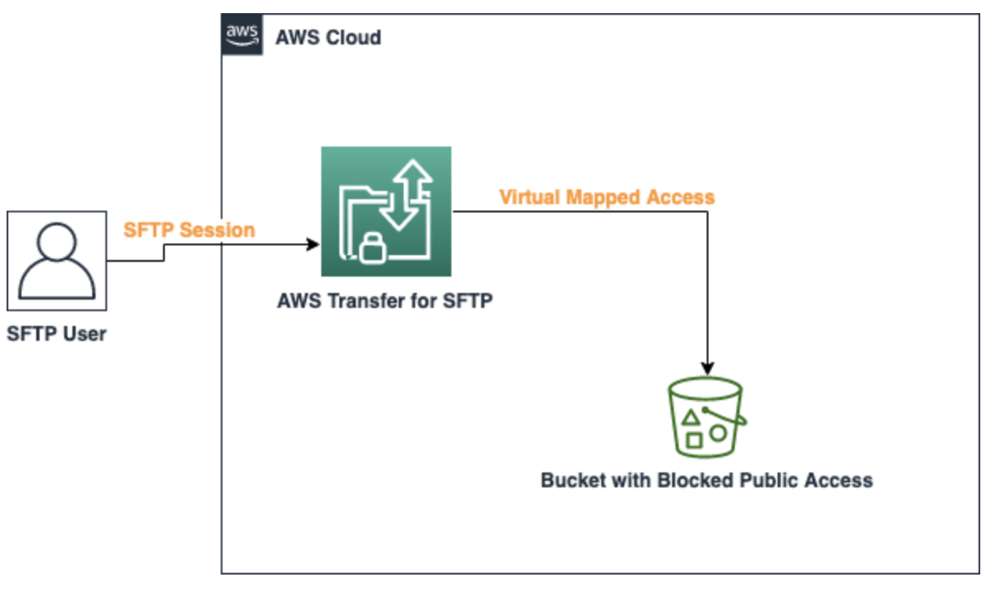

# AWS Transfer SFTP -> S3

This pattern in CDK offers an example to setup an AWS SFTP server using [AWS Transfer for SFTP](https://aws.amazon.com/aws-transfer-family/). You can simply create a server, set up user accounts, and associate the server with one or more Amazon Simple Storage Service (Amazon S3) buckets.
You have fine-grained control over user identity, permissions, and keys. You can create users within Transfer for SFTP. You can also use IAM policies to control the level of access granted to each user.



Learn more about this pattern at Serverless Land Patterns: https://serverlessland.com/patterns/transfer-s3-cdk.

Important: this application uses various AWS services and there are costs associated with these services after the Free Tier usage - please see the [AWS Pricing page](https://aws.amazon.com/pricing/) for details. You are responsible for any AWS costs incurred. No warranty is implied in this example.

## Requirements

* [Create an AWS account](https://portal.aws.amazon.com/gp/aws/developer/registration/index.html) if you do not already have one and log in. The IAM user that you use must have sufficient permissions to make necessary AWS service calls and manage AWS resources.
* [AWS CLI](https://docs.aws.amazon.com/cli/latest/userguide/install-cliv2.html) installed and configured
* [Git Installed](https://git-scm.com/book/en/v2/Getting-Started-Installing-Git)
* [AWS Cloud Development Kit](https://docs.aws.amazon.com/cdk/latest/guide/cli.html) (AWS CDK) installed

## Deployment Instructions

1. Create a new directory, navigate to that directory in a terminal and clone the GitHub repository:
    ```
    git clone https://github.com/aws-samples/serverless-patterns
    ```
1. Change directory to the pattern directory:
    ```
    cd cdk-awstransfer
    ```
1. From the command line, use AWS SAM to deploy the AWS resources for the pattern as specified in the template.yml file:
    ```bash
      npx cdk bootstrap aws://accountnumber/region
      npx cdk synth
      npx cdk deploy --all
    ```
1. In the `lib/options.ts` please update the S3 Bucket ARN to which we need to SFTP transfer, along with user name and user public key.

## How it works

This example creates AWS SFTP server which is accessible over internet. User along public key and fine grained access to S3 bucket will be created.


## Testing

1. Deploy the app, by specifying account and region within configurations.
2. Switch to AWS Transfer services on the AWS console. Switch to your region, you will see SFTP Server created.
2. Click on the server, you will find the user which its default HomeDirectory.
3. Connect to you server from your terminal or windows ssh client `sftp -i {transfer-key-private-key} {serverid}.server.transfer.{region}.amazonaws.com`.

## Handing Errors


## Cleanup

1. Delete the stack
    ```bash
    aws cloudformation delete-stack --stack-name STACK_NAME
    ```
1. Confirm the stack has been deleted
    ```bash
    aws cloudformation list-stacks --query "StackSummaries[?contains(StackName,'STACK_NAME')].StackStatus"
    ```
1. ```bash
    cdk destroy --all
   ```
----
Copyright 2021 Amazon.com, Inc. or its affiliates. All Rights Reserved.

SPDX-License-Identifier: MIT-0
