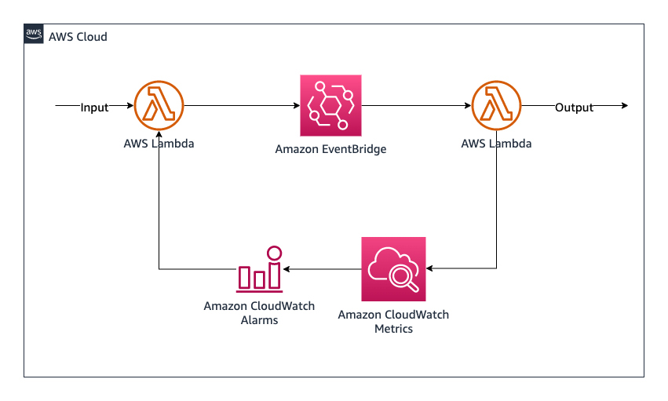
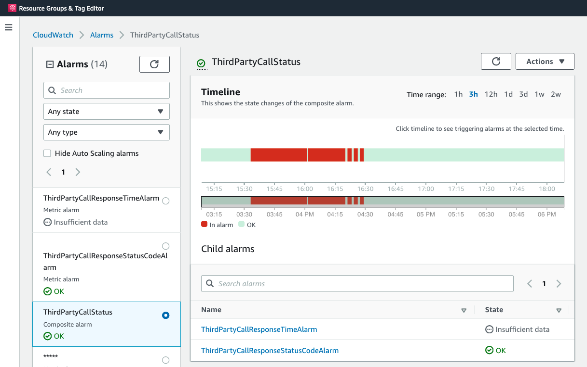

# Amazon EventBridge to AWS Lambda with feedback control by Amazon CloudWatch Alarms

This serverless pattern demonstrates an ON/OFF control implementation on AWS Lambda with a closed-loop (feedback) control mechanism. This is useful when your application is dependent on third-party calls and you need to handle any throttling or a performance issue on the third-party service.

This pattern deploys two AWS Lambda functions, one Amazon EventBridge rule, two Amazon CloudWatch alarms and one Amazon CloudWatch composite alarm. After performing the third-party call on AWS Lambda function, it uses Amazon CloudWatch custom metrics feature to store third-party service call metrics like response time and status code to provide feedback for generation of the control signal.

A set of CloudWatch Alarms monitors these custom metrics produced after the third-party call and decides if the third-party service call is healthy. If not, the event planner Lambda function stops feeding messages to EventBridge to drop third-party calls temporarily to avoid additional load on the third-party service. It also brings cost benefits and concurrency savings on AWS Lambda by avoiding the lambda invocations for the unhealthy 3rd party service. 

### Considerations 
- This serverless pattern uses Amazon CloudWatch metrics to store remote service's health information. This brings all the power of CloudWatch metrics and math expressions to make the decision of the remote API worker call.
- You can use CloudWatch metrics to build CloudWatch dashboards for monitoring the remote service's health and also API call control decisions.
- This serverless pattern doesn't implement any fallback mechanism. You can choose and bring another serverless pattern with your decision of the fallback path.
- The controller function makes API calls to Amazon CloudWatch Alarms feature to get alarm status and implements an ON/OFF control. You can also use all the alarm status properties to make advanced decisions on remote service API call.

Learn more about this pattern at Serverless Land Patterns: https://serverlessland.com/patterns/cdk-closed-loop-serverless-control-pattern

Important: this application uses various AWS services and there are costs associated with these services after the Free Tier usage - please see the [AWS Pricing page](https://aws.amazon.com/pricing/) for details. You are responsible for any AWS costs incurred. No warranty is implied in this example.

## Requirements

* [Create an AWS account](https://portal.aws.amazon.com/gp/aws/developer/registration/index.html) if you do not already have one and log in. The IAM user that you use must have sufficient permissions to make necessary AWS service calls and manage AWS resources.
* [AWS CLI](https://docs.aws.amazon.com/cli/latest/userguide/install-cliv2.html) installed and configured
* [Git Installed](https://git-scm.com/book/en/v2/Getting-Started-Installing-Git)
* [AWS Cloud Development Kit](https://docs.aws.amazon.com/cdk/latest/guide/cli.html) (AWS CDK) installed
* [Docker](https://docs.docker.com/get-docker/) installed and running

## Deployment Instructions

1. If it's your first time with AWS CDK, run `cdk bootstrap` to initiate process called bootstrapping that needed to provision some initial resources the AWS CDK needs to perform the deployments. Check [Bootstrapping documentation](https://docs.aws.amazon.com/cdk/v2/guide/bootstrapping.html) page for details. 
2. Create a new directory, navigate to that directory in a terminal and clone the GitHub repository:
    ``` 
    git clone https://github.com/aws-samples/serverless-patterns
    ```
3. Change directory to the pattern directory:
    ```
    cd serverless-patterns/cdk-closed-loop-serverless-control/cdk
    ```
4. Install dependency packages:
    ```
    npm install
    ```
5. From the command line, use AWS CDK to deploy the AWS resources for the pattern as specified in the CDK project:
    ```
    cdk deploy
    ```

## Useful commands

 * `cdk ls`          list all stacks in the app
 * `cdk synth`       emits the synthesized CloudFormation template
 * `cdk deploy`      deploy this stack to your default AWS account/region
 * `cdk diff`        compare deployed stack with current state
 * `cdk docs`        open CDK documentation

## How it works

>Control theory deals with the control of dynamical systems in engineered processes and machines. Feedback control, which is one fundamental type of control loops, involves taking measurements using a sensor and making calculated adjustments to keep the measured variable within a set range by means of a "final control element".
_Reference: [Control theory](https://en.wikipedia.org/wiki/Control_theory)_

[](images/Feedback_loop_with_descriptions.png)
By [Orzetto](//commons.wikimedia.org/wiki/User_talk:Orzetto~commonswiki "User talk:Orzetto~commonswiki") - Own work, [CC BY-SA 4.0](https://creativecommons.org/licenses/by-sa/4.0 "Creative Commons Attribution-Share Alike 4.0"), [Link](https://commons.wikimedia.org/w/index.php?curid=5000019)

This pattern is implemented to showcase third-party API load control and throttle-handling use cases but it will be helpful for the most cases when you don't have any ability for a direct effect on a system but you want to manage and influence it's behaviour. Furthermore, even if sometimes you can't manage it, you may want to reduce the exposure on your system. For a third-party API call control system, that exposure may be the increasing concurrency and cost on Lambda functions due to the increased response time.



Closed-loop (feedback) control system tries to handle the throttling by stopping calls to the third-party API when response times are increased above a threshold or during increased HTTP error rates. Control signal allows the third-party API to cool-down or recover for some time period. After, the alarm state expries and goes from `ON_ALARM` to `INSUFFICIENT_DATA` since there is no API call, means no call related performance data to evaluate. At this stage, `CallPlanner` function tries sending some traffic to the third-party API again and uses the metrics to evaluate the API's performance again.


### Alarm definitions

There are two Amazon CloudWatch Alarm rules and one Amazon CloudWatch composite alarm implemented in this pattern. One rule defines the abnormal behaviour on average API response time and the other defines the abnormal error ratio of API status codes. The composite alarm allows to perform a logic operation `OR` for `ON_ALARM` states of any of two rules. Thus, when any alarm goes on `ON_ALARM`, state, the composite alarm indicates `ON_ALARM` state as well. The composite alarm is used as a control signal of third-party API processing event in the `CallPlanner` Lambda function.



## Testing

You can use following test scenario scripts to feed the `CallPlanner` Lambda function, which the event generation and control signal evaluation happens. To build a proper testing environment, the input event provided to `CallPlanner` function is forwarded to the `ThirdPartyProcessor` function to be able to simulate a third-party API behaviour. If you provide an event input as `{"simulated_response":{"response_time": 10,"status_code":200}}` to `CallPlanner` function, the `ThirdPartyProcessor` function will simulate a third-party API call as took `10ms` (±10% for a natural variation) and responded `HTTP2000`.

By switching different scenari scripts, you can monitor CloudWatch Alarms dashboard and watch how ON/OFF feedback control tries to handle the throttling.

### Testing as the third-party API is on healthy state

The following shell command invokes the lambda function 8 times for a HTTP200 response and 1 time for a HTTP500 with 10ms response time. It ends up with 10ms average response time and `~0.125` API error rate metric and doesn't trigger any alarm on the defined CloudWatch Alarm rules.

```bash
for i in {1..10000}; \
do \
    for j in {1..8}; \
    do \
        aws lambda invoke --function-name CallPlanner --payload '{"simulated_response":{"response_time": 10,"status_code":200}}' \
            --cli-binary-format raw-in-base64-out /dev/stdout; \
        sleep 1;\
    done
        aws lambda invoke --function-name CallPlanner --payload '{"simulated_response":{"response_time": 10,"status_code":500}}' \
            --cli-binary-format raw-in-base64-out /dev/stdout; \
        sleep 1;\
done
```

### Testing as the third-party API is on unhealthy state

#### 1. Testing as increased HTTP500 responses
The following shell command invokes the lambda function 3 times for a HTTP500 response and 1 time for a HTTP200 with 10ms response time. It ends up with 10ms average response time and `~3` API error rate metric and triggers `ThirdPartyCallResponseStatusCodeAlarm` on the defined ClodWatch Alarm rules and makes the composite `ThirdPartyCallStatus` alarm on `ON_ALARM` state.

```bash
for i in {1..10000}; \
do \
    for j in {1..3}; \
    do \
        aws lambda invoke --function-name CallPlanner --payload '{"simulated_response":{"response_time": 10,"status_code":500}}' \
            --cli-binary-format raw-in-base64-out /dev/stdout; \
        sleep 1;\
    done
        aws lambda invoke --function-name CallPlanner --payload '{"simulated_response":{"response_time": 10,"status_code":200}}' \
            --cli-binary-format raw-in-base64-out /dev/stdout; \
        sleep 1;\
done
```

#### 2. Testing as increased response times

The following shell command invokes the lambda function 8 times for a HTTP200 response and 1 time for a HTTP500 with `~2500 ms` response time. It ends up with `~2500 ms` average response time metric and `~0.125` API error rate metric and triggers `ThirdPartyCallResponseTimeAlarm` on the defined ClodWatch Alarm rules and makes the composite `ThirdPartyCallStatus` alarm on `ON_ALARM` state.

```bash
for i in {1..10000}; \
do \
    for j in {1..8}; \
    do \
        aws lambda invoke --function-name CallPlanner --payload '{"simulated_response":{"response_time": 2500,"status_code":200}}' \
            --cli-binary-format raw-in-base64-out /dev/stdout; \
        sleep 1;\
    done
        aws lambda invoke --function-name CallPlanner --payload '{"simulated_response":{"response_time": 2500,"status_code":500}}' \
            --cli-binary-format raw-in-base64-out /dev/stdout; \
        sleep 1;\
done
```

## Cleanup
 
1. Run the given command to delete the resources that were created. It might take some time for the CloudFormation stack to get deleted.
    ```
    cdk destroy
    ```
2. Confirm the stack has been deleted
    ```bash
    aws cloudformation list-stacks --query "StackSummaries[?contains(StackName,'ServerlessControlStack')].StackStatus"
    ```
----
Copyright 2022 Amazon.com, Inc. or its affiliates. All Rights Reserved.

SPDX-License-Identifier: MIT-0
