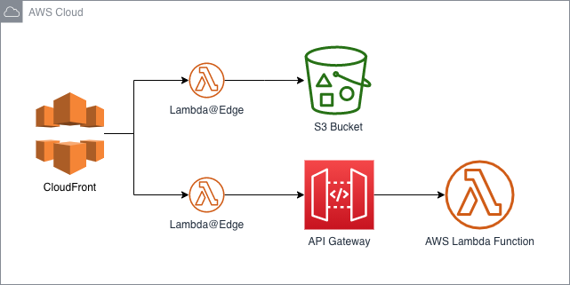

# CloudFront to S3 and API Gateway backed by TypeScript Lambda functions



This pattern deploys a CloudFront distribution and routes HTTP traffic to two backend services based on the URL. Any URLs that have a path beginning with `/api/` are routed to an API Gateway which integrates with Lambda Functions which are written in TypeScript. All other traffic is routed to an S3 bucket.

The pattern also includes examples of using Lambda@Edge integrated with CloudFront to implement redirects, and to add CORS headers to API requests.

Learn more about this pattern at Serverless Land Patterns: https://serverlessland.com/patterns/cdk-cloudfront-to-s3-and-lambda

Important: this application uses various AWS services and there are costs associated with these services after the Free Tier usage - please see the [AWS Pricing page](https://aws.amazon.com/pricing/) for details. You are responsible for any AWS costs incurred. No warranty is implied in this example.

## Requirements

* [Create an AWS account](https://portal.aws.amazon.com/gp/aws/developer/registration/index.html) if you do not already have one and log in. The IAM user that you use must have sufficient permissions to make necessary AWS service calls and manage AWS resources.
* [AWS CLI](https://docs.aws.amazon.com/cli/latest/userguide/install-cliv2.html) installed and configured
* [Git Installed](https://git-scm.com/book/en/v2/Getting-Started-Installing-Git)
* [Node.js Installed](https://nodejs.org/en/download/)

## Deployment Instructions

1. Create a new directory, navigate to that directory in a terminal and clone the GitHub repository:
    ``` 
    git clone https://github.com/aws-samples/serverless-patterns
    ```
1. Change directory to the CDK directory within the pattern directory:
    ```
    cd cdk-cloudfront-to-s3-and-lambda/cdk
    ```
1. Install Node.js dependencies:
    ```
    npm i
    ```
1. Update the `./cdk/bin/static-site.ts` file to adjust the target region (default is `eu-west-2`).
1. From the command line, use CDK to deploy the AWS resources for the pattern. You'll be prompted to approve security related changes during the deployment.
    ```
    npx cdk deploy --all
    ```

1. Note the outputs from the CDK deployment process. These contain the resource names which are used for testing.

## How it works

At the end of the deployment the CDK output will list stack outputs, an API Gateway URL, and the CloudFront distribution domain name that can be accessed in a Web browser, it will look like this:

```
Outputs:                                                                                                                                                                     
StaticSiteStack.apiGatewayEndpoint8F3C8843 = https://xxxxxxxxxx.execute-api.eu-west-2.amazonaws.com/prod
StaticSiteStack.distributionDomainName = xxxxxxxxxxxxxx.cloudfront.net
```

## Testing

You can test the solution by accessing the CloudFront distribution domain using a Web browser.

### Static content

You can view the static content Website by accessing the `distributionDomainName` in a Web browser. You should see the content that is present in the `./web` directory ("Hello, World!").

The default content in the `./web` directory includes a subdirectory containing an `index.html` file. Many Web servers have the ability to inspect filesystems and look for default documents to serve, however, CloudFront does not implement this. This pattern includes a Lambda@Edge that inspects the viewer requests and adds default document support. This can be tested by accessing the `/subdirectory` path of your CloudFront distribution, e.g. `https://xxxxxxxxxxxxxx.cloudfront.net/subdirectory` and noting that a HTML document is displayed, not an error.

Any content placed in the `./web` directory will be uploaded to the S3 bucket and served by CloudFront, you could replace this content with the build output of a static React app, a Hugo project or other framework that produces static content.

### API

#### API Endpoints

The API endpoints that execute Lambda functions can be accessed by adding `/api/hello` or `/api/world` to the end of the distributionDomainName, e.g. `https://xxxxxxxxxxxxx.cloudfront.net/api/hello`.

The `/api/hello` endpoint is configured to show a random face made out of emojis.

The `/api/world` endpoint is configured to return a JSON response.

#### CORS

The API Lambda code (e.g. `./api/hello/index.ts`) doesn't contain any code to implement CORS. This would usually mean that JavaScript running in a Web browser would not be able to access the APIs, however, this pattern includes a Lambda@Edge applied to the APIs which adds CORS headers to HTTP responses from the API.

This can be tested by using `curl` at the command line to send an origin header:

```
curl --verbose -H "Origin: https://xxxxxxxxxxxxxx.cloudfront.net" https://xxxxxxxxxxxxxx.cloudfront.net/api/hello
```

The response will contain CORS headers (you can customise the `access-control-allow-origin` header by editing the Lambda function):

```
< access-control-allow-origin: *
< access-control-allow-methods: GET, HEAD, POST
< access-control-max-age: 86400
```

#### Making changes

You can customise the Lambda functions by editing the code at `./api/hello/index.ts` or `./api/world/index.ts` and re-deploying using `npx cdk deploy --all` from within the `./cdk` directory.

## Cleanup
 
1. Delete the stack
    ```bash
    npx cdk destroy --all
    ```

Due to how Lambda@Edge functions are globally replicated, the initial deletion of the CloudFormation stack that contains Lamdba@Edge functions will fail with the message similar to:

```
edge-lambda-stack-c82ac052924d93dcf8fd3575adccfc7302931756eb: destroy failed Error: The stack named edge-lambda-stack-c82ac052924d93dcf8fd3575adccfc7302931756eb is in a failed state. You may need to delete it from the AWS console : DELETE_FAILED (The following resource(s) failed to delete: [apiCorsEE047D24, staticRewrite57ABF371]. )
    at Object.waitForStackDelete (/Users/adrian/github.com/aws-samples/serverless-patterns/cdk-cloudfront-to-s3-and-lambda/cdk/node_modules/aws-cdk/lib/api/util/cloudformation.ts:277:11)
    at processTicksAndRejections (internal/process/task_queues.js:93:5)
    at Object.destroyStack (/Users/adrian/github.com/aws-samples/serverless-patterns/cdk-cloudfront-to-s3-and-lambda/cdk/node_modules/aws-cdk/lib/api/deploy-stack.ts:395:28)
    at CdkToolkit.destroy (/Users/adrian/github.com/aws-samples/serverless-patterns/cdk-cloudfront-to-s3-and-lambda/cdk/node_modules/aws-cdk/lib/cdk-toolkit.ts:253:9)
    at initCommandLine (/Users/adrian/github.com/aws-samples/serverless-patterns/cdk-cloudfront-to-s3-and-lambda/cdk/node_modules/aws-cdk/bin/cdk.ts:208:9)
The stack named edge-lambda-stack-c82ac052924d93dcf8fd3575adccfc7302931756eb is in a failed state. You may need to delete it from the AWS console : DELETE_FAILED (The following resource(s) failed to delete: [apiCorsEE047D24, staticRewrite57ABF371]. )
```

However, you can confirm that the StaticSiteStack CloudFormation stack has been deleted by viewing the list of CloudFormation stacks in your selected region, and by checking the list of CloudFront distributions.

Because the CloudFront distribution has been deleted, the Lambda@Edge replicated functions will be deleted by AWS after a few hours. After this time, running the destoy command again will succceed.

However, if you want to delete the remaining stack immediately, you can delete the stack manually from the CloudFormation console in `us-east-1` and choose to retain the two Lambda@Edge functions.

2. Confirm the stack has been deleted
    ```bash
    aws cloudformation list-stacks --query "StackSummaries[?contains(StackName,'StaticSiteStack')].StackStatus"
    ```

You should expect to see a message confirming `DELETE_COMPLETE`.

----
Copyright 2021 Amazon.com, Inc. or its affiliates. All Rights Reserved.

SPDX-License-Identifier: MIT-0

