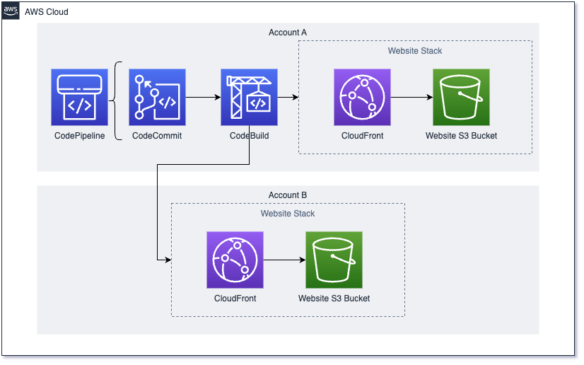

# CDK CodePipline Cross-Account Deployment

This pattern deploys a CodePipleine using CodeCommit and CodeBuild. From this pipeline it deploys a CloudFront distribution in front of an S3 Bucket to serve as a static website, across 2 accounts. This is an example of how you can use one pipeline to deploy the same stack across multiple environments.

Note that CloudFront and S3 are used in this pattern for demonstration purposes, you can use this pattern with any stack you wish to deploy.



Important: this application uses various AWS services and there are costs associated with these services after the Free Tier usage - please see the AWS Pricing page for details. You are responsible for any AWS costs incurred. No warranty is implied in this example.

## Requirements

* [Create AWS account(s)](https://portal.aws.amazon.com/gp/aws/developer/registration/index.html) if you do not already have one and log in. The IAM user that you use must have sufficient permissions to make necessary AWS service calls and manage AWS resources. 
* [AWS CLI](https://docs.aws.amazon.com/cli/latest/userguide/install-cliv2.html) installed and configured
* [Git Installed](https://git-scm.com/book/en/v2/Getting-Started-Installing-Git)
* [AWS Cloud Development Kit](https://docs.aws.amazon.com/cdk/v2/guide/getting_started.html) (AWS CDK >= 2.2.0) Installed

## Language

Python

## Framework

CDK

## How It Works

After cloning this pattern, you will bootstrap 2 AWS environments with CDK. An environment is an Account-Region pair. This example uses 2 different accounts as a way to demonstrate deploying the same CDK stack(s) across accounts i.e. Development and Production. The CI/CD pipeline will only deploy in the account you designate in the app.py file. 

It is a common practice to have CDK read external variables at build time, this is done by providing context in the cdk.json file in the projects root, then using this context from the ```cdk deploy``` command with the ```--context``` option for example. But in this example, we are going to utilize a CodePipeline to deploy our CDK into the different accounts after the inital bootstrap and deployment of said pipeline. Because of this, we are not going to be deploying from local after the initial set-up and this further context configuration wouldn't be necessary.

While bootstrapping the, you include a ```--trust``` flag that creates a trust relationship from the primary (pipeline) account to the accounts you wish to deploy to.

## Deployment Instructions

1. Create a new directory, navigate to that directory in a terminal and clone the GitHub repository:
    ```bash
    git clone https://github.com/aws-samples/serverless-patterns
    ```
2. Change directory to the pattern directory:
    ```bash
    cd cdk-codepipeline-cross-account-deployment
    ```
3. Use CDK to bootstrap environments (Please note that the modern bootstrap template effectively grants the permissions implied by the --cloudformation-execution-policies to any AWS account in the --trust list. By default, this extends permissions to read and write to any resource in the bootstrapped account. Make sure to configure the bootstrapping stack with policies and trusted accounts that you are comfortable with.):
    ```bash
    cdk bootstrap aws://ACCOUNT-NUMBER-1/REGION-1
    ```

    ```bash
    cdk bootstrap aws://ACCOUNT-NUMBER-2/REGION-2 --trust <PRIMARY-ACCOUNT-NUMBER>
    ```

4. Create a virtual environment for python:
    ```bash
    python3 -m venv .venv
    ```
5. Activate the virtual environment:
    ```bash
    source .venv/bin/activate
    ```

    If you are in Windows platform, you would activate the virtualenv like this:

    ```
    % .venv\Scripts\activate.bat
    ```

6. Install python modules:

    ```bash
    python3 -m pip install -r requirements.txt
    ```

7. From the command line, use CDK to synthesize the CloudFormation template and check for errors:

    ```bash
    cdk synth
    ```

8. From the command line, use CDK to deploy the stack:

    ```bash
    cdk deploy
    ```
## Testing

1. After the initial deployment, you can make changes in the CodeCommit repo, and push those changes to main. After these changes are pushed, navigate to the CodePipline dashboard and select the pipeline to watch the CI/CD process. At this point you can still make changes and deploy your CDK from local, but as a security best practice developers would not need to have account credentials at all after the initial pipeline deployment. Changes could all be deployed through the pipeline, therefore reducing the possibility of credentials leaking by not needing them in the first place. 

2. After the pipeline is complete, you can navigate to CloudFront in both accounts and see the distribution that has been created. The CloudFront dashboard will provide you with a URL you can use to navigate to the exmaple website that has been created.

## Cleanup

1. Delete the stack in both accounts, this will delete the distribution in both accounts, as well as the pipeline in the primary account.

    ```bash
    cdk destroy
    ```

----
Copyright 2023 Amazon.com, Inc. or its affiliates. All Rights Reserved.

SPDX-License-Identifier: MIT-0